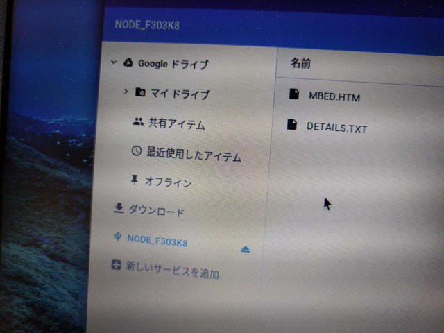

秋月電子の新商品店頭ワゴンコーナーで[STM32F303 Nucleo-32](http://akizukidenshi.com/catalog/g/gM-10172/ "STM32 Nucleo Board STM32F303")(Cortex-M4)を見かけました。mbed Enabledで、お値段も1600円とお手ごろですし、Arduino Nanoピン互換でありブレッドボードでの試作にも適しているため思わず買ってしまいました。

早速電源をいれてみたところ、Lチカが始まりました。  <!--more-->

私のmbed開発環境となっているChromebookに接続したところ、USBストレージとして認識し、いつものmbed.htmが見えました。

もちろん、開発環境でLチカをコンパイルしてChromebookでも問題なく動かすことができました。

他にもCortex-M0の製品もありますので、購入するときは型番を注意して確認してください。おまけにお値段はなぜか一緒です。
