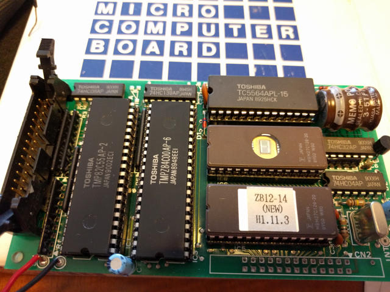
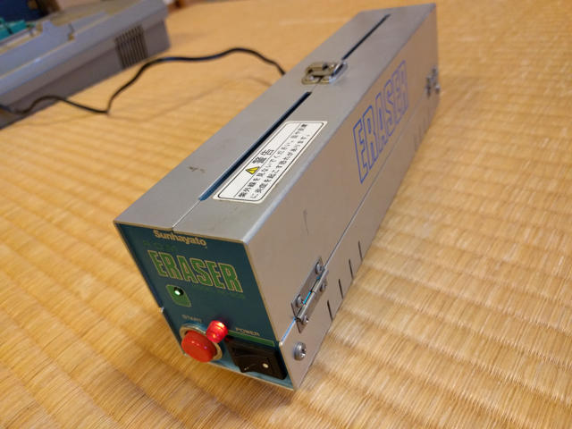

中日電工さんのBASIC制御小型マイコンボードZB19Cを手にいれました。このボードは別製品のZB11で開発したプログラムを載せるためのボードのようです。

 <!--more-->

基板をみるとわかるように実にシンプルな構成で、Z-80 CPU、8KB SRAM（バッテリーバックアップ付）、16KB PROM×2、8255 PPIが実装されています。PROMの１つは制御用BASICが書き込まれているようです。もう１つはユーザROMで何が書かれているかわかりません。

とりあえず、PROMの内容を見てみます。久しぶりにPECKER-11の出番です。

システムROMを読みだして、Intel HEXフォーマットでPCに転送です。これはあとでじっくり解析してみることにします。

もう１つのユーザ用PROMは全て0xFFで、未使用か消去済のようです。

付属説明書によると、8255 PPIのポートアドレスは0x80〜0x83ですので、このポートを操作すればPPIから信号を出力することができます。

以前、同様の[Super AKI-80ボードでLチカ](https://kanpapa.com/2014/01/super-aki80-led-blink.html "Super AKI-80でLチカをしてみました")を行いましたので、このボード用にプログラムを修正して、PECKER-11でユーザ用PROMに書き込み、システムROMと差し替えました。これで書き込んだPROMが0x0000番地に配置され、Lチカプログラムが動くはずです。

8255 PPIにLEDを接続し、電源を投入したところ、何も動きません。アセンブリリストを確認したらポートアドレスが間違っていました。再びアセンブルして、PROMに書き込み・・・といきたいところですが、まずはPROMを消去しなければなりません。

またまた久しぶりにPROMイレーサーの登場です。

こんな感じでPROMをセットします。

内部の殺菌灯からの紫外線でPROMが消去されます。消去には20分ぐらいかかります。

もう一度プログラムをPECKER-11で書き込み、システムROMソケットに差し込んだところ、Lチカできました。

久しぶりにPROMを書き込んでZ-80と遊びましたが、このボードは内部バスが別のコネクタに引き出されているので、ここにZ-80の周辺デバイスを接続しても面白いかなと思います。

YouTubeにもアップしておきました。
