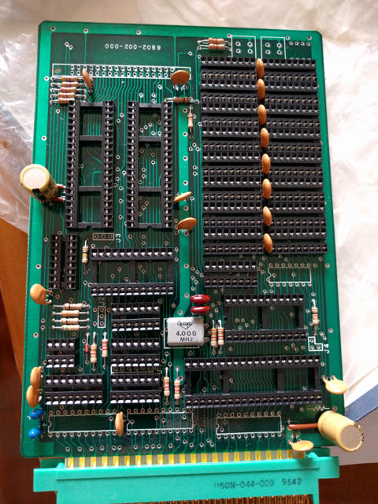
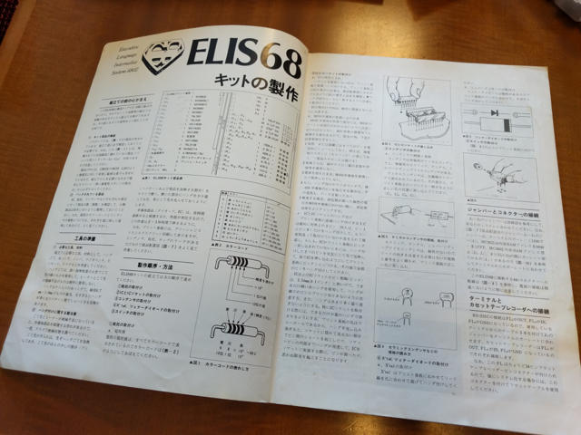
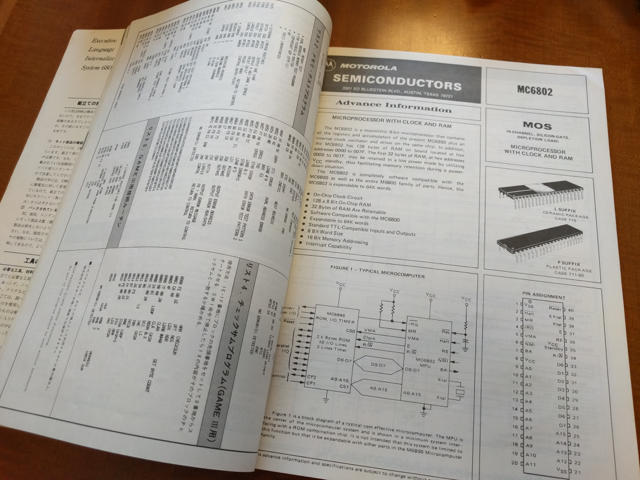

ELIS68というワンボードマイコンの基板がヤフオクにありました。このワンボードマイコンは聞きなれないものでしたが、手持ちのエンサイクロペディアアスキーVol.2を見たところ、6802CPUと周辺チップと2114RAMを使い、MIKBUG 2.0というモニタープログラムをシリアルコンソールで操作できるというものでした。今回ヤフオクで入手したのはこのキットで、ICが未実装の基板とマニュアル一式です。

マニュアルの表紙にも書かれていますが、ELIS68の名前の由来はExecutive Language Internalize System 6502とのことで、6800用のあらゆるソフトを走らせるために作られたスーパーマシンとのことです。

基板にはICソケットやコンデンサといった部品は実装済みでしたが、CPUやメモリなどのICは当時高価だったため完成には至らなかったようです。しかし、前の持ち主のかたはパーツセットを綺麗なハンダ付けで実装されていて基板の状態も良く、大切に保管されていたようです。

私はナカダイの工場ハックで6802搭載の基板をジャンク品として購入しており、6802CPUは持っていました。その後、[6802nano](https://kanpapa.com/2012/04/6802-nano-computer.html "6802 Nano computerを動かしてみました")を組み立てるために6821PIAも入手しています。残るパーツをなんとかして集め、この80年代のワンボードコンピュータであるELIS68を完成させてみたいと思いました。

ELIS68のマニュアルを確認したところ、月刊アスキーでの連載は1979年8月号から1979年12月号だったようです。

このキットは連載と同時に購入申し込みが行われ、以下の３つのコースに分かれていました。加えてIC以外の部品をまとめたパーツセットもあったようです。

(1)コース：プリント基板だけ・・・・9,000円

(2)コース：プリント基板と2114RAMを除いたCPUと周辺チップ・・・・30,000円

(3)コース：プリント基板とCPUとRAMを含んだ周辺チップ全部・・・・40,000円

パーツセット（XTAL、ダイオード、44Pコネクタ、ICソケット、抵抗、コンデンサなど一式）・・・4,000円

マニュアルのELIS68キット部品表には、薄く数字が鉛筆書きされていました。当時の価格でしょうか。

- MC6802 2800
- MC6846L1 7800
- MCM6810 1200
- MC6850 3000
- MC6821 1500
- MC14526 240
- MC14024 180
- MC14583 260

このあたり、当時の雑誌を確認して価格を調べてみようと思います。

この付属のマニュアルがすばらしく、各チップのデータシートが全て載っています。モトローラ全面協力というところでしょうか。これも今後のパーツ集めや動作確認にも役に立ちます。

さあ、パーツ集めの開始です。（[続く](https://kanpapa.com/2016/05/elis68-6802-2.html)）
