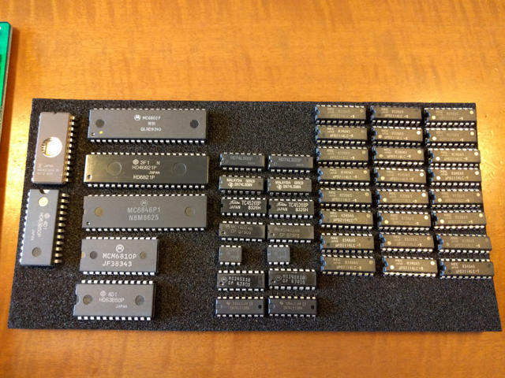

[ELIS68の基板とマニュアルを入手](https://kanpapa.com/2016/05/elis68-6802-1.html "6802ワンボードコンピュータELIS68を動かしてみた（その１）")したところで必要なパーツを洗い出します。

- U1 MC6802 Microprocessor with clock and optional RAM　（手持ちあり）
- U2 MC6846L1 ROM-I/O-Timer
- U3 MCM6810 128 x 8-bit static random access memory
- U4 MC6850 Asynchronous communications interface adapter
- U5 MC6821 Peripheral interface adapter　（手持ちあり）
- U6 74LS00 Quad 2-Input NAND Gate（手持ちあり）
- U7 74LS08 Quad 2-Input AND Gates（手持ちあり）
- U8 MC14526 Presettable 4-Bit Down Counters
- U9 MC14024 7-Stage Ripple Counter
- U10 MC1458 Dual Operational Amplifiers
- U12 MC14583 Dual Schmitt Trigger
- U13 74LS138 3 to 8 Decoder/Demultiplexer（手持ちあり）
- U16-U31 MCM2114 4096bit (1024 x 4bits) Static RAM

74系のデバイスは手持ちもありますし、そんなに入手は難しくはありません。  
やはり難しいのは68系の周辺デバイスとメモリでしょうか。

メモリICのMCM2114を試しにヤフオクで検索したところ、同等品のNEC uPD2114LC-5 (SRAM nMOS / 4K 18Pin DIP) \[4個組\]が500円でしたので、こちらで必要数が入手できました。

74系は手持ちがありましたが、MC14xxx系は持っていないため、秋葉原の[若松通商](http://www.wakamatsu-net.com/biz/ "若松通商")さんで揃えることができました。MC1458のオペアンプは互換品のNJM1458Dが[共立エレショップ](http://eleshop.jp/ "共立エレショップ")さんで購入できました。

残るは68系のチップです。残念ながらオークションにも通販サイトにもこんな古いチップは取り扱いがありません。

でもひょんなところでMC6850のC-MOS版であるHD63B50Pを手にいれることができました。いつも立ち寄っている[マルツパーツ館](http://www.marutsu.co.jp/pc/static/shop/akihabara2go "マルツパーツ２号館")のジャンクコーナーで一袋100円で販売されている部品の詰め合わせセットの中になんとこのHD63B50Pが入っていたのです。これでシリアル通信ICは確保できました。

残るはMC6846L1とMCM6810です。いろいろ調べましたが、この２つは国内では入手が困難と判断し、海外の電子部品取り扱いサイトにあたってみました。

MCM6810はあちこちで扱いがありましたが、結局、eBayのショップから5個で14.93USDで入手しました。

MC6846L1 はみつからず、プラスチックパッケージのMC6846P1はeBayのお店にはありましたが、なんと6000円近い値段がついていました。さすがにこれは高すぎるのでビンテージICを扱っている海外のサイトをあたってみましたが、ほぼ取り寄せという状態で在庫があるところが見つかりません。しかし、あるイギリスのお店のサイトでビンテージICの在庫数が一覧になっていて、MC6846P1の在庫が3個とありました。価格はお問い合わせということでしたので、下手な英文で問い合わせたところ、1個10USDとのことなので、ここにオーダーし無事入手できました。

このように海外からパーツが届くのを待ったため、すべて部品が揃うまでに２ヶ月近くかかりましたが、良い経験になったと思います。

次はいよいよ組み立てと動作確認になります。（[続く](https://kanpapa.com/2016/05/elis68-6802-3.html "6802ワンボードコンピュータELIS68を動かしてみた（３）動作確認編")）
