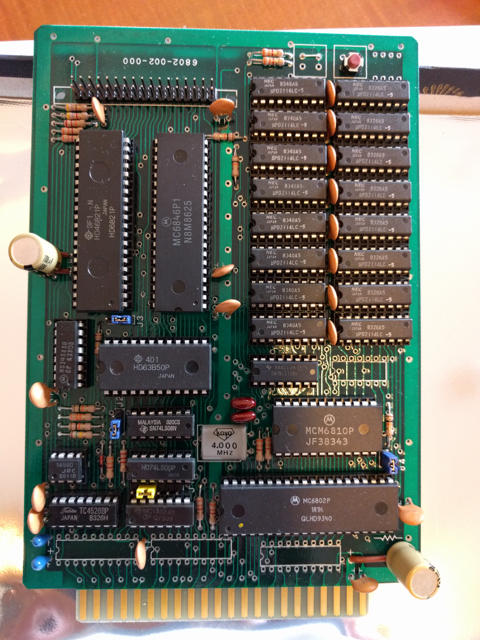
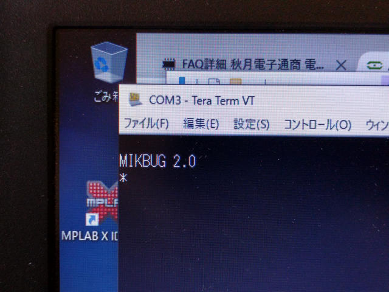

[ELIS68の部品がすべて揃った](https://kanpapa.com/2016/05/elis68-6802-2.html "6802ワンボードコンピュータELIS68を動かしてみた（２）部品収集編")ところでICソケットに実装していきます。

すべてのICを実装した後のELIS68ボードです。かっこいいです。

リセットスイッチは付属のスイッチでは背が高く不安定に見えたので、[秋月電子](http://akizukidenshi.com/ "秋月電子")の[タクトスイッチ](http://akizukidenshi.com/catalog/g/gP-08079/ "タクトスイッチ（赤）　（１０個入）")を使用しています。ジャンパー箇所とフラットケーブル接続部分にはピンヘッダを取り付けました。

シリアル通信はフラットケーブル接続端子から取り出しますが、RS232Cレベルの信号なので[シリアルUSB変換ケーブル](http://akizukidenshi.com/catalog/g/gM-08343/ "ＦＴ２３２　ＵＳＢ－シリアル変換ケーブル　ＶＥ４８８")を使用してPCと接続しました。

電源は+5V、+12V、-12Vの3電源が必要です。TK-85で使用していたスイッチング電源を接続しました。

この状態でターミナルソフト（Teraterm）を立ち上げ、USB-シリアルのCOM番号を指定し、1200bpsの速度にします。電源を投入すると、Teratermの画面に「MIKBUG 2.0」と無事表示されました。

一応動いているようです。マニュアルを見ながらMIKBUGのコマンドを投入してみます。

メモリの読み書きも、レジスタ表示なども問題なさそうです。

ここでメモリチェックプログラムを入力してメモリに問題がないか確認します。昔はよく不良品のメモリがあり、ビット落ちとかがあったものです。アセンブルリストを見ながらプログラムを16進数で入力していきます。

入力が完了したらSフォーマットで出力しておきます。

ターミナルソフトでSフォーマットの出力をファイルにしておきます。次回このプログラムを使うときは、ターミナルソフトでSフォーマットのファイルを送信することでメモリにロードすることができます。

0000番地から実行し、メモリチェックプログラムを動かします。全く動きがない状況になって、正常に動いているのか、暴走しているのか不安でしたが、約20分後にMIKBUGの表示に戻りました。

特にエラーは出ていませんのでメモリチェック完了です。

これでELIS68ボードの動作確認は完了しました。ボード上のCPUやメモリを触ってみると結構熱くなっていました。昔のボードコンピューターはこんなに熱かったなと思いだしました。

次はいよいよGAMEインタプリターをこのELIS68で動かしてみます。（[続く](https://kanpapa.com/2016/05/elis68-6802-4.html "6802ワンボードコンピュータELIS68を動かしてみた（４）GAME移植編")）
