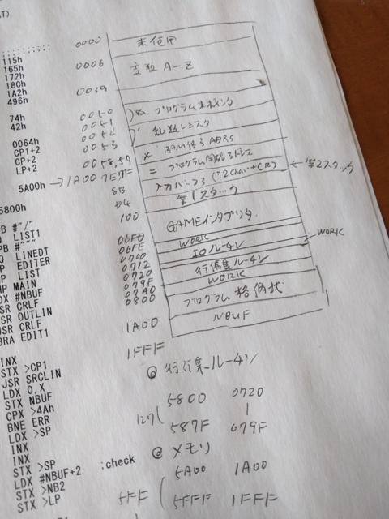

[GAMEが動き始めたELIS68](https://kanpapa.com/2016/05/elis68-6802-4.html "6802ワンボードコンピュータELIS68を動かしてみた（４）GAME移植編")ですが、残念ながら手持ちのエンサクロペディア Volume2にはGAMEの全４回の連載のうち２回分しか掲載されておらず、続巻のエンサイクロペディア Volume3は持っていません。こういうときは国立国会図書館が頼りです。

## GAMEの全記事を国立国会図書館で読む

[国立国会図書館サーチ](http://iss.ndl.go.jp/ "国立国会図書館サーチ")を使うと蔵書の検索を行うことができます。GAMEの連載は以下の４つのようです。

- ASCII 2(7)(13) 1978-07 新言語"GAME"

- ASCII 2(8)(14) 1978-08 GAME インタプリタの研究

- ASCII 2(9)(15) 1978-09 行編集機能とディスコンパイラー

- ASCII 2(10)(16) 1978-10 6800用セルフアセンブラ

おまけに、68系のGAMEコンパイラの記事も見つけました。

- ASCII 5(5)47 1981-05 H68/TR GAME68コンパイラ

さらに、ELIS68の連載5回目のQ&Aの記事も見つかりました。

- ASCII 3(12)(30) ELIS68 Q&A 編集部

これまで[何度か国会図書館は利用](https://kanpapa.com/2015/08/vem16-8088.html "VEM16 8088トレーニングボードを手に入れた")していますので、早速出かけて該当の記事を複写していただきました。

## 行編集機能の移植

GAME連載第３回目に載っている行編集機能は私も欲しい機能でしたので、この部分の移植を行いました。

オリジナルのGAMEで は$5800から行編集ルーチンが書かれています。でも、ELIS68ではメモリは$1FFFまでしかありません。ELIS68のメモリマップやGAME のメモリマップから考えて、行編集ルーチンは$0700〜$0800のI/Oルーチン用の領域を使い、$0720からのメモリに置くことにしました。

行編集ルーチンはリロケータブルに書かれていますが、GAME本体とメモリの上限値などいくつかパッチが必要です。この部分はMIKBUGで直接書き換えてしまいます。

行編集ルーチンをMIKBUGで入力し、必要な部分にパッチを当てたあとGAMEを動かして、行編集ができるかの確認です。どこか間違っていたら暴走してしまい、最初からやり直しです。

行編集はカーソルを持って行って修正するという方式ではなく、sedのように"置換する文字列"置換後の文字列"と指定しますが、どうやら正常に動作することができました。

他の部分にも問題が起こっていないか確認するためにサンプルプログラムを動かしてみます。

動作も大丈夫のようなので一旦リセットしてMIKBUGに戻し、GAME本体をSフォーマットで保存しました。これでGAMEインタプリターの移植は完了です。

## まとめ

次に試したいのは連載４回目のGAMEで書かれた6800セルフアセンブラです。こちらは行数が多いので入力に時間かかりそうです。でもアセンブラが動くと開発がかなり楽になりますので、ここまでは動かしたいです。

最終的にはGAMEコンパイラで機械語生成までもっていきたいところですが、ELIS68の8KBメモリに収まるかどうか・・・。収まらない場合はELIS68改を作ることになってしまいそうです。
