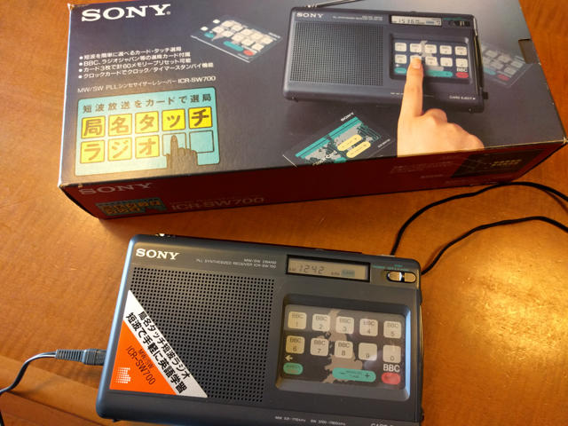
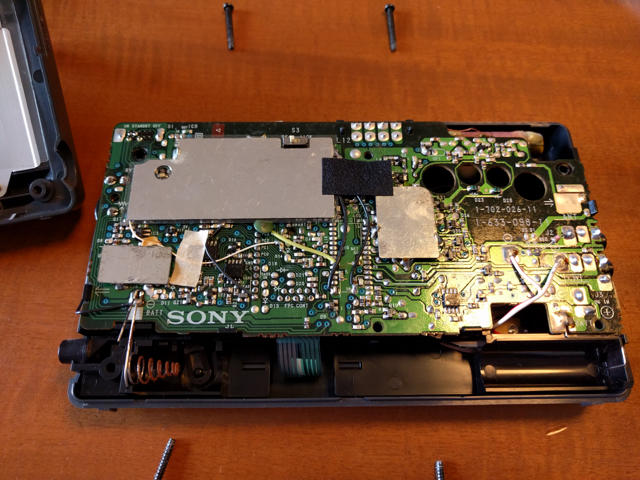
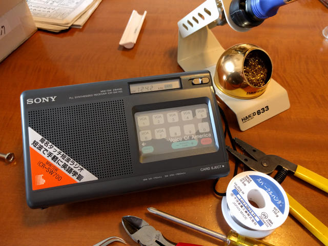

HARDOFFのジャンクコーナーでSONYの短波ラジオICR-SW700をみつけました。中身を確認させていただいたところそこそこ綺麗でしたが、電池ボックスに液漏れの跡がありマイナス側の電池のバネは腐食していました。でもなんとかなるかなと買って帰りました。お値段は980円です。

手持ちのICF-2001D用の4.5VのACアダプタを接続したところ問題なく動きました。でも、やはりラジオは電池で手軽に使いたいものです。

<!--more-->

電池ボックスのバネを交換すれば再び電池で使えるはずです。状況を確認するために裏ふたを開けてみました。

電池バネの部分は思ったより単純な構造です。似たようなバネがあれば交換できます。手持ちのジャンクパーツで適当なバネを探しました。今回はベネッセの学習教材のPDAぽいものの電池バネが使えそうです。

ラジオのバネは思い切って切断し、新しいバネはPDAぽいものを分解して取り外しました。取り外したバネを比較したところ代替できそうです。新しいバネには半田付けしやすい曲げ部分もあり最適です。

新しいバネに交換し、リード線で基板のマイナスに接続します。

これでバネの交換は完了です。電池をいれて電源をいれると問題なく使えるようになりました。

このラジオは感度が良いようで鉄筋マンションの中でも中波がクリアに受信できます。久しぶりに短波も聞いてみようと思います。
