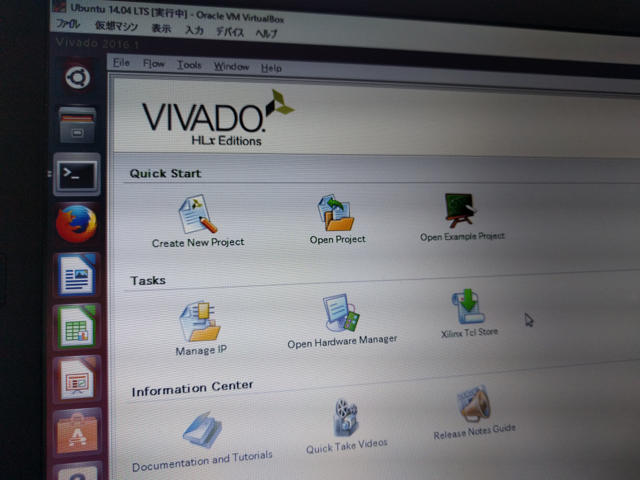
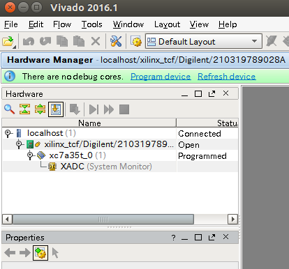

## はじめに

[OpenCores](http://opencores.org/ "OpenCores")の[FPGAでPDP-11を動かすプロジェクト](http://opencores.org/project,w11 "PDP-11/70 CPU core and SoC")にしたがって、Xilinx Artix-7が載ったDIGILENTの[ARTY](http://akizukidenshi.com/catalog/g/gM-10034/ "ARTY")というFPGA評価ボードでUNIX V5を動かすまでをまとめました。

FPGAについては初心者ですので、間違っているところもあるかもしれません。

今回使用するDIGILENTのARTYは秋月電子で取り扱っています。 [http://akizukidenshi.com/catalog/g/gM-10034/](http://akizukidenshi.com/catalog/g/gM-10034/ "Digilent Arty FPGA評価ボード")

使用するLinux環境ですが、ubuntu 14.04 LTSをiMacのVMware Fusionにインストールしているので、この上で作業を行いました。

## Vivado開発環境の準備

Xilinx社のFPGA開発環境であるVivadoのインストーラーは以下にあります。 Vivado Design Suite - HLx Editions - 2016.1 Full Product Installation [http://japan.xilinx.com/support/download.html](http://japan.xilinx.com/support/download.html "Vivado HLx 2016.1 WebPack")

各種のインストーラがありますが、今回は以下のLinux版を使用します。

Vivado HLx 2016.1: WebPACK および Editions - Linux 用自己解凍型ウェブ インストーラー (BIN - 80.67 MB)

これをubuntuのFirefoxでダウンロードしました。正常に終了するとDownloadsフォルダに保存されます。

```
$ cd ~/Downloads
$ ls 
合計 88524
Xilinx_Vivado_SDK_2016.1_0409_1_Lin64.bin
$
```

## Vivadoインストーラーの起動

ダウンロードしたファイルを実行してインストールします。私はsudoでインストールしてしまいましたが、sudoである必要はないらしいです。

```
$ chmod 555 Xilinx_Vivado_SDK_2016.1_0409_1_Lin64.bin
$ sudo ./Xilinx_Vivado_SDK_2016.1_0409_1_Lin64.bin 
[sudo] password for ocha: 
Verifying archive integrity... All good.
Uncompressing Xilinx Installer.............................................................................................................................................................................................................................................................................................................................................................................................................................................................................................
INFO : Log file location - /root/.Xilinx/xinstall/xinstall_1465016640139.log
```

GUI画面が表示されるのでインストールを行います。Artix-7のチェックを忘れずに。

 <!--more-->

インストールが終了すると、シェルに戻ります。

```
$
```

## ケーブルドライバのインストール

Windows版だと同時にケーブルドライバもインストールされますが、Linux版は別にインストール作業が必要です。インストールはsudoで行います。

```
$ cd /opt/Xilinx/Vivado/2016.1/data/xicom/cable_drivers/lin64
$ cd install_script/install_drivers
$ sudo ./install_drivers 
[sudo] password for ocha: 
INFO: Installing cable drivers.
INFO: Script name = ./install_drivers
INFO: HostName = ocha-virtual-machine
INFO: Current working dir = /opt/Xilinx/Vivado/2016.1/data/xicom/cable_drivers/lin64/install_script/install_drivers
INFO: Kernel version = 3.13.0-87-generic.
INFO: Arch = x86_64.
Successfully installed Digilent Cable Drivers
--File /etc/udev/rules.d/52-xilinx-pcusb.rules does not exist.
--File version of /etc/udev/rules.d/52-xilinx-pcusb.rules = 0000.
--Updating rules file.

INFO: Digilent Return code = 0
INFO: Xilinx Return code = 0
INFO: Return code = 0
INFO: Driver installation successful.
CRITICAL WARNING: Cable(s) on the system must be unplugged then plugged back in order for the driver scripts to update the cables.
$
```

## Vivadoを起動してみる

ここでVivadoが正常に動作するかを確認してみました。

```
$ cd
$ /opt/Xilinx/Vivado/2016.1/bin/vivado

****** Vivado v2016.1 (64-bit)
  **** SW Build 1538259 on Fri Apr  8 15:45:23 MDT 2016
  **** IP Build 1537824 on Fri Apr  8 04:28:57 MDT 2016
    ** Copyright 1986-2016 Xilinx, Inc. All Rights Reserved.

CRITICAL WARNING: [Common 17-741] No write access right to the local Tcl store at '/home/ocha/.Xilinx/Vivado/2016.1/XilinxTclStore'. XilinxTclStore is reverted to the installation area. If you want to use local Tcl Store, please change the access right and relaunch Vivado.
ERROR: [Common 17-1257] Failed to create directory '/opt/Xilinx/Vivado/2016.1/tclapp'.
start_gui
Error: Failed to save the Vivado user preferences file. Reason: '/home/ocha/.Xilinx/Vivado/2016.1/vivado.ini (Permission denied)'
Failed to create the shortcut directory: '/home/ocha/.Xilinx/Vivado/2016.1/shortcuts'
Failed to create the layout directory: '/home/ocha/.Xilinx/Vivado/2016.1/layouts/application'
Failed to create the commands directory: '/home/ocha/.Xilinx/Vivado/2016.1/commands'
Failed to create the layout directory: '/home/ocha/.Xilinx/Vivado/2016.1/layouts/'
Failed to create directory: /home/ocha/.profile
Jun 04, 2016 2:37:34 PM java.util.prefs.FileSystemPreferences$1 run
INFO: Created user preferences directory.
Error: Failed to save the Vivado user preferences file. Reason: '/home/ocha/.Xilinx/Vivado/2016.1/vivado.ini (Permission denied)'
Error: Failed to save the Vivado user preferences file. Reason: '/home/ocha/.Xilinx/Vivado/2016.1/vivado.ini (Permission denied)'
INFO: [Common 17-206] Exiting Vivado at Sat Jun  4 14:37:49 2016...
```

sudoでVivadoをインストールしたためか、パーミッションまわりでエラーがでて起動しませんでした。

## パーミッションを修正

エラーメッセージにしたがってパーミッションを修正しました。（本来なら不要かも）

```
$ cd /opt/Xilinx/Vivado/2016.1
$ sudo mkdir tclapp
$ sudo chmod 777 tclapp
$ ls -l 
合計 52
drwxr-xr-x  3 root root 4096  6月  4 14:29 bin
drwxr-xr-x 26 root root 4096  6月  4 14:29 data
drwxr-xr-x  8 root root 4096  6月  4 14:28 doc
drwxr-xr-x  6 root root 4096  6月  4 14:28 examples
drwxr-xr-x  3 root root 4096  6月  4 14:22 ids_lite
drwxr-xr-x  4 root root 4096  6月  4 14:28 layouts
drwxr-xr-x  6 root root 4096  6月  4 14:27 lib
drwxr-xr-x 17 root root 4096  6月  4 14:29 scripts
-rwxrwxrwx  1 root root  376  6月  4 14:30 settings64.csh
-rwxrwxrwx  1 root root  373  6月  4 14:30 settings64.sh
drwxr-xr-x  2 root root 4096  6月  4 14:28 strategies
drwxrwxrwx  2 root root 4096  6月  4 14:39 tclapp
drwxr-xr-x  6 root root 4096  6月  4 14:25 tps
$ cd 
$ ls -la
合計 308
drwxr-xr-x 28 ocha ocha   4096  6月  4 14:40 .
drwxr-xr-x  3 root root   4096 12月 13  2014 ..
-rw------- 1 ocha ocha   5984  6月  4 13:18 .ICEauthority
-rw------- 1 ocha ocha     65  6月  4 13:18 .Xauthority
drwxr-xr-x  3 root root   4096  6月  4 14:29 .Xilinx
-rw------- 1 ocha ocha   4969  6月  4 13:18 .bash_history
　　　：
drwxr-xr-x  2 ocha ocha   4096 12月 13  2014 ピクチャ
drwxr-xr-x  2 ocha ocha   4096 12月 13  2014 ミュージック
drwxr-xr-x  2 ocha ocha   4096 12月 13  2014 公開
$ sudo chown -R 自分のユーザ:自分のグループ .Xilinx/

```

パーミッション修正後にVivadoを再度起動してエラーがでないことを確認しました。

正常に起動するとこのような画面が表示されます。



ここでARTYボードをUSBケーブルで接続し、Open Hardware Managerを起動してOpen targetのリンクをクリックし、ARTYボードが認識されることを確認します。



ここまでできればVivadoのセットアップは完了です。

続いて[OpenCoresの開発環境の設定](https://kanpapa.com/2016/06/pdp-11-arty-fpga-2-opencores.html "OpenCoresの開発環境設定")を行います。
