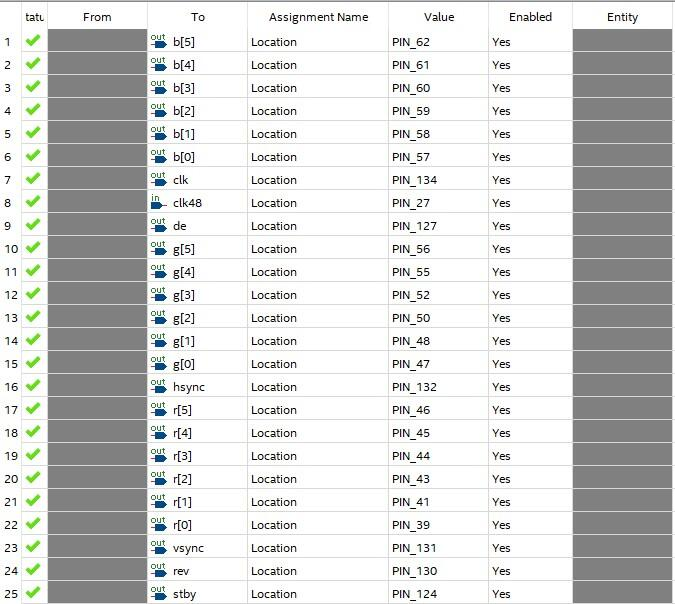
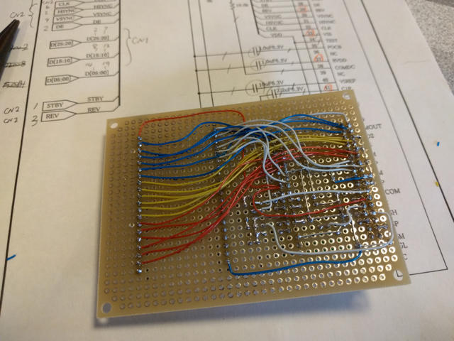
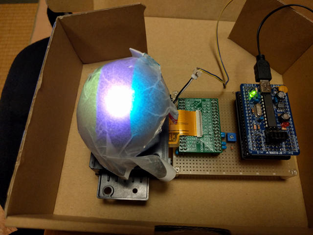

秋月電子の新製品で興味あるデバイスが販売されていました。[ドーム型スクリーン用カラー液晶プロジェクタ（球体液晶・光学表示ユニット）](https://akizukidenshi.com/catalog/g/g110731/)です。詳細な仕様書もあり、信号さえ作れば表示できそうな雰囲気です。

このLCDは色信号をパラレルで入力してVSYNCやHSYNCといった信号を常に流し続ける必要があります。これをFPGAで動かしてみようと思いつきました。ちょうどCQ出版社の[FPGA電子工作スーパーキット](https://www.cqpub.co.jp/hanbai/books/48/48081.htm)の付録のMAX10-FB FPGA基板がありますのでこれが手頃です。

## 実験基板の実装方法の検討

課題がいくつかありました。一つは表示ユニットの接続ケーブルが0.3mmのFPC 67Pという特殊なものであることです。

親切なことに基板用のFPCコネクタは表示ユニットに同梱されていますが、これだけのために基板を起こすわけにもいきません。もう一つは光源となるパワーLEDの定電流電源が必要なことです。

いろいろ調べたところ、[FFC変換基板（0.3mm/67P）](http://www.aitendo.com/product/12179 "FFC変換基板（0.3/67P）")がaitendoから発売されていましたので、これにFPCコネクタをはんだ付けします。かなり細かい作業ですが、ルーペを駆使して、表面実装用のこて先とフラックスでなんとかはんだ付けしました。

現在は[ドーム型スクリーン用カラー液晶プロジェクタ用　ピッチ変換基板](http://akizukidenshi.com/catalog/g/gP-11756/ "ドーム型スクリーン用カラー液晶プロジェクタ用　ピッチ変換基板")が秋月電子から発売されているのでこちらを使うと駆動に必要なコンデンサや抵抗が含まれているのでさらに楽でしょう。(2017.3.25追記）

光源のパワーLEDに使用する定電流電源はストロベリーリナックス社の[LED用定電流ドライバモジュール(70mA～350mA可変)＜降圧型＞](https://strawberry-linux.com/catalog/items?code=13001 "LED用定電流ドライバモジュール(70mA～350mA可変)＜降圧型＞")が表示ユニットの定格である220mAを満たすので、これを使いました。モジュールには半固定抵抗が同梱されていましたが、これは使わずにデータシートのグラフからおよそ200mA付近になるように5.6KΩの抵抗をはんだ付けしました。

表示ユニットに与える電気信号の作成はMAX10 FPGAを使います。FPGAであれば高速な信号も作ることができますし、開発ツール上で信号のシミュレートもできます。仕様書のタイミングチャートに合うように調整もしやすいでしょう。

## MAX10 FPGAのピンアサイン

MAX10 FPGAのピンアサインは以下のようにしました。（2020/5/3追記）

## 実験基板の製作

完成したのが以下の基板です。左側がFFC変換基板、右側はMAX10基板です。

配線面はこんな感じです。

これを球体液晶表示ユニットに取り付けます。光源であるパワーLEDと定電流モジュールの接続は表示ユニットに付属の電源コネクタ用ソケットにリード線で直接はんだ付けしました。

## PLLの設定

MAX10 FPGAに書き込むアプリケーションですが、MAX10本をみながら試行錯誤で作っていきました。PLLで好きなクロックが作れるとのことでしたので、表示モジュールの仕様書にあるCLK 6.75MHzを作成し、このCLKをベースとしてカウントしながら必要なタイミングで信号をON/OFFします。

PLLの設定は以下の通りです。（2020/5/4追記）

画像データはRGBのパラレル入力ですが、まずは単純に縦方向のカウント数でR,G,Bの色データを設定するようにしました。うまく動けばこれでカラーストライプが表示されるはずです。

今回ベースとしたソースはMAX10本のPROJ\_COLORLED2です。作成したソースは[github](https://github.com/kanpapa/max10/tree/master/PROJ_GROVELCD "PROJ_GROVELCD")におきました。このソースに加えてPLLの作成も必要です。

## 球体スクリーンの製作

あとはスクリーンです。球体のスクリーンをどう作ろうかと思って回りを見渡すと、ちょうど良いものがありました。愛用のトラックボールの球がちょうどいい感じです。これを半透明の紙をあててドーム状にしました。

## 球体液晶の動作確認

FPGAにアプリケーションを書き込んで、電源を投入すると眩しい光源の下にやや色がついたLCDが見えました。そこにドーム状のスクリーンを載せたところ・・・。

カラーストライプがドームスクリーンに表示されました。

いまのところ固定パターンしか表示できませんが、MAX10にRAMを半田付けして表示データをおけばさらに面白くなりそうです。RAMのアクセス方法はこれから勉強です。

追記：このあと[画像を表示して動かしてみました。](https://kanpapa.com/2016/07/akizuki-globe-lcd-miku.html "秋月電子の球体液晶ユニットで画像を動かしてみた")
