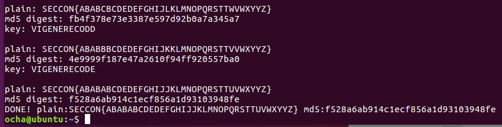

SECCON 2016 オンラインCTFに参加しました。  
[前回](https://kanpapa.com/2015/12/seccon-ctf-2015-online-write-up.html "SECCON CTF 2015")同様一人チームでのんびり取り組みましたが、今回は前回までとは違って難易度がかなり高くなったと感じました。誰でも解ける練習用問題もありませんでしたし・・・。  
結局解いた問題は２つだけです。合計で200点獲得できました。

- Vigenere (Crypto) 100点 777人が回答済
- VoIP (Forensics) 100点 733人が回答済

忘れないうちにWrite-upを書いておきました。

<!--more-->

### Vigenere (Crypto) 100点

Vigenereとは[ヴィジュネル暗号](https://ja.wikipedia.org/wiki/%E3%83%B4%E3%82%A3%E3%82%B8%E3%83%A5%E3%83%8D%E3%83%AB%E6%9A%97%E5%8F%B7 "ヴィジュネル暗号")のことで、暗号表と鍵を組み合わせて使う暗号のようです。  
このような古典的な暗号の場合は、解読ツールがいろいろあるので探してみましたが、今回のSECCON問題ではフラグに含まれる{}が暗号表に含まれているのでそのままでは使えませんでした。

ただ問題の中に鍵の長さは12文字であること、途中まで平文と暗号文が対応していたので、その部分と暗号表を照らし合わせて鍵の頭の文字はVIGENERであることがわかりました。あと５文字の鍵を見つけなければなりません。この場合はプログラムを書いて総当たりでキーを作って試していくしかありません。フラグのMD5ハッシュ値がありますので、作成した平文をこのハッシュ値と付き合わせればいいでしょう。

結局慣れているCでプログラムを書きました。急いで作ったので汚いプログラムですが、ソースファイルは[github](https://github.com/kanpapa/ctf/blob/master/v.c "v.c")に入れておきました。コンパイルはcc v.c -lcryptoで行なってください。

このプログラムを動かして、無事フラグを取ることができました。

### VoIP (Forensics) 100点

これはpcapが添付されていましたので、WireSharkで読み込みました。VoIPなのでツールバーの「VoIP通話」を選ぶと、ストリームを再生することができました。

聞き取りにくい声ですが、フラグを教えてくれているようです。SECCON{9001???}と聞き取れたのですが、数字の後の３文字がなかなか聞き取れません。これかなと思ったアルファベットを組み合わせて入力しても回答が一致しません。この手の問題であればランダムな英字３文字をフラグにするというのは無いように思います。意味のある英字３文字・・・あ、そういえばこの音声って自動音声応答装置だよなぁ・・「IVR」だ！　ということで無事フラグが取れました。こういう発想もSECCONには必要なんですよね。

### 総評

今回が４回目のSECCON CTFですが、合計200点ということで残念な結果となりました。  
他の問題も手をつけてみたもののなかなか先にすすめず、やはりチームでないと厳しいですね。  
まあ、SECCONは国際大会なのでレベルが高くなるのはやむを得ませんが・・。  
他の参加者の皆様のWrite-Upを参考にして次回に備えたいと思います。  
運営の皆様もお疲れさまでした。
