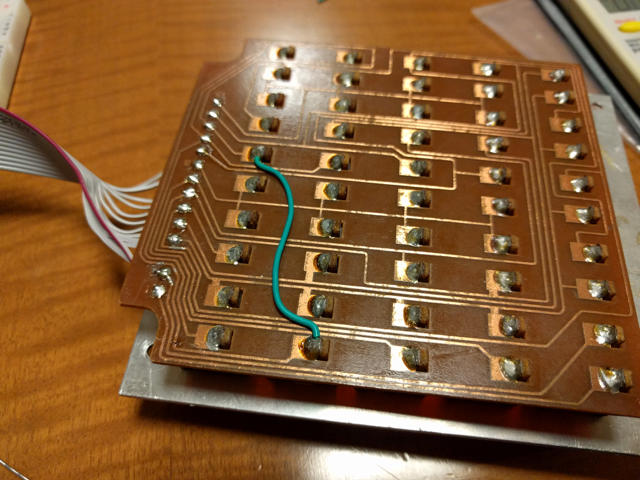
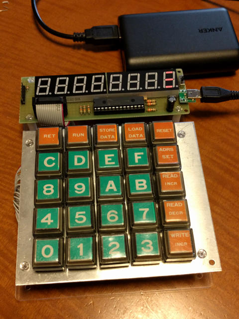
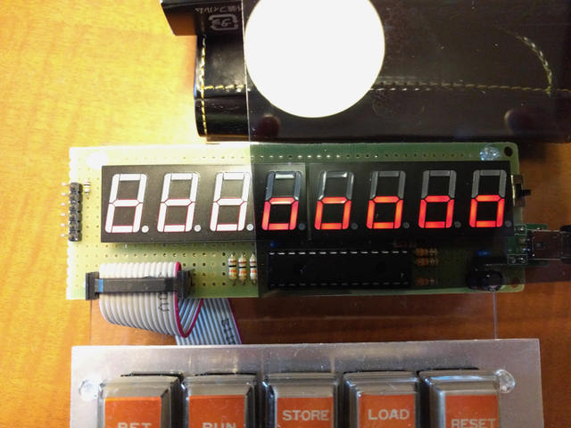
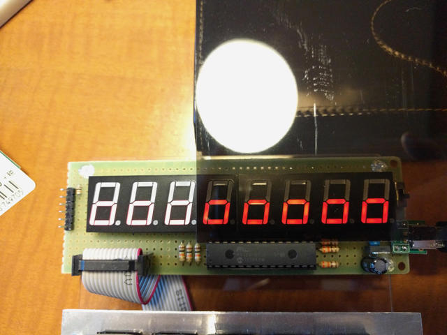
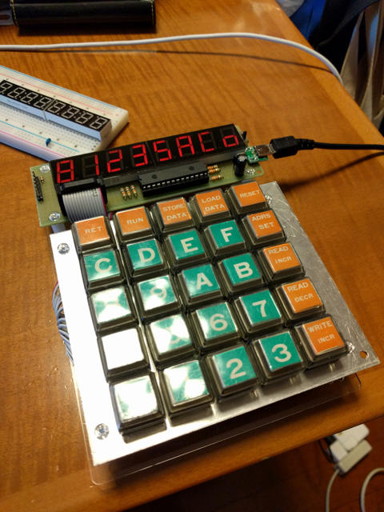

NECの8ビットワンボードマイコンTK-80について調べていたところ、ZK-80 miniというPIC32MX 1チップで実装したTK-80互換機の製作記事をみつけました。PIC32であればTK-80ぐらいの仕組みは作れるとは思っていましたが、実際に動作しているのには感心しました。しかも回路図も非常にシンプルでさすがです。

https://www.rad51.net/blog/mycom/index.php?itemid=883

## 本物のTK-80のキーボードを接続する

この記事をみて、TK-80のキーボードをそのまま保管していたことを思い出しました。実は[工場ハック](https://kanpapa.com/2012/07/factory-hack-summer.html "工場ハック")というイベントで偶然TK-80のキーボードを手にいれていたのです。  
これが使えるとよりTK-80に近い感覚で使えるので、ますます楽しくなるのではと思ったのです。

まずは、ZK-80 miniをブレッドボードで組み立てました。配線は多いように見えますが大したことはありません。

つぎに、TK-80の回路図で確認しながら、TK-80のキーボードをZK-80 miniに接続しました。

動作テストをしてみたところ、RUNキーが動かないのでマイクロスコープで目視したらキーボード基板のパターンが切れていたのでリード線で補修し、正常な動作になりました。

動作している画像をYouTubeにアップしておきました。



## ユニバーサル基板での製作

ひとまず動くようにはなりましたが、ブレッドボードでの配線は仮組みで不安ですので、ユニバーサル基板に載せ替えてTK-80キーボードと組合せて秋月のA基板用透明アクリル板のベースにまとめました。ついでに電源回路を追加してUSB電源で動くようにしました。これならモバイルバッテリーでどこでもTK-80もできます。

最終的な実装はこのようになりました。

ただ、使っていると7セグメントLEDがやや暗く、周囲が明るいところでは手で光を遮らないと文字が読み取れません。

これを解消するには7セグメントLEDにスモーク板を取り付けると見やすくなるのではと、東急ハンズで何種類かのアクリル板と塩ビ板を買ってきて試してみました。

## スモーク板で見やすくする

まずは、アクリル板のブラウンスモーク。くっきりしますね。

アクリル板のブルースモーク。こちらも同様見やすくなります。

塩ビ板(0.4mm厚)の透明スモーク。これもアクリル板と遜色ありません。

このように7セグメントLEDにスモーク板の効果は絶大です。  
今回のおすすめは塩ビ板の透明スモーク。加工がしやすく見やすさもアクリル板とあまり変わりません。厚さも0.4mmと薄いので、7セグメントのLEDのサイズにハサミで加工して完成です。

## コンパクトなTK-80が完成！

これで蛍光灯直下でも見やすくなりました。

ZK-80 miniのPICに書き込むファームウェアのソースコードは公開されているので、ソースを改造して、LOAD/SAVE機能を実装したり、音が鳴るようにしたりとか、拡張してみようと思います。

また、8080をエミュレーションしているところを他のCPUに載せ替えるようなこともできてしまうかもしれませんが、こちらはもう少しPICに慣れないと厳しそうです。
