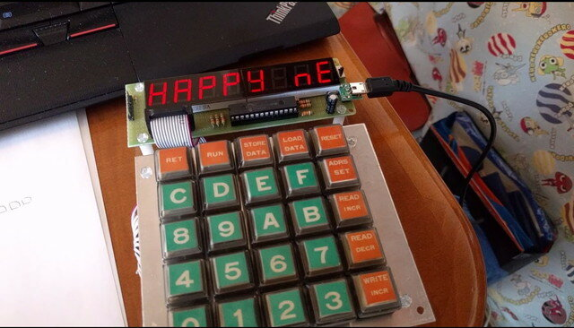

あけましておめでとうございます。新春初プログラミングは8080アセンブラでした。

https://youtu.be/0U\_0NbnFAVU

私は[ZK-80 mini](http://www.recfor.net/blog/mycom/?itemid=883 "ZK-80 mini")で動かしましたが、TK-80でも動くと思います。



プログラムリストは以下の通りです。8000番地から実行してください。

```
;;;;;;;;;;;;;;;;;;;;;;;;;;;;;;;
;; ZK-80 mini(TK-80 compatible)
;; Happy New Year 2017 PROGRAM
;; 2017/1/1 by @kanpapa
;;;;;;;;;;;;;;;;;;;;;;;;;;;;;;;
ORG    8000H
8000: 01 30 80                  START:	LXI	B,SDATA1
8003: 1E 17                     	MVI	E,17H
8005: 21 F8 83                  LOOP1:	LXI	H,83F8H
8008: 16 08                     	MVI	D,08H
800A: C5                        	PUSH	B
800B: 0A                        LOOP2:	LDAX	B
800C: 77                        	MOV	M,A
800D: 23                        	INX	H
800E: 03                        	INX	B
800F: 15                        	DCR	D
8010: C2 0B 80                  	JNZ	LOOP2
8013: CD 1F 80                  	CALL	WAIT
8016: C1                        	POP	B
8017: 03                        	INX	B
8018: 1D                        	DCR	E
8019: C2 05 80                  	JNZ	LOOP1
801C: C3 00 80                  	JMP	START
;;
;; WAIT ROUTINE
801F: C5                        WAIT:	PUSH	B
8020: D5                        	PUSH	D
8021: 16 FF                     	MVI	D,0FFH
8023: 06 00                     WAIT2:	MVI	B,0
8025: 05                        WAIT3:	DCR	B
8026: C2 25 80                  	JNZ	WAIT3
8029: 15                        	DCR	D
802A: C2 23 80                  	JNZ	WAIT2
802D: D1                        	POP	D
802E: C1                        	POP	B
802F: C9                        	RET
;; SEGMENT DATA
8030: 00 00 76 77 73 73 6E 00   SDATA1:	DB	0,0,76H,77H,73H,73H,6EH,0	;; HAPPY
8038: 54 79 7E 00 6E 79 77 50   	DB	54H,79H,7EH,0,6EH,79H,77H,50H	;; NEW YEAR
8040: 00 5B 5C 06 27 00 00 00   	DB	0,5BH,5CH,06H,27H,0,0,0,0	;; 2007
8049: 76 77 73 73 6E 00         	DB	76H,77H,73H,73H,6EH,0		;; HAPPY
END
```
