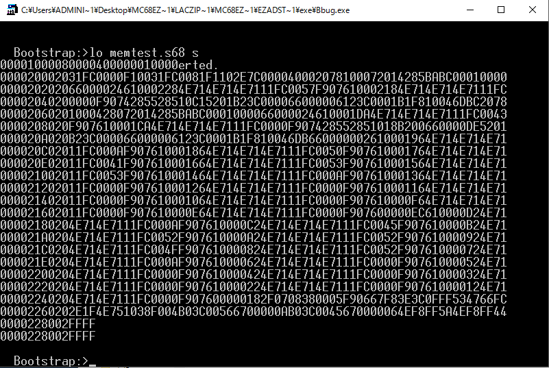

DragonBall-EZ(MC68EZ328)に64KByteのメモリ空間ができましたので何かプログラムを動かしてみます。

ちょうどMC68EZ328ADSTOOLS2\_0.zipの中にメモリテストプログラムがありましたので、これを実行してみます。

今回アセンブラは[EASy68K](http://www.easy68k.com/ "EASy68K")を使いました。実は今回のDragonBall-EZで遊ぶきっかけはこのサイトのフォーラムで知った情報なのです。

ソースコードは少しの修正だけでEASy68Kでアセンブルすることができました。

メモリ空間が0x0000〜0x0FFFFまでですので、データは0x01000〜、プログラム本体は0x02000〜とし、0x04000〜0x0FFFFまでをメモリテストの対象としました。

アセンブルを行って生成したSフォーマットファイルをBBUG.EXEで読み込ませます。

読み込んだあとにプログラムの先頭アドレスの0x2000から実行します。

無事PASSと表示されました。実行後のメモリを見ると昇順に値が書き込まれていることがわかります。

これである程度のプログラムを動かすことができるようになりました。

BBUG.EXEは最低限の機能しかありませんので、この次はもう少し高機能なモニタプログラムを作って動かしてみたいと思います。

あとはフラッシュメモリとかDRAM（残念ながらMC68EZ328はSDRAMは使えません）とかを接続すればモニタを固定して広いメモリ空間を使うことができるはずです。

でも、その前におきまりのLチカをしないといけないですね。
