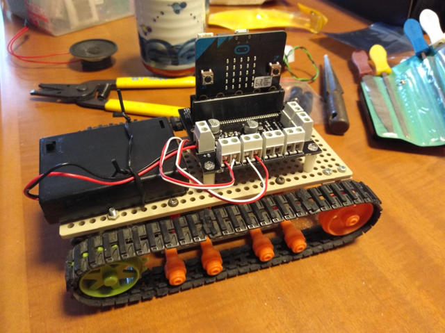

[micro:bitでモーターを制御](https://kanpapa.com/2017/08/microbit-motor-driver.html "micro:bitでモーターを動かしてみた")できることを確認しましたが、この[モータードライバ](https://www.switch-science.com/catalog/3229/ "micro:bit用モータードライバ V2")はモーターを2つ接続することができます。モーターが2つといえばタミヤのキャタピラー車です。早速、タミヤのキャタピラー車にmicro:bitのモータードライバを実装してみました。

<figure>

<figcaption>

dav

</figcaption>

</figure>

モータードライバ基板の取り付け穴とタミヤのプレートの穴は若干ずれますのでリーマーと棒やすりでプレートの穴を少し広げて取り付けました。電池ボックスは適当に針金でくくりつけています。

次にプロジェクトを作ります。せっかくですので、micro:bitの無線機能を使って、無線リモコンにしてみます。私は[micro:bit](https://www.switch-science.com/catalog/3380/ "micro:bit")と[chibi:bit](https://www.switch-science.com/catalog/2900/ "chibi:bit")を持っているのでこの２つを使って、片方はモータードライバ、片方はリモコンとします。

プロジェクトは以下のようになりました。このプログラムをmicro:bitとchibi:bitの両方に書き込みます。

ボタンAを押すと無線で1という数値を送信します。受信側では無線で送られてきた数値を見てモーターを動かします。ついでにLEDに動いている方向を表示させてみました。ボタンAとボタンBを同時に押すと停止します。

プロジェクトをモーター側とリモコン側に分けてもよかったのですが、同じプログラムにしておくことでモーター側のmicro:bitとリモコン側のchibi:bitを差し替えてもそのまま使えるはずです。

なお、[今回作成したプロジェクトを共有](https://makecode.microbit.org/_areabp93UJKU "今回作成したプロジェクト")しておきますので、興味のあるかたは参考にしてください。

早速動かしてみます。今回はchibi:bitをモーター側に、micro:bitをリモコンとして使ってみました。

https://youtu.be/cUEb1i0tbUo

ちゃんと無線制御で動きますね。無線といっても難しいところは隠蔽されていて簡単に扱うことができます。micro:bitは単体ではなく複数で使うとより楽しめると思います。

あとはモーターシールドにはデジタル入力ができる端子がありますので、これを使うとセンサーとかを取り付けて自律走行もできるなずなので、今後試してみたいと思います。
