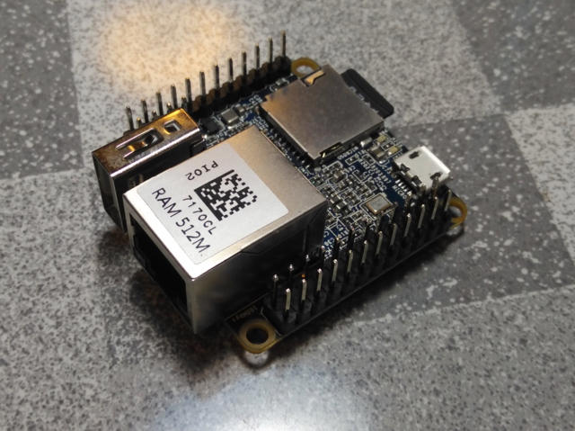
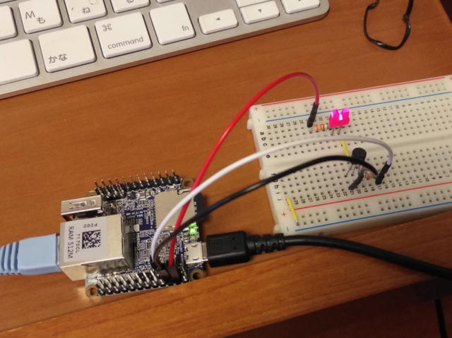

Nano Pi NEOにはGPIOがありますのでLチカをやってみようと思います。まずはGPIOを使うために、ピンヘッダを半田付けしました。



基板が小さいのでうまく固定してから半田付けしないとピンヘッダが曲がってしまいますので要注意です。

さて、GPIOを制御するにはどうすればいいかなと調べてみたところ、Raspberry PiでおなじみのWiringPiのNano Pi版である[WiringNP](http://wiki.friendlyarm.com/wiki/index.php?title=WiringNP:_NanoPi_NEO/NEO2/Air_GPIO_Programming_with_C "WiringNP")というものが用意されていました。早速インストールします。

```
pi@NanoPi-NEO:~$ git clone https://github.com/friendlyarm/WiringNP
pi@NanoPi-NEO:~$ cd WiringNP/
pi@NanoPi-NEO:~/WiringNP$ chmod 755 build
pi@NanoPi-NEO:~/WiringNP$ ./build
```

<!--more-->

次にCでプログラムを書き、コンパイルしてみます。

```
pi@NanoPi-NEO:~/WiringNP$ cd
pi@NanoPi-NEO:~$ mkdir test
pi@NanoPi-NEO:~$ cd test
pi@NanoPi-NEO:~/test$ vi test.c
#include 
int main(void)
{
  wiringPiSetup() ;
  pinMode (7, OUTPUT) ;
  for(;;)
  {
    digitalWrite(7, HIGH) ;
    delay (500) ;
    digitalWrite(7,  LOW) ;
    delay (500) ;
  }
}
pi@NanoPi-NEO:~/test$ gcc -Wall -o test test.c -lwiringPi -lpthread
pi@NanoPi-NEO:~/test$ ls -l 
total 16
-rwxrwxr-x 1 pi pi 8256 Aug  1 08:22 test
-rw-rw-r-- 1 pi pi  195 Jul 31 13:34 test.c
pi@NanoPi-NEO:~/test$
```

コンパイルまでは問題なくできました。

次に先ほど半田付けしたピンヘッダにLEDを接続します。ここでNano Piのスペックを確認したところ、以下の記述がありました。

All pins are 3.3V, output current is 5mA

出力電流は5mAまでということなので、直接LEDをドライブするのではなく、トランジスタでスイッチングすることにしました。回路図はこんな感じになりました。


手持ちの部品で済ませたので、計算値にできるだけ近くなるような部品を使っています。

P4, P6, P7はそれぞれNano Pi NEOの拡張ヘッダのピン番号です。

ブレッドボードにこの回路を組み、Nano Pi NEOに接続し、先ほどコンパイルしたプログラムをsudoをつけて実行します。

```
pi@NanoPi-NEO:~/test$ sudo ./test
```

無事LEDが点滅しました。Raspberry Piと同様に使えそうですね。



他のWiringNPの機能も試してみたいと思います。
