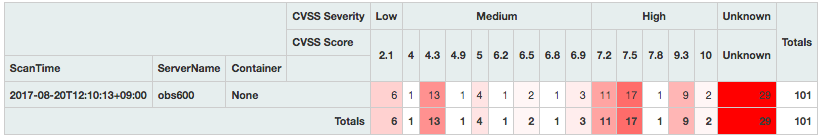
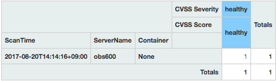

[オープンデベロッパーズカンファレンス2017 Tokyo](https://www.ospn.jp/odc2017/)が近くで開催されていることに当日気づき飛び込み参加してきました。

その中で、「[GitHubスター日次ランキング一位になった脆弱性スキャナVulsの開発の裏側](https://www.ospn.jp/odc2017/modules/eguide/event.php?eid=19)」のセッションを聞き、早速自宅サーバの診断を行ってみました。

また、ちょうど「[What's New in Docker for Developers (2017 Summer ver.)](https://www.ospn.jp/odc2017/modules/eguide/event.php?eid=20)」でDockerについても詳しく聞くことができたのでDockerも使ってみました。

<!--more-->

VlusのすべてはREADME.jaに書いてあるということでしたので、README.jaを読みながら進めました。

まずは、Vulsを動かすサーバの設定です。私の場合はiMacをメインで使っていますので、iMacにDockerをインストールしました。

- [Get started with Docker for Mac](https://docs.docker.com/docker-for-mac/ "Get started with Docker for Mac")

上記のドキュメントにしたがって、サンプルのWebサーバまでを動かして一通り動作確認は完了しました。

次にVulsの設定です。今回はDockerコンテナを使ってみますので、次のドキュメントに従いました。

- [Dockerコンテナ上にセットアップ](https://github.com/future-architect/vuls/tree/master/setup/docker "Vuls Docker components")

手順にしたがってどんどん進めます。まずはgo-cve-dictionaryとvulsのセットアップをします。

```
$ docker run --rm vuls/go-cve-dictionary -v
go-cve-dictionary v0.1.1 b3b5265
$ docker run --rm vuls/vuls -v
vuls v0.3.0 2cec20c
```

次に、各種脆弱性情報をDBに取り込みます。

```
$ for i in `seq 2002 $(date +"%Y")`; do \
> docker run --rm -it \
> -v $PWD:/vuls \
> -v $PWD/go-cve-dictionary-log:/var/log/vuls \
> vuls/go-cve-dictionary fetchnvd -years $i; \
> done
[Aug 19 21:23:54] INFO Fetching... https://static.nvd.nist.gov/feeds/xml/cve/nvdcve-2.0-2002.xml.gz
 1 / 1 [============================================================] 100.00% 7s
[Aug 19 21:24:02] INFO Fetched 6745 CVEs
[Aug 19 21:24:02] INFO Opening DB (sqlite3).
[Aug 19 21:24:02] INFO Migrating DB (sqlite3).
   :
   :
[Aug 20 00:15:08] INFO Opening DB (sqlite3).
[Aug 20 00:15:08] INFO Migrating DB (sqlite3).
[Aug 20 00:15:08] INFO Inserting NVD into DB (sqlite3).
[Aug 20 00:15:08] INFO Inserting CVEs...
 6232 / 6232 [=====================================================] 100.00% 37s
[Aug 20 00:15:46] INFO Refreshed 6232 Nvds.
$
```

これは少し時間がかかりました。夜間に行ったのでネットワークが混んでいたためかもしれません。

次に診断対象を指定するためのconfig.tomlファイルを作ります。

診断対象のサーバーは自宅LANに接続されている[OpenBlockS 600](http://openblocks.plathome.co.jp/products/600/ "OpenBlockS 600")です。CPUはPowerPCとやや古いものですが、debian8.8が稼働しています。

config.tomlは以下のようになりました。

```
[servers]
[servers.obs600]
host = "192.168.100.254"
port = "22"
user = "vuls-user"
keyPath = "/root/.ssh/id_rsa_vuls"
```

診断対象のサーバにリモートアクセスするための、ssh接続用のキーペアは新たに作成しましたが、このときパスフェーズは設定しないようにします。

設定ファイルのkeyPathには"/root/.ssh/id\_rsa\_vuls"とありますが、これはボリューム上のパスですので、iMac側では自分のホームディレクトリ ~/.ssh/に秘密鍵（id\_rsa\_vuls）を置きます。

診断対象のサーバでは、診断に使うアカウントvuls-userを作成し、~/.sshにauthorized\_keysというファイル名で公開鍵を置き、sudo visudoで以下の行を追加しました。このあたりはREADME.jaに載っています。

```
# for vuls
vuls-user ALL=(ALL) NOPASSWD: /usr/bin/apt-get update
Defaults:vuls-user env_keep="http_proxy https_proxy HTTP_PROXY HTTPS_PROXY"
```

次に設定が正常に行われているか確認します。

```
$ docker run --rm -it -v ~/.ssh:/root/.ssh:ro -v $PWD:/vuls -v $PWD/vuls-log:/var/log/vuls vuls/vuls configtest -config=./config.toml
[Aug 20 02:44:54] INFO [localhost] Validating config...
[Aug 20 02:44:54] INFO [localhost] Detecting Server/Container OS... 
[Aug 20 02:44:54] INFO [localhost] Detecting OS of servers... 
[Aug 20 02:44:56] INFO [localhost] (1/1) Detected: obs600: debian 8.8
[Aug 20 02:44:56] INFO [localhost] Detecting OS of containers... 
[Aug 20 02:44:56] INFO [localhost] Checking dependendies...
[Aug 20 02:44:57] INFO [obs600] Dependencies... Pass
[Aug 20 02:44:57] INFO [localhost] Checking sudo settings...
[Aug 20 02:44:57] INFO [obs600] Checking... sudo apt-get update
[Aug 20 02:46:58] INFO [obs600] Sudo... Pass
[Aug 20 02:46:58] INFO [localhost] Scannable servers are below...
obs600 
$
```

設定は問題なさそうです。診断対象のOSがdebian8.8だと認識できていますし、sudoも実行できています。

いよいよ脆弱性スキャンを行います。

```
$ docker run --rm -it -v ~/.ssh:/root/.ssh:ro -v $PWD:/vuls -v $PWD/vuls-log:/var/log/vuls \
> -v /etc/localtime:/etc/localtime:ro -e "TZ=Asia/Tokyo" vuls/vuls scan -config=./config.toml
[Aug 20 12:09:57] INFO [localhost] Start scanning
[Aug 20 12:09:57] INFO [localhost] config: ./config.toml
[Aug 20 12:09:57] INFO [localhost] Validating config...
[Aug 20 12:09:57] INFO [localhost] Detecting Server/Container OS... 
[Aug 20 12:09:57] INFO [localhost] Detecting OS of servers... 
[Aug 20 12:10:00] INFO [localhost] (1/1) Detected: obs600: debian 8.8
[Aug 20 12:10:00] INFO [localhost] Detecting OS of containers... 
[Aug 20 12:10:00] INFO [localhost] Detecting Platforms... 
[Aug 20 12:10:13] INFO [localhost] (1/1) obs600 is running on other
[Aug 20 12:10:13] INFO [localhost] Scanning vulnerabilities... 
[Aug 20 12:10:13] INFO [localhost] Open boltDB: /vuls/cache.db
[Aug 20 12:10:13] INFO [localhost] Scanning vulnerable OS packages...
[Aug 20 12:10:14] INFO [obs600] apt-get update...
[Aug 20 12:35:46] INFO [obs600] (1/46) Scanned libffi-dev-3.1-2+b2 : [{CVE-2017-1000376 50 / ChangelogLenientMatch}]
[Aug 20 12:35:46] INFO [obs600] (2/46) Scanned libexpat1-2.1.0-6+deb8u3 : [{CVE-2017-9233 95 / ChangelogExactMatch} {CVE-2016-9063 95 / ChangelogExactMatch}]
　　　　　:
[Aug 20 12:39:43] INFO [obs600] (44/46) Scanned exim4-base-4.84.2-2+deb8u3 : [{CVE-2017-1000369 95 / ChangelogExactMatch}]
[Aug 20 12:39:46] INFO [obs600] (45/46) Scanned debconf-1.5.56 : []
[Aug 20 12:39:47] INFO [obs600] (46/46) Scanned libc6-2.19-18+deb8u9 : [{CVE-2017-1000366 95 / ChangelogExactMatch}]
One Line Summary
================
obs600 debian8.8 40 CVEs 46 updatable packages
To view the detail, vuls tui is useful.
To send a report, run vuls report -h.
$
```

なにやら、CVEという文字列がみえます。既知の脆弱性が残っているようです。

画面にあるようにレポートを出力してみます。

```
$ docker run --rm -it \
> -v ~/.ssh:/root/.ssh:ro \
> -v $PWD:/vuls \
> -v $PWD/vuls-log:/var/log/vuls \
> -v /etc/localtime:/etc/localtime:ro \
> vuls/vuls report \
> -cvedb-path=/vuls/cve.sqlite3 \
> -format-short-text \
> -config=./config.toml # path to config.toml in docker
[Aug 20 03:50:51] INFO [localhost] Validating config...
[Aug 20 03:50:51] INFO [localhost] cve-dictionary: /vuls/cve.sqlite3
[Aug 20 03:50:51] INFO [localhost] Loaded: /vuls/results/2017-08-20T12:10:13+09:00
obs600 (debian8.8)
==================
Total: 40 (High:17 Medium:14 Low:3 ?:6) 46 updatable packages
CVE-2017-7895 10.0 (High) The NFSv2 and NFSv3 server implementations in the Linux kernel through 4.10.13
　　　　　　：
```

全体で40個の脆弱性がのこっています。そのうちHighは17個もあります。vulsの実行時にapt-get updateは行われるので、最新状態にはなっているはずなのですが。

念のためにVulsRepoも動かしてみます。これでWebブラウザから詳細レポートをみることができるようです。

```
$ docker run -dt -v $PWD:/vuls -p 80:80 vuls/vulsrepo
Unable to find image 'vuls/vulsrepo:latest' locally
latest: Pulling from vuls/vulsrepo
ad74af05f5a2: Already exists 
3d839585b9c7: Pull complete 
　：
946bb0021788: Pull complete 
Digest: sha256:8143147420e9f013eed72da44a026048a50ca38a4f8cf07db294453b58b6943e
Status: Downloaded newer image for vuls/vulsrepo:latest
701b6c431538d8603887367ae828d8276c7c0b2bf675fd035d499d7a92b16c43
$
```

この状態で http://localhost/vulsrepo/ にアクセスすると、以下のような結果が表示されました。



もっと細かい情報も表示できますが、CVSSスコアが10のものも残っていることがわかります。

ここで、診断対象のサーバに apt-get upgrade を行いました。これにより debian8.9となりました。

この状態で再度診断を行ったところ、

```
$ docker run --rm -it \
> -v ~/.ssh:/root/.ssh:ro \
> -v $PWD:/vuls \
> -v $PWD/vuls-log:/var/log/vuls \
> -v /etc/localtime:/etc/localtime:ro \
> -e "TZ=Asia/Tokyo" \
> vuls/vuls scan \
> -config=./config.toml # path to config.toml in docker
[Aug 20 14:14:01] INFO [localhost] Start scanning
[Aug 20 14:14:01] INFO [localhost] config: ./config.toml
[Aug 20 14:14:01] INFO [localhost] Validating config...
[Aug 20 14:14:01] INFO [localhost] Detecting Server/Container OS... 
[Aug 20 14:14:01] INFO [localhost] Detecting OS of servers... 
[Aug 20 14:14:04] INFO [localhost] (1/1) Detected: obs600: debian 8.9
[Aug 20 14:14:04] INFO [localhost] Detecting OS of containers... 
[Aug 20 14:14:04] INFO [localhost] Detecting Platforms... 
[Aug 20 14:14:16] INFO [localhost] (1/1) obs600 is running on other
[Aug 20 14:14:16] INFO [localhost] Scanning vulnerabilities... 
[Aug 20 14:14:16] INFO [localhost] Open boltDB: /vuls/cache.db
[Aug 20 14:14:16] INFO [localhost] Scanning vulnerable OS packages...
[Aug 20 14:14:17] INFO [obs600] apt-get update...
One Line Summary
================
obs600 debian8.9 0 CVEs 0 updatable packages
To view the detail, vuls tui is useful.
To send a report, run vuls report -h.
$ docker run --rm -it \
> -v ~/.ssh:/root/.ssh:ro \
> -v $PWD:/vuls \
> -v $PWD/vuls-log:/var/log/vuls \
> -v /etc/localtime:/etc/localtime:ro \
> vuls/vuls report \
> -cvedb-path=/vuls/cve.sqlite3 \
> -format-short-text \
> -config=./config.toml # path to config.toml in docker
[Aug 20 05:17:37] INFO [localhost] Validating config...
[Aug 20 05:17:37] INFO [localhost] cve-dictionary: /vuls/cve.sqlite3
[Aug 20 05:17:37] INFO [localhost] Loaded: /vuls/results/2017-08-20T14:14:16+09:00
obs600 (debian8.9)
==================
Total: 0 (High:0 Medium:0 Low:0 ?:0) 0 updatable packages
No CVE-IDs are found in updatable packages.
0 updatable packages
$
```

見事に脆弱性が検出されなくなりました。

念のためVulsRepoでも確認してみます。



これでひとまずは安心です。

実はもう一台OBS600があるのですが、そちらもあとでupgradeしておきましょう。

このようにVulsとDockerを使えば簡単に脆弱性診断環境が構築できることが確認できました。

昨日の講義では、次期バージョンの準備を着々と進めていて、様々な新機能や改善が行われたvulsが近日中に公開と聞きましたので、これからも楽しみです。

なかなかOSSの開発に貢献するのはハードルが高いですが、使用レポートだけでも公開することで、OSSコミュニティに貢献できればと思います。
