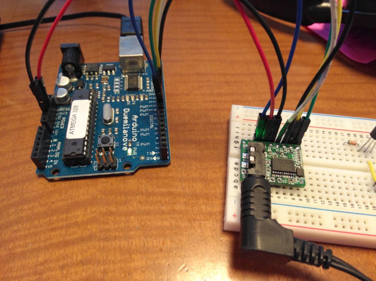

Maker Faire Tokyo 2017でヤマハの[YMF825 FM音源モジュール](https://www.switch-science.com/catalog/3399/ "YMF825 FM音源モジュール")が発売されるとのことで購入してみました。

早速Arduinoに接続して音を鳴らしてみましたが、[GitHub](https://github.com/yamaha-webmusic/ymf825board "ymf825board")のサンプルプログラムでは単調な音色でのドレミファソラシドの繰り返しでした。

 <!--more-->

少し音色を変えたいなとArduinoのサンプルスケッチ（ymf825board\_sample1.ino）とデータシートを見比べたところ、tone\_data\[35\] が音色の情報で、7byte並んでいるところがOperator1〜4の値のようです。

```
void set_tone(void){
  unsigned char tone_data[35] ={
    0x81,　//　header
    //T_ADR 0
    0x01,0x85, ←オクターブの設定とLFO、アルゴリズムの設定
    0x00,0x7F,0xF4,0xBB,0x00,0x10,0x40,  ←Operator1の設定
    0x00,0xAF,0xA0,0x0E,0x03,0x10,0x40,　←Operator2の設定
    0x00,0x2F,0xF3,0x9B,0x00,0x20,0x41,  ←Operator3の設定
    0x00,0xAF,0xA0,0x0E,0x01,0x10,0x40, ←Operator4の設定
    0x80,0x03,0x81,0x80, ←データの終わり
 };
```

7byte並んでいる各行の最後のbyteの上位5bitがwsなので、0x40を0x30とすると矩形波になるはずです。そこで以下のように書き換えてみました。

```
void set_tone(void){
  unsigned char tone_data[35] ={
    0x81,　//　header
    //T_ADR 0
    0x01,0x85,
    0x00,0x7F,0xF4,0xBB,0x00,0x10,0x30,
    0x00,0xAF,0xA0,0x0E,0x03,0x10,0x30,
    0x00,0x2F,0xF3,0x9B,0x00,0x20,0x31,
    0x00,0xAF,0xA0,0x0E,0x01,0x10,0x30,
    0x80,0x03,0x81,0x80,
 };
```

すると予想通りに正弦波から矩形波に変わりました。

もう少しパラメタをいじってピアノっぽくなるような音色にしてみました。

パラメタがわかるようにコメントをかなり追加しています。

```
void set_tone(void){
  unsigned char tone_data[35] ={
    0x81,　// header Header: 1byte(80H + Maximum Tone Number)
    // T_ADR 0
    // Entire Tone Setting
    0x01, // BO (Basic Octave)
    0x43, // LFO,ALG
    //Operator1 Setting 
    0x00, // SR, XOF, KSR
    0xE7, // RR, DR
    0xFF, // AR, SL
    0x9D, // TL, KSL
    0x00, // DAM(amplitude modulation depth), EAM(enable amplitude modulation), DVB(vibrato depth), EVB(enable vibrato)
    0x10, // MULTI(magnification of frequency), DT(detune)
    0x40, // WS(wave shape), FB(FM feedback level)
    // Operator2 Setting
    0x20, // SR, XOF, KSR
    0x33, // RR, DR
    0xE2, // AR, SL
    0x73, // TL, KSL
    0x00, // DAM(amplitude modulation depth), EAM(enable amplitude modulation), DVB(vibrato depth), EVB(enable vibrato)
    0x50, // MULTI(magnification of frequency), DT(detune)
    0x40, // WS(wave shape), FB(FM feedback level)
    // Operator3 Setting
    0x10, // SR, XOF, KSR
    0x41, // RR, DR
    0xD3, // AR, SL
    0x5B, // TL, KSL
    0x00, // DAM(amplitude modulation depth), EAM(enable amplitude modulation), DVB(vibrato depth), EVB(enable vibrato)
    0x10, // MULTI(magnification of frequency), DT(detune)
    0x41, // WS(wave shape), FB(FM feedback level)
    // Operator4 Setting
    0x20, // SR, XOF, KSR
    0x63, // RR, DR
    0xD4, // AR, SL
    0x02, // TL, KSL
    0x01, // DAM(amplitude modulation depth), EAM(enable amplitude modulation), DVB(vibrato depth), EVB(enable vibrato)
    0x10, // MULTI(magnification of frequency), DT(detune)
    0x40, // WS(wave shape), FB(FM feedback level)
    0x80,0x03,0x81,0x80, // End(80H,03H,81H,80H)
 };
```

これで少し音色がよくなったように思います。
