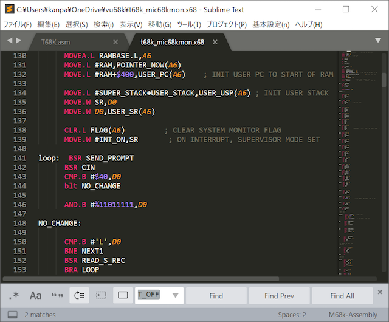
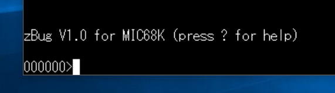
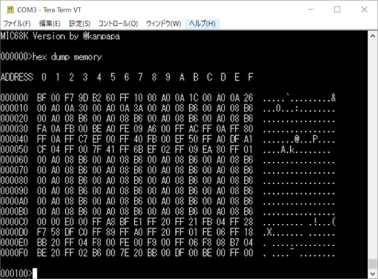

前回の[Hello World編](https://kanpapa.com/2017/10/mic68k-helloworld.html "MIC68KHelloWorld編")では、MIC68KでEPROMに焼いたプログラムを動かして、シリアルポートからHello Worldの文字列を出力させました。今回はこのシリアルポートをコンソールにしてモニタプログラムを実装しますが、ゼロから実装するのは大変なので、他のシステムで使われたモニタプログラムを移植することにしました。Web検索をしてみると次のような手頃なシステムがありました。

- 68kSingle Board Computer （サイトが無くなりました：旧URL http://www.kswichit.com/68k/68k.html）

PLCCの68HC000とか、アドレスデコーダにXilinxのCPLDを使ったりと、MIC68Kよりは新しいデバイスが使われていますが、UARTが6850でありここはMIC68Kと同じです。これで使われているモニタプログラムはzBugという名前で、別ソースとなっている逆アセンブラ部分を除いたソースコードも1300行程度なので移植も容易そうです。ライセンスはGPLv2です。 まずは逆アセンブラの機能を除いた基本部分を移植します。ソースファイルを[EASy68K](http://www.easy68k.com/ "EASy68K")に読み込ませてアセンブルしたところ、アセンブラの文法が異なるため若干修正が必要でした。EASy68Kにもエディタがあるのですが、1300行となると使いなれたものがよいので、[Sublime Text](https://www.sublimetext.com/ "Sublime Text")というエディタを使いました。このエディタはプラグインを使うことで、viエディタのキーバインドにすることや、68000アセンブラを理解して色分けしてくれることもできます。  <!--more-->

MIC68Kのメモリマップに合わせて定数を書き換え、モニタで使われるRAM上のワークエリアも変更しました。もちろんUARTのアドレスもMIC68Kに合わせました。EASy68Kでアセンブルして生成したバイナリをEPROMに焼き込んでリセットしたところ、

無事モニタプログラムが動きました。

メモリダンプも大丈夫のようです。

このままでもモニタプログラムとしては必要最低限の機能は持っているのですが、せっかくなので逆アセンブラも実装してみました。

ここで問題がでてきて、モニタプログラムのソースに逆アセンブラのソースをマージしてアセンブルしたのですが、足りない関数が出てきました。公開されているソースを見直しても一部のソースが無いようです。ソースファイル中に"The portion of code within STAR lines are modified from Tutor source code"という記述があり、この足りない関数はこの"TUTOR"というソースコードを見ればわかるかもしれません。

"TUTOR"というキーワードで探したところ、EASy68Kのページに以下のようなものがありました。

- [Motorola MC68000 Educational Computer Board (MEX68KECB)](http://www.easy68k.com/paulrsm/mecb/mecb.htm "Motorola MC68000 Educational Computer Board (MEX68KECB)")

TUTORとはモトローラ純正の68000教育用ワンボードコンピュータのモニタプログラムだったのです。このページにはオリジナルのソースコードとEASy68Kでアセンブルできるように修正したソースコードがあります。しかし、ソースの行数が8400行もあるので、今回は最初動かしたモニタプログラムをそのまま使うことにしました。

ちなみに、逆アセンブラのソースはこのTUTORから持ってきたものでした。このため不足しているソースはTUTORに含まれていたので、それをマージしてアセンブルすることができました。マージした時点でソースコードは3000行程度になりました。

EPROMに焼く前に、EASy68Kのシミュレータ機能でモニタプログラムの動作確認を行ったところ、赤線で示すように逆アセンブラで定数の表示がおかしいようです。

EASy68Kのトレース機能で追っていったところ、モニタプログラムの関数で使われるレジスタと逆アセンブラが期待しているレジスタが不一致となっていてパラメタの受け渡しがうまくできていませんでした。その部分を修正して動作確認ができました。

EPROMに焼いてMIC68Kに実装したところ、

正しく動作することが確認できました。（追記：zBugのソースは[github](https://github.com/kanpapa/mic68k/blob/master/zbug/zbug_mic68k.x68 "zbug_mic68k.x68")に置きました。）

これで当分EPROMは焼く必要はなくなったので、ROMの内容が消えないように遮光シールをはりました。

これでモニタプログラムの実装が完了しました。

このモニタプログラムを使って残りの周辺デバイスの機能を確認したあとに、先ほどのTUTORのページにあったTinyBASICやFORTHなどのアプリケーションを実装してみたいと思います。
