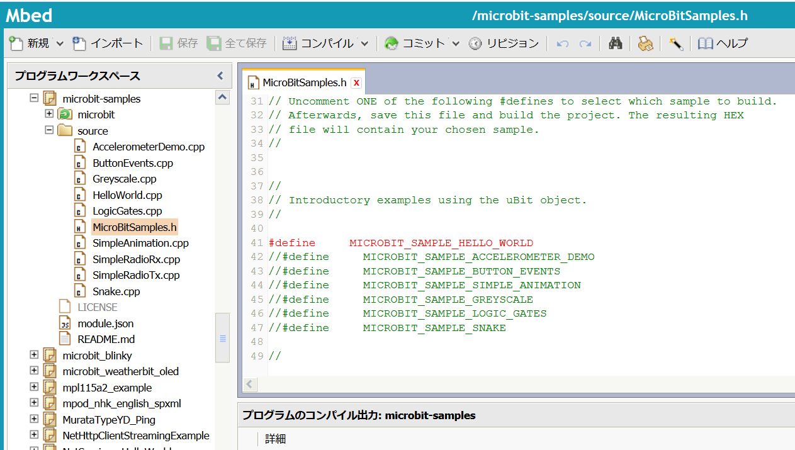

この記事は[microbit Advent Calendar 2017](https://qiita.com/advent-calendar/2017/microbit "microbit Advent Calendar 2017")と[Mbed Advent Calendar 2017](https://qiita.com/advent-calendar/2017/mbed "Mbed Advent Calendar")の17日目の記事です。

micro:bitのプログラムをmbedで開発するには、以下を参照するとよいでしょう。

[https://os.mbed.com/teams/BBC/code/microbit-samples/](https://os.mbed.com/teams/BBC/code/microbit-samples/ "microbit-samples")

このプログラム一式を「Import into Compiler」で自分のワークスペースに取り込んで試すことができます。



microbit-samplesの中にあるsourceディレクトリがmicro:bitの各機能を使用したサンプルプログラムになります。

<!--more-->

複数のサンプルプログラムがありますが、コンパイル対象はMicroBitSamples.hの以下の部分を書き換えて選択します。

```
//
// Introductory examples using the uBit object.
//

#define     MICROBIT_SAMPLE_HELLO_WORLD
//#define     MICROBIT_SAMPLE_ACCELEROMETER_DEMO
//#define     MICROBIT_SAMPLE_BUTTON_EVENTS
//#define     MICROBIT_SAMPLE_SIMPLE_ANIMATION
//#define     MICROBIT_SAMPLE_GREYSCALE
//#define     MICROBIT_SAMPLE_LOGIC_GATES
//#define     MICROBIT_SAMPLE_SNAKE

```

初期値は「#define MICROBIT\_SAMPLE\_HELLO\_WORLD」が指定されていて、Hello\_World.cppがコンパイルされます。

例えば、AccelerometerDemo.cppを試したい場合は、以下のように「#define　MICROBIT\_SAMPLE\_HELLO\_WORLD」をコメントにして、「#define　MICROBIT\_SAMPLE\_ACCELEROMETER\_DEMO」のコメントを外します。

```
//#define     MICROBIT_SAMPLE_HELLO_WORLD
#define     MICROBIT_SAMPLE_ACCELEROMETER_DEMO

```

このようにすれば、AccelerometerDemo.cppの内容がコンパイルされます。

注意すべき点としては、各\*.cppファイルにはmain関数がありますので、どれか１つだけコメントを外すようにしてください。

このサンプルプログラムを組み合わせることで、micro:bitに搭載されている機能を組み合わせることができると思います。
