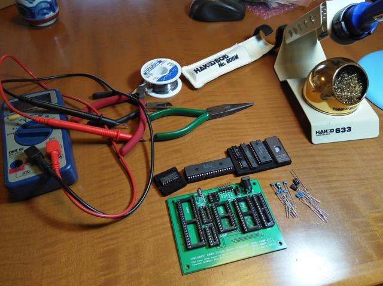
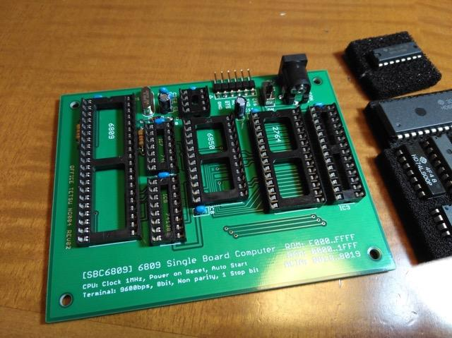
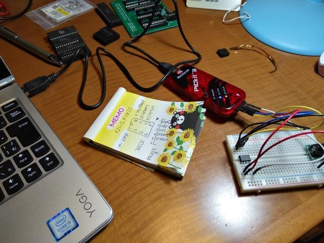

Twitterでスイッチサイエンスさんから[SBC6809ルーズキット](https://www.switch-science.com/catalog/3583/ "SBC6809ルーズキット")が販売されていることを知り早速オーダーしました。

キットといっても基板だけです。あとはマニュアルを見て自分でパーツを集めて組み立てるというものです。

以前、[6802のワンボードコンピュータELIS68](https://kanpapa.com/2016/05/elis68-6802-1.html "6802ワンボードコンピュータELIS68を動かしてみた")を組み立てた時のパーツ集めよりは楽そうです。

手元にはPROM 27256, ACIA 63B50, 74LS00, 74LS138はありました。あとはCPU 6809とRAM 6264(300mil)がありません。その他のパーツは秋月電子で揃うようでした。6809と6264は無事ヤフオクで見つけ、すべてのパーツが揃いましたので早速組み立て開始です。

まずはICチップを除いたすべてのパーツをハンダづけしました。

SBC6809基板は余裕をもって設計されていて、ハンダづけは楽でした。特にブリッジとかは無いと思いますが、念のためICを取り付けない状態で電源を入れ、+5Vラインに+5Vが供給されるかをテスターで確認しました。

次はPICの書き込みです。このPICによって153.6KHzのクロックを作ります。ACIAのシリアル通信のクロックになります。

久しぶりのPIC書き込みだったので、最新の開発ツールをダウンロードして、配布されているHEXファイルを読み込みpickit3で書き込みました。PICとの接続はジャンバー線です。

次は動作確認用のPROMの書き込みです。昔ながらの丸い窓のついた紫外線消去型のPROMを[愛機Pecker-11](https://kanpapa.com/2012/04/avalrom-pecker-112732a.html "Pecker-11")で書き込みます。

配布されているHEXファイルを読み込んでPROMに書き込むわけですが、マニュアルには$8000のオフセットをつけて書き込んでくださいと書かれてあったのに、オフセットを設定せずに書き込んでしまいました。仕方ないので別のPROMにもう一度書き込みました。

配布されているHEXファイルは$E000からコードが配置されているので、実際の27256のROM上では$6000からコードを書き込まれなければなりません。念のためPecker-11のバッファRAMを確認です。

$6000に$10がありますので、間違いないですね。この状態でPROMに書き込みました。

ICの準備ができましたので、SBC6809基板にすべてのICを取り付けます。

この状態で電源をいれ、すかさずICを触って異常に熱くなっているものが無いか確認しましたが、特に問題なさそうです。

PICが正常に動いているかを確認するために出力端子にポケットオシロスコープを接続し、波形と周波数を確認したところ154KHzでしたので正常に動作しているようです。

次にシリアル端子にUSB-シリアル変換ケーブルを接続し、PCでターミナルを立ち上げて電源を入れました。

ECHOBACK TESTと表示され、ターミナルから入力した文字がエコーバックされました。これで6809CPUが正常に動作していることが確認できました。

今後は動かしたい6809のプログラムをROMに焼くことになりますが、アセンブラとか6809の開発環境の整備から始めないといけません。まずは[簡単なモニタを動かしてみた](https://kanpapa.com/2017/12/sbc6809-monitor.html "6809モニタを動かしてみた")いですね。また楽しみが増えました。
