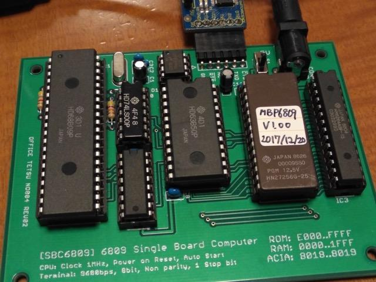

[SBC6809ルーズキットを組み立てて](https://kanpapa.com/2017/12/sbc6809-kit.html "SBC6809ルーズキットを組み立ててみた")無事完成しましたが、いまのところサンプルプログラムしか動きません。次のステップに進むにはモニタプログラムを動かしたいところです。

まずは6809アセンブラの入手です。検索してみたところ次のものをみつけました。

- 6809用アセンブラについて　[http://www.takeoka.org/~take/pds/as09.html](http://www.takeoka.org/~take/pds/as09.html "6809用アセンブラについて")

なんと、太田昌孝氏が作成したもので、junet時代のものでした。

早速macのxcodeでコンパイルしたところ、レガシーなCの書き方のためエラーがでてしまいます。

```
as09 $ make
cc -O -DMC6809   -c -o as68.o as68.c
as68.c:10:7: warning: incompatible redeclaration of library function 'malloc'
      [-Wincompatible-library-redeclaration]
char *malloc(),*strcpy(),*strcat();
      ^
　：
as68.c:989:1: warning: type specifier missing, defaults to 'int'
      [-Wimplicit-int]
printdecimal(n,p)
^
fatal error: too many errors emitted, stopping now [-ferror-limit=]
127 warnings and 20 errors generated.
make: *** [as68.o] Error 1
as09 $
```

そこで、makefileにおまじないを加えます。

```
 CFLAGS = -O -DMC6809
```

を

```
 CFLAGS = -O -DMC6809 -w -Wno-return-type
```

にします。あとはソースで使われているgetline()が標準ライブラリとコンフリクトしていたので、getline1()に関数名を変更しました。

```
as09mac $ diff -rc ../as09/as68.c as68.c
*** ../as09/as68.c    1998-06-28 20:42:17.000000000 +0900
--- as68.c    2017-12-20 20:14:19.000000000 +0900
***************
*** 197,203 ****
      }
  }

! char *getline()
  {    lineptr = linebuf + LINEHEAD;
      return fgets(lineptr,MAXCHAR-LINEHEAD,srcf);
  }
--- 197,203 ----
      }
  }

! char *getline1()
  {    lineptr = linebuf + LINEHEAD;
      return fgets(lineptr,MAXCHAR-LINEHEAD,srcf);
  }
***************
*** 206,212 ****
  {
      initpass();
      while ( !endfile ) {
!         if ( getline() == NULL ) {
              fclose(srcf);
              if ( (srcf = popfile()) == NULL ) break;
              continue;
--- 206,212 ----
  {
      initpass();
      while ( !endfile ) {
!         if ( getline1() == NULL ) {
              fclose(srcf);
              if ( (srcf = popfile()) == NULL ) break;
              continue;
as09mac $
```

これでコンパイルができるようになりました。

```
as09mac $ make
cc -O -DMC6809 -w -Wno-return-type   -c -o as68.o as68.c
cc -O -DMC6809 -w -Wno-return-type   -c -o optab.o optab.c
cc -O -DMC6809 -w -Wno-return-type -o as09 as68.o optab.o
as09mac $
```

ためしにSBC6809ルーズキットに含まれる動作確認用のエコーバックプログラムをアセンブルしてみます。

```
as09mac $ ./as09 TESTPOL9.ASM -o -l
MC6809 cross assembler version 01.00
    5: illegal character in expression
    5: extra garbage
   :
   63: extra garbage

     Total Errors 68
as09mac $
```

残念ながらエラーが大量にでてしまいました。  
やはりソースを直さないとだめかなと念のためアセンブリリストをみたところ、ソースコードの一部に6800のニーモニックが残っていてエラーになっている部分があるようです。このas09は6809のニーモニックしか処理できないので、TESTPOL9.ASMのソースを以下のように書き換えました。

```
as09mac $ diff -rc TESTPOL9.ASM.old TESTPOL9.ASM
*** TESTPOL9.ASM.old    2017-12-21 22:26:47.000000000 +0900
--- TESTPOL9.ASM    2017-12-21 22:39:54.000000000 +0900
***************
*** 11,20 ****
  START    LDS    #STACK
  *
  *    ACIA INITIALIZE
!     LDAA    #$03
!     STAA    ACIACS
!     LDAA    #$15
!     STAA    ACIACS
  *
  *    ECHOBACK TEST
      LDX    #MESG
--- 11,20 ----
  START    LDS    #STACK
  *
  *    ACIA INITIALIZE
!     LDA    #$03
!     STA    ACIACS
!     LDA    #$15
!     STA    ACIACS
  *
  *    ECHOBACK TEST
      LDX    #MESG
***************
*** 24,48 ****
      BRA    LOOP
  *
  *    INPUT CHAR
! INCH    LDAA    ACIACS
      ASRA
      BCC    INCH
!     LDAA    ACIADA
      RTS
  *
  *    OUTPUT CHAR
! OUTCH    LDAB    ACIACS
      ASRB
      ASRB
      BCC    OUTCH
!     STAA    ACIADA
      RTS
  *
  *    OUTPUT STRING
! PDATA    LDAA    0,X
      BEQ    EXIT
      JSR    OUTCH
!     INX
      BRA    PDATA
  EXIT    RTS
  *
--- 24,48 ----
      BRA    LOOP
  *
  *    INPUT CHAR
! INCH    LDA    ACIACS
      ASRA
      BCC    INCH
!     LDA    ACIADA
      RTS
  *
  *    OUTPUT CHAR
! OUTCH    LDA    ACIACS
      ASRB
      ASRB
      BCC    OUTCH
!     STA    ACIADA
      RTS
  *
  *    OUTPUT STRING
! PDATA    LDA    0,X
      BEQ    EXIT
      JSR    OUTCH
!     LEAX    1,X
      BRA    PDATA
  EXIT    RTS
  *
as09mac $
```

このソースコードでアセンブルしてみました。

```
    :
   8 E000                   ORG    $E000
   9                    *
  10                    *    POWER ON SEQUENCE
*** illegal character in expression
*** extra garbage
  11 E000 10CE 1FFF     START    LDS    #STACK
  12                    *
  13                    *    ACIA INITIALIZE
*** illegal character in expression
*** extra garbage
  14 E004 86   03           LDA    #$03
*** illegal character in expression
*** extra garbage
  15 E006 B7   8018         STA    ACIACS
*** illegal character in expression
*** extra garbage
  16 E009 86   15           LDA    #$15
*** illegal character in expression
*** extra garbage
  17 E00B B7   8018         STA    ACIACS
   :
```

as09からエラーメッセージはでているもののコードは正しく生成されていました。

このエラーメッセージですが、ソースファイルの行末コードが$0D $0Aになっていたのが原因でした。以下の手順でソースファイルの行末コードをUNIXの$0Aに修正するとエラーは無くなりました。（2017/12/22追記）

```
as09mac $ perl -pe 's/\r\n/\n/' TESTPOL9.ASM > TESTPOL9.ASM.unix
as09mac $ ./as09 TESTPOL9.ASM.unix -o -l
MC6809 cross assembler version 01.00

     Total Errors 0
as09mac $
```

アセンブル結果のSフォーマットファイルも正しく生成されています。

```
as09mac $ cat TESTPOL9.ASM.o
123E00010CE1FFF8603B780188615B780188EE03DBDE031BDE01CBDE02620F8B68018479C
S123E02024FAB6801939B68018575724F9B7801939A6842707BDE026300120F5390D0A459E
S113E04043484F4241434B20544553540D0A003B2F
S10BFFF8E04FE04FE04FE00090
S9030000FC
as09mac $
```

6809アセンブラの準備ができましたので、このas09でモニタをアセンブルすることにしました。  
モニタも良いものはないか探してみたところ、以下の記事を見つけました。

- MPB6809の製作　[http://www.geocities.jp/wnoy/mpb6809.html](http://www.geocities.jp/wnoy/mpb6809.html "MBP6809の製作")

SBC6809と同様の構成の6809ワンボードマイコンの記事です。シンプルなモニタプログラムのソースも掲載されています。  
これであれば、メモリマップとACIAのアドレスを変えるだけで使えそうです。  
早速ソースコードをSBC6809用に修正します。修正箇所は以下のように３箇所だけです。

```
sbc6809mon $ diff -rc ../mpb6809/MON6809.ASM MON6809SBC.ASM
*** ../mpb6809/MON6809.ASM    2010-11-27 08:13:42.000000000 +0900
--- MON6809SBC.ASM    2017-12-20 20:53:32.000000000 +0900
***************
*** 10,18 ****
  *    F  FILL
  *    C  CONTINUE FROM BREAKPOINT
  *
! ACIACS    EQU    $EFFE
  ACIADA    EQU    ACIACS+1
!     ORG    $F000

  *     I/O INTERRUPT SEQUENCE
  IO    LDX    IOV
--- 10,19 ----
  *    F  FILL
  *    C  CONTINUE FROM BREAKPOINT
  *
! ACIACS  EQU     $8018
  ACIADA    EQU    ACIACS+1
! *    ORG    $F000
!     ORG    $E000

  *     I/O INTERRUPT SEQUENCE
  IO    LDX    IOV
***************
*** 398,404 ****
      FDB    START
  **

!     ORG    $DF80
  IOV    RMB    2    IO INTERRUPT POINTER
  BEGA    RMB    2    BEGINING ADDR PRINT/PUNCH
  ENDA    RMB    2    ENDING ADDR PRINT/PUNCH
--- 399,406 ----
      FDB    START
  **

! **    ORG    $DF80
!     ORG    $1F80
  IOV    RMB    2    IO INTERRUPT POINTER
  BEGA    RMB    2    BEGINING ADDR PRINT/PUNCH
  ENDA    RMB    2    ENDING ADDR PRINT/PUNCH
sbc6809mon $
```

早速アセンブルです。

```
sbc6809mon $ ./as09 MON6809SBC.ASM -o -l
MC6809 cross assembler version 01.00

     Total Errors 0
sbc6809mon $ cat MON6809SBC.ASM.o
S123E000BE1F806E84BE1F866E848E80188603A7848615A784391700AE81302B4481392FB1
S123E0200A81412B3C81462E3880073912170097815326F91700908139272B813126EE7F11
S123E0401F888D338002B71F898D1E8D2A7A1F89270AA784A1842609300120EF7C1F8827B6
　　　：
S123E3205717FDE35F8E1F8F8D308E1F8D8D2B8D29BE1F8D8D247A1F8C26F9BF1F8D53343A
S122E340041F418D153504BE1F8D301FBC1F8426AF8EE26017FDB016FDE4EB8416FD95EC
S10FFFF4E186E000E000E18CE005E12281
S9030000FC
sbc6809mon $
```

正常にアセンブルはできているようです。このSフォーマットのデータをPROMに書き込みます。また、Pecker-11の登場です。


書き込んだPROMをSBC6809に取り付けて電源をいれたところ


見事にモニタの起動メッセージが表示されました。  
メモリダンプをしてみます。


問題なく動くようです。  
これでモニタが実装できましたので、作成したプログラムをロードして実行することができます。  
しばらくはPROMを書き換えることは無いと思いますので、消去防止シールを貼ってPROMを固定しました。



次はFORTHか、BASICかGAME言語かますます楽しみが広がります。
