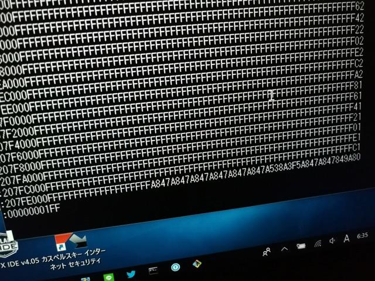

ヤフオクで63B03が載っているマイコンボードを見つけました。このマイコンボードは２枚のCPUボードがDual Port-RAMで結合されて協調して動作するもののようです。価格も安かったので落札しました。

到着したマイコンボードはこんな感じです。

基板の大きさも同じで、40Pのコネクタも同じ位置に配置されていますが、若干構造は違うようです。それぞれのボードが特定の役割を持っているように見えます。

<!--more-->

今回のCPUボードには嬉しいことにROMが載っています。このROMの中身を見ればある程度ハードウェアの推測はできると思われます。それぞれの基板からROMを外して、愛機のPECKER-11でデータを吸い出しました。

吸い出したデータはシリアルでPCに転送します。ダンプしてみるとこんな感じです。

1個目のROMをざっとみたところ、ROMの前半にデータとコードが入っていますが、それ以降のかなりの部分が$FFの連続でした。PROMは書き込む前に紫外線で消去しますが、その際はすべて$FFになりますので、使われていない部分が多いようです。また、ROMの最後に少しデータが書かれていますが、これが割り込みベクタでしょう。最後の２バイトの$9A80がスタートアドレスのようです。このROMはTEXAS 27C256ですので、32Kbyteの容量があります。となると、$8000-$FFFFがこのROMのアドレスと思われます。

2枚目の基板のROMデータも同様な感じでしたが、こちらはデータがかなり詰め込まれていて$FFの連続領域は少なかったです。ここからも2枚のCPUボードの役割がかなり違うことが予想されます。

ROMを読みだしたファイルはIntel-HEX形式になります。これをPCに保存しておき、逆アセンブラにかけることになりますが、63B03の開発環境は持っていないので、まずは開発環境の整備を行います。（[続く](https://kanpapa.com/2018/01/63b03-dual-cpu-disasm.html "63B03デュアルCPUマイコンボードで遊んでみた（２）解析編")）
