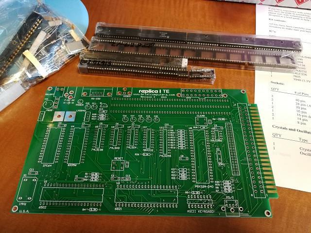

ヤフオクに興味あるキットが出品されていました。その名もreplica 1 TEです。

調べたところ、Apple1の機能を持つ6502コンピュータキットのようです。さすがにApple1は触ったことがないので、ぜひ組み立てて触ってみたいと思い入手しました。

replica 1 TEのページは以下にあります。

[http://www.brielcomputers.com/wordpress/?p=290](http://www.brielcomputers.com/wordpress/?p=290 "http://www.brielcomputers.com/wordpress/?p=290")

現在はもう少しコンパクトになった[replica 1 plus](http://www.brielcomputers.com/wordpress/?p=1152 "replica 1 plus")が販売されているようです。

この[Briel Computers](http://www.brielcomputers.com/wordpress/ "Briel Computers")では様々なレトロなコンピュータのキットを取り扱っているようですので、面白いですね。
