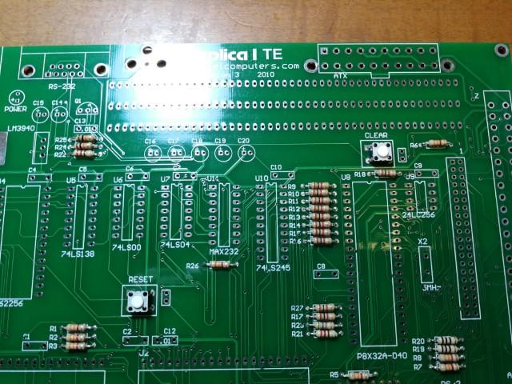
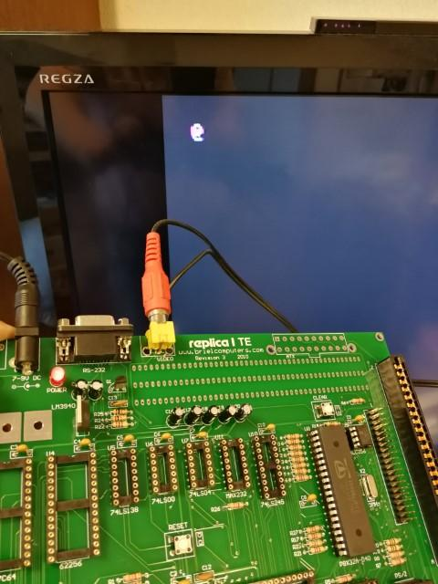

replica1 TE kitのパーツの確認も終わったので、まずは背の低いパーツである抵抗からはんだ付けしていきます。

ICソケット、電源周り、コネクタ類をはんだ付けします。だんだんコンピュータらしくなってきました。

  

欠品の電源スイッチのところはリード線でショートしておきます。

この状態でICは取り付けずに電源をいれてみます。

電源は7V～9Vとありましたので、手持ちの9V DCアダプタを使ってみました。LEDが点灯し電源も5Vがでています。

ここまで動いたのでいったん電源を切り、ICを取り付けていきます。

ここでICピンそろった君の出番です。ICソケットに挿しやすいようにピンをそろえておきましょう。

マニュアル通りに最初はビデオ周りのIC（Parallax Propeller P8X32A-D40と24LC256 EEPROM）だけ載せてビデオ出力の確認を行います。

ビデオ出力をテレビに接続して電源を入れたところ、見事に@が表示されました。

これで6821にシリアル接続され、ビデオ出力とキーボード入力のコントロールを行うPropellerチップは問題なく動作しているようです。

次はすべてのICを取り付けての動作確認に入ります。
