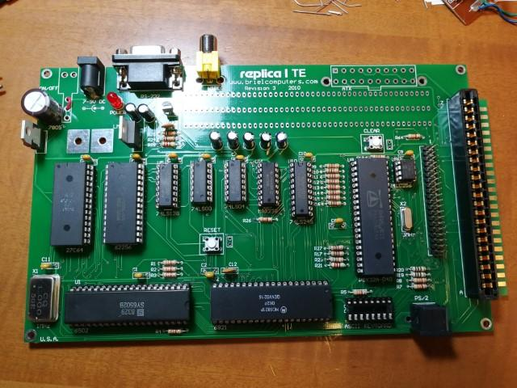
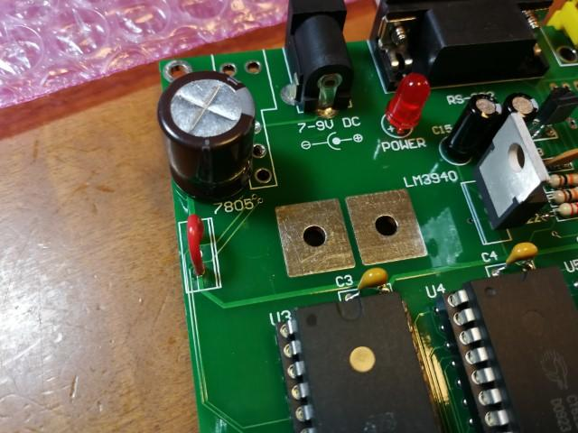
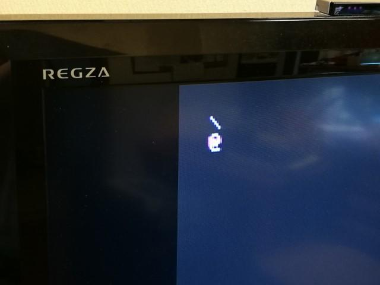

replica1 TEの入出力部は無事動作しましたので残りのICを取り付けます。

ここでTwitterで@airvariableさんから、コメントをいただき大変なことに気が付いたのです。

電源レギュレーターICの7805とLM3940は本来であれば、基板にある２つの四角い穴に寝かせて実装し、基板放熱をするようにしないといけなかったのです。パーツに２本ネジとボルトが入っていたのですが、それはこの基板放熱の実装用でした。

でも、すでにはんだ付けしてしまいました。電源レギュレーターICを買ってきて交換ということもできますが、ここでは発熱が多いと思われる7805はいったん取り外して入力と出力を直結し、電源は5V DCアダプタを使うことにしました。

3.3VのLM3940はそんなに発熱はなさそうなのでこのまま使います。もし熱で壊れたときは、交換するときに基板放熱を行うことにします。

これらの改造を行い以下のようになりました。

この状態で電源を入れ、5Vと3.3Vが問題なく供給されることを確認しました。

ビデオ出力をテレビに接続し、PS/2キーボードを接続したのですが、キーボードを押しても全く反応がありません。どこかショートしているかもと思い、基板をマイクロスコープで見直してみると、１か所ビアとパターンがはんだくずでショートしているところを見つけました。

この部分を修正して電源を投入し、キーボードを押してみると。

マニュアル通りにバックスラッシュ（ \\ ）とアットマーク（＠）が表示されました。

ハードウェアは正常に動作しているようです。

次は実装されているモニタプログラムなどのソフトウェアの動作確認に移ります。
