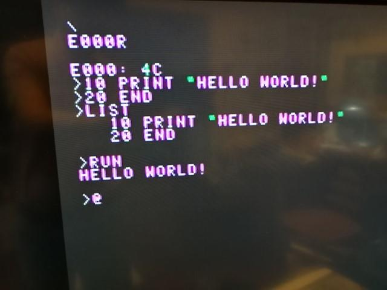
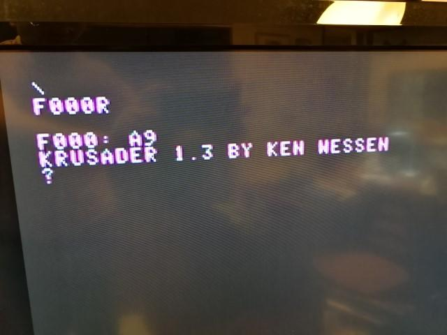

このreplica1 TEのメモリマップは以下のようになっています。

- $0000-$00FF Zero Page RAM

- $0100-$7FFF User RAM Area

- $8000-$8FFF CFFA1(CompactFlash Interface for Apple 1：別売) Scratch Memory

- $9000-$AFFF CFFA1(CompactFlash Interface for Apple 1：別売) Firmware

- $B000-$BFFF 未使用

- $C000-$CFFF Cassette Interface（外部記憶装置のカセットテープI/F：別売）

- $D000-$DFFF PIA I/O Area

- $E000-$EFFF BASIC

- $F000-$FEFF Krusader（アセンブラ）

- $FF00-$FFFF Woz Monitor（モニタプログラム）

replica1 TEに実装されているROMは27C64なので8KB($E000-$FFFF)、RAMは62256なので32KB($0000-$7FFF)となります。

モニタプログラムであるWoz Monitorはなんと256バイトです。ソースコードはAPPLE 1 OPERATION MANUALに掲載され、インターネットにも公開されているのでそちらを見ていただくとして、非常にコンパクトにまとめられています。

早速、WoZ Monitorを使ってみましょう。

アドレスを入力するとそのメモリの内容が表示されます。ここでは$300を見ています。アドレス．(ピリオド)アドレスと入力するとその範囲をメモリダンプします。ここでは$300-$32Fとしました。正常にメモリの内容が表示されているようです。


次にプログラムをメモリに書き込んで動かしてみます。

メモリに値を書き込むにはアドレス：（コロン）値で書き込めます。以下のように入力すれば$300から続けて値をメモリに書き込めます。

```
300： A9 0 AA 20 EF FF E8 8A 4C 23
```

また、アドレスのあとにRと入力すれば、そのアドレスから実行されます。

例えば、300R とすれば $300から実行されます。

これらを実際に入力して実行してみました。


プログラムが動作し、ASCIIコードの文字列が連続して出力されていることがわかります。

次に、BASICを動かしてみます。先ほどのメモリマップにあるように$E000からBASICが実装されていますので、E000RでBASICを起動してみます。



無事BASICも動きました。

残るはアセンブラです。Krusaderという名前のアセンブラは$F000に実装されていますので、F000Rで起動してみます。



Krusaderの起動まではできましたが、本格的にはまだ試していません。時間があるときにじっくり試してみようと思います。

これで一通りのreplica1 TEの動作確認ができました。CFカードとか、カセットテープのインターフェースなどが入手できれば、拡張コネクタに実装して試してみたいものです。
