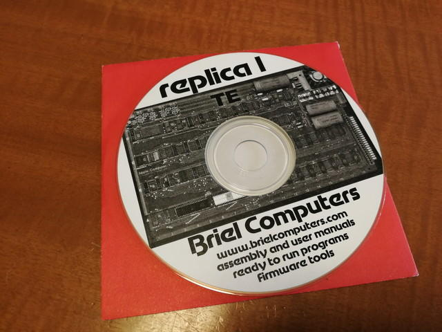
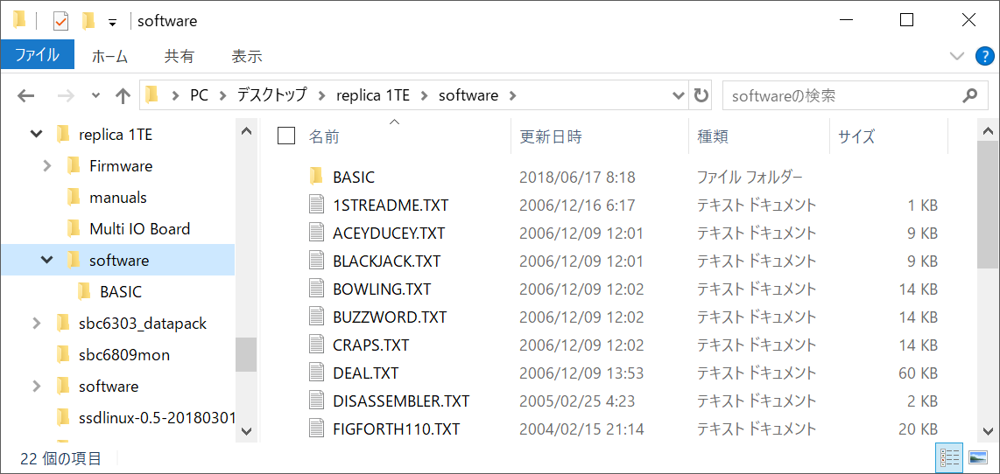
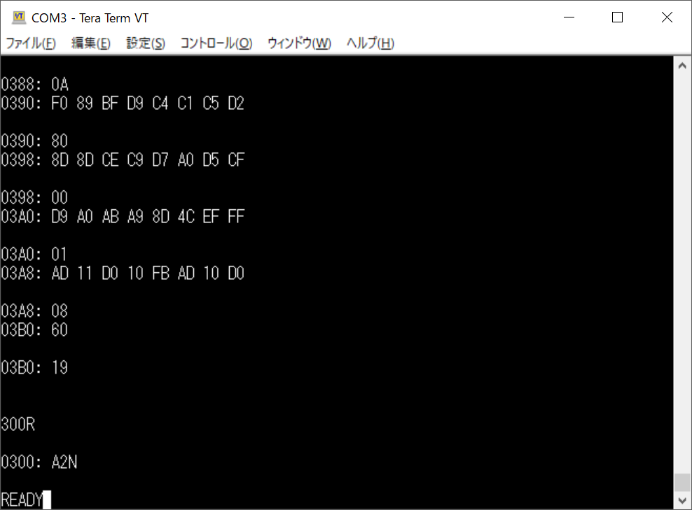
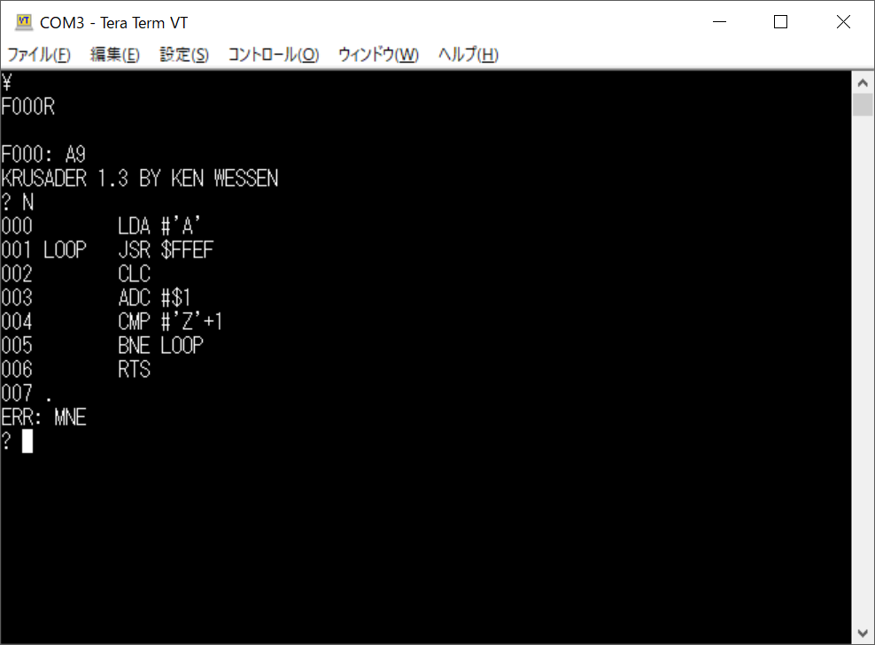

[前回](https://kanpapa.com/2018/06/replica1-te-5.html "Apple1レプリカのreplica1 TEを組み立ててみる（５）")まででハードウェアとソフトウェアの動作確認ができました。

今回はApple1のアプリケーションソフトウェアを動かしてみます。replica1 TEにはCD-ROMが付属していてその中にApple1のアプリケーションが収録されています。

CD-ROMの内容を見てみます。replica1の技術資料やApple1の資料も収録されています。

 <!--more-->

ここに収録されているソフトウェアはテキスト形式です。

この内容を見るとわかりますが、Woz Monitorにそのまま入力できる形になっています。最後に300Rとあるので、自動実行まで行われます。

replica1 TEにはシリアルポートがついています。こちらをターミナルに接続し、これらのテキストをアップロードすれば、そのプログラムが動くという仕掛けです。

早速、USB-シリアル変換ケーブルを使ってPCに接続します。シリアルスピードは2400bpsです。おまけに文字間、改行時にディレイを入れないと取りこぼしてしまいます。このあたりは昔のコンピュータではやむをえないところです。

今回はTeratermを使うので、設定は以下のようにしました。

この状態でreplica1 TEの電源を入れます。シリアルポートがコンソールになりますので、ビデオ出力やPS/2キーボードは使用しません。

電源をいれるとバックスラッシュが表示されます。この状態で先ほどのテキスト形式のプログラムをコピーし、クリップボードから送信します。

キーボードから入力したようにWoz Monitorによってプログラムがメモリに書き込まれていきます。のんびり待ちましょう。

最後までアップロードが終わると自動的に実行されます。

READYと表示されていますが、これは実行したプログラムが出力しています。

今回アップロードしたプログラムはMASTERMINDという簡単なゲームプログラムです。

コンピュータが０～７までの数字からランダムに５桁の数字を作ります。回答者が５桁の数字を入力すると、桁位置と数字が同じ場合は「＋」、桁位置は違って数字が同じ場合は「ー」を表示します。この結果を利用して正しい５桁の数字を当てるというものです。

今回は一番小さいプログラムを動かしたところ、たまたまこのゲームでした。私もやったことがないゲームだったのですが、試してみました。

CD-ROMにはバイナリのプログラムだけでなく、BASICプログラムも多数収録されているようですので、試してみたいと思います。

なお、アップロード機能を使ってアセンブラも試してみました。まずはF000から実行し、Krusaderを起動します。新規ソースを入力するために「N」を入力し、あとはテキストファイルで作っておいたアセンブラソースをアップロードします。

適当な文字を入力して中断し、ソースが入力できているか確認するために「L」を入力してソースリストを表示します。このあと「A」を入力してアセンブルします。アセンブルに成功すると生成されたバイナリファイルのアドレスが表示されます。このあと「R」コマンドで指定したアドレスから実行を行います。

ご覧のように英字の一覧が表示されました。これでも立派なプログラムです。

Apple1でプログラム１つ作って実行するのもなかなか大変な作業だったと思いますが、当時はいろんなアプリケーションを作ってみて、動かすこと自体を楽しんでいたように思います。このような環境を今も作って動かせるというのはやはり面白いですね。
