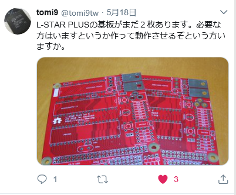
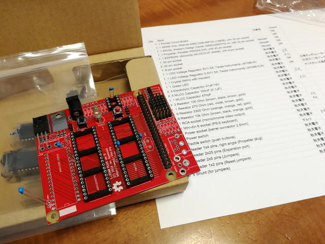
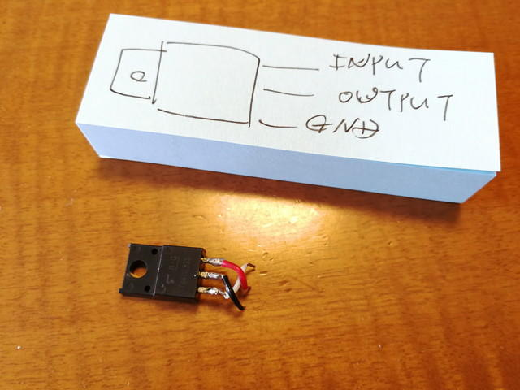
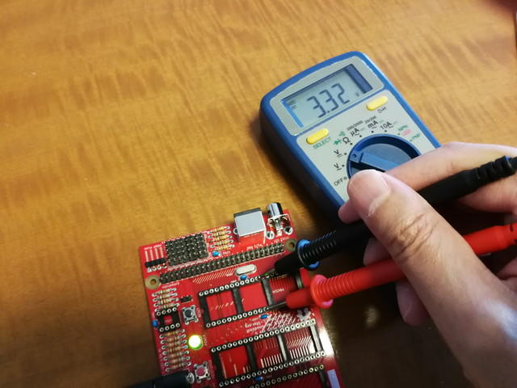

[Replica 1](https://kanpapa.com/2018/06/replica1-te-1.html "Apple1レプリカのreplica1 TEを組み立ててみる（１）")の製作が落ち着いたところで、このようなツイートを見かけました。

この前作ったReplica 1と何となく似ているなと、[L-STAR PLUS](https://www.l-star.org/ "https://www.l-star.org/")について調べたところオープンソースハードウェアとして公開されている6502のマイコンボードで、Replica 1をさらに最適化したボードのようです。早速、製作希望ということで基板を配布いただきました。@tomi9tw様ありがとうございました。

 <!--more-->

Replica 1はキットでしたのでパーツはほぼ揃っていましたが、今回はパーツをすべてそろえなければなりません。リストを作って秋葉原で入手できるものをまずは揃えます。

秋葉原で入手が難しいものは海外に注文しました。今回は以下のパーツを[Mouser](https://www.mouser.jp/ "https://www.mouser.jp/")に発注しました。

- [SRAM chip: Alliance AS6C1008-55PCN (128KB), with 32 pin socket](https://www.mouser.jp/ProductDetail/913-AS6C1008-55PCN "https://www.mouser.jp/ProductDetail/913-AS6C1008-55PCN")
- [65C02: Western Design Center W65C02S6TPG-14, with 40 pin socket](https://www.mouser.jp/ProductDetail/955-W65C02S6TPG-14 "https://www.mouser.jp/ProductDetail/955-W65C02S6TPG-14")
- [Propeller: Parallax P8X32A-D40, with 40 pin socket](https://www.mouser.jp/ProductDetail/619-P8X32A-D40 "https://www.mouser.jp/ProductDetail/619-P8X32A-D40")
- [EEPROM: Microchip 24LC512-I/P (64KB), with 8-pin socket](https://www.mouser.jp/ProductDetail/579-24LC512-I-P "https://www.mouser.jp/ProductDetail/579-24LC512-I-P")
- [Parallax Prop Plug](https://www.mouser.jp/ProductDetail/619-32201 "https://www.mouser.jp/ProductDetail/619-32201")（Parallaxの書き込み機）

発送はUPSのため送料が高かったのですが、送料を払うぐらいならと2台分のパーツとParallax Prop Plug（Parallaxの書き込み機）を注文して送料を無料にしました。

しばらくしてパーツが到着しましたので、組み立て開始です。

基板はReplica 1よりシンプルで製作は容易でした。まずは背の低い抵抗から取り付けます。

順番にパーツを取り付け、はんだ付け完了です。

電源投入前に確認をしていたところ、3.3VレギュレーターICのピン仕様が通常と違うことに気が付いたので、いったん取り外し、プリント基板と正しい接続になるように加工して、接続し直しました。

 

電源を投入する前に気がついてよかったです。テスターで電源電圧の確認です。

電源電圧は問題なさそうです。[動作確認](https://kanpapa.com/2018/07/l-star-plus-build-2.html "L-STAR PLUS（Apple1レプリカ）を動かしてみた（２）")に移ります。
