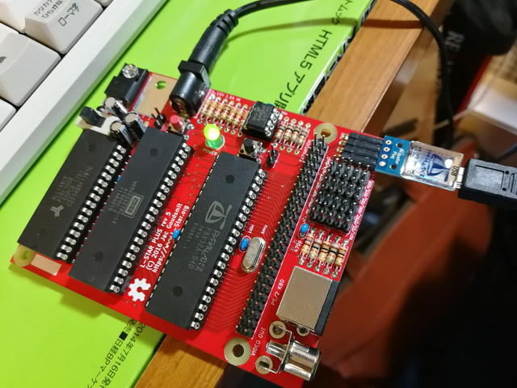
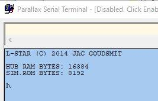
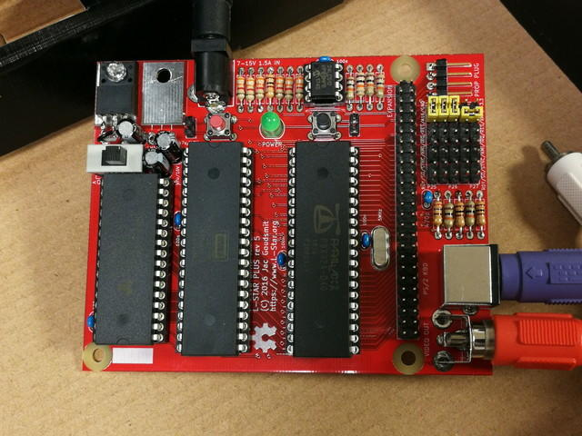

[前回](https://kanpapa.com/2018/07/l-star-plus-build-1.html "L-STAR PLUS(Apple1レプリカ)を動かしてみた（１）")はL-STAR PLUSの基板のはんだ付けと電源ラインの確認まで行いました。続いて、向きを間違えないように注意しながらICソケットにICをとりつけます。

今回はL-STAR PLUSのキットではありませんので、ICにファームウェアが書きこむ必要があります。

そこで[Propeller Tool](https://www.parallax.com/downloads/propeller-tool-software-windows-spin-assembly)とProp Plugを使ってファームウェアを書き込みます。書き込み方法はWebサイト [https://www.l-star.org/](https://www.l-star.org/ "https://www.l-star.org/") や、GitHub [https://github.com/jacgoudsmit/L-Star/](https://github.com/jacgoudsmit/L-Star/ "https://github.com/jacgoudsmit/L-Star/") を参照してください。ちなみに基板はKiCad (4.0.4)で作られたようです。

今回はApple1用のファームウェアを書き込みました。

Prop plugがシリアルコンソールとして動くようなのでこの状態でリセットをして、Propeller Toolのシリアルモニタをみたところ、

無事起動しているようです。

<!--more-->

Replica 1のときと同じようにWoz monitorが動いているようでしたので、メモリの内容を表示してみます。

無事メモリダンプが表示されました。またBASICもReplica 1と同様に動きました。

基本的な部分は動いていることが確認できましたので、次はビデオ出力とキーボードの確認です。

ビデオ出力端子にテレビを接続し、PS/2キーボードを接続しました。

電源を投入すると・・・

見事に文字が表示されました。

キーボードからWoz monitorのコマンドを入力し、メモリダンプを行ったところ正常に表示されました。

これでハードウェア、ソフトウェア共にReplica 1と同等のものになりました。

今回はApple1相当のファームウェアを書き込みましたが、L-STAR PLUSには他にもKimStar、OSI、PET2001（開発中）など様々なファームウェアが準備されているようです。

このように、L-STAR PLUSは、シンプルな構成かつ本物の6502で様々なコンピュータが試せる面白いボードなのでおすすめです。
