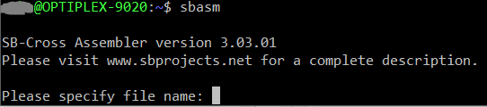

久しぶりに[SB-Projects](https://www.sbprojects.net/ "SB-Projects")のサイトに行ったら[SB-Assembler](https://www.sbprojects.net/sbasm/ "SB-Assembler")が PythonベースのVersion 3になって、新たにAVRやPICをサポートしていてびっくりしました。これまでのSB-AssemblerはDOSベースのため、Windows 64bitで動かす場合は[MS-DOS player](http://takeda-toshiya.my.coocan.jp/msdos/ "MS-DOS player")といったツールを使う必要がありました。 今回、Pythonベースになったことで、UNIX/Mac/LinuxはPython3があればすぐ動きますし、WindowsもWindows用のPython3をインストールすることで使えるはずです。 このSB-Assemblerはディレクティブが少し独特な面もありますが、多数のCPUをサポートしているので便利です。 今回、新しいVersion 3を使ってみました。

ダウンロードはSB-Assemblerの[Download page](https://www.sbprojects.com/sbasm/download.php "Download page")から行います。

私の場合は、Windows10の環境で、WSLを使っていますので、そちらにインストールしました。

### WSLでの環境構築の手順

1. まずブラウザでダウンロードします。
2. ダウンロードしたファイルをWSLのホームディレクトリにコピーします。
3. unzipで展開します。
4. 展開したフォルダの中にあるsbasm本体とsbapackディレクトリを/usr/local/binにコピーします。WSLの場合はsudoを使ってコピーしてください。
5. PATH変数に/usr/local/binが含まれていることを確認してください。
6. python3がインストールされていない場合はsudo apt install python3 でインストールしてください。
7. 環境が整えば sbasm と入力すると以下のように表示されるはずです。 
8. これで環境構築は完了です。

<!--more-->

### SB-Assemblerを使ってみる

サンプルソースとして先日製作したSBC6809 + SBC-I/OのLチカプログラムを使います。オリジナルのソースは[github](https://github.com/kanpapa/sbc6809/blob/master/sbc-io/TESTLED.ASM "TESTLED.ASM")にありますので参照してください。

SB-Assemblerはオーバーレイアセンブラなので、どのCPUをターゲットにするのかディレクティブで指定しなければなりません。どんなCPUをサポートしているか、またCPUごとの注意点などは以下のページにまとまっています。

- [Cross Overlays](https://www.sbprojects.com/sbasm/crosses.php "Cross Overlays")

またその他のディレクティブの書き方も異なるため、ソースを少し修正する必要があります。これについてはディレクティブの説明ページにまとまっています。

- [Directives Index](https://www.sbprojects.com/sbasm/directives.php "Directives Index")

この点は専用のアセンブラと比較するとやや使いにくいかもしれませんが、すでにサポートが打ち切られているアセンブラをDOSベースで使い続けるよりも、サポートが継続されているため安心感があります。

今回は以下のように修正を行いました。WAITがたくさんあって無駄だらけですが、テストプログラムなのでご勘弁ください。

```
* LED TEST for SBC6809 + SBC-I/O
* SB-Assembler
*
        .CR   6809              To load this cross overlay
        .TF   TESTLED.MOT,S19   Motorola S19 format (64 kb range)
        .SF   TESTLED.SYM       Symbol file
*
LED     .EQ   $8000
STACK   .EQ   $DFFF
*
        .OR   $A000
*
START   LDS   #STACK
        LDA   #$00
LOOP    STA   LED
        INCA
        BSR   WAIT
        BSR   WAIT
        BSR   WAIT
        BSR   WAIT
        BSR   WAIT
        BSR   WAIT
        BSR   WAIT
        BSR   WAIT
        BSR   WAIT
        BSR   WAIT
        BRA   LOOP
*
WAIT    LDB   #$00
WAIT2   INCB
        TSTB
        BNE   WAIT2
        RTS

       .EN
```

見ていただくとわかりますが、.CRとか.ORとか頭にドットが付いているところがディレクティブです。あまり見ない形式ですが、難しくはありません。

このソースプログラムをSB-Assemblerでアセンブルしてみます。

### SB-Assemblerでアセンブルする

アセンブルは簡単です。ファイル名を指定するだけです。出力ファイルなどはディレクティブで指定しているので他のパラメタはありません。


今回の場合、アセンブルが完了すると以下のファイルができました。


MOTファイルはモトローラS19フォーマットにしました。ディレクティブの指定でIntel Hexとかにもできます。


正常に生成されているようです。

今回は6809をターゲットにしましたが、他のCPUでも同様にアセンブルすることができると思いますので試してみてください。
