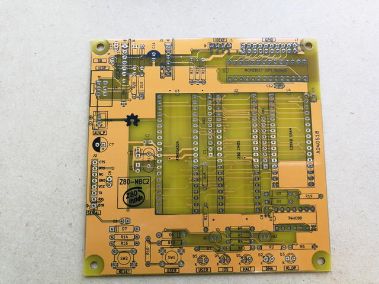
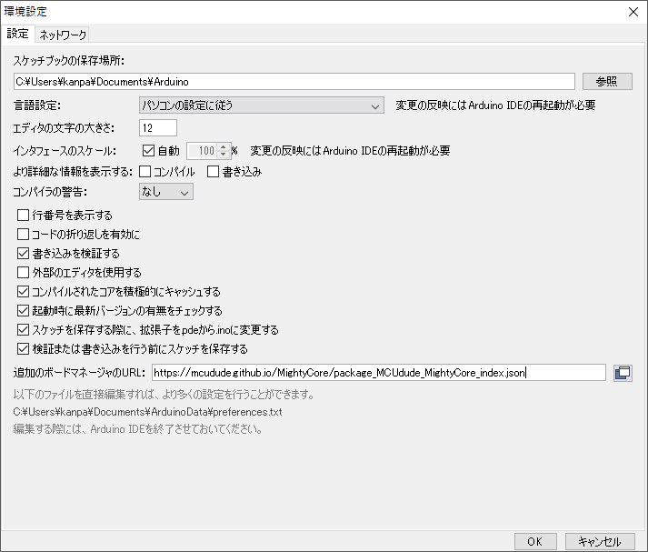
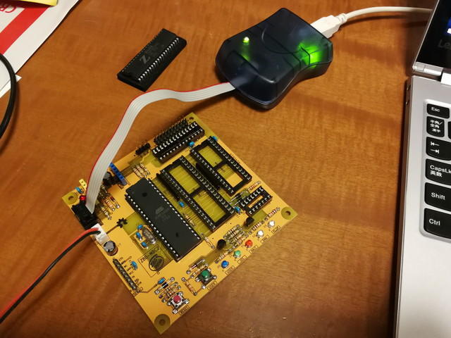
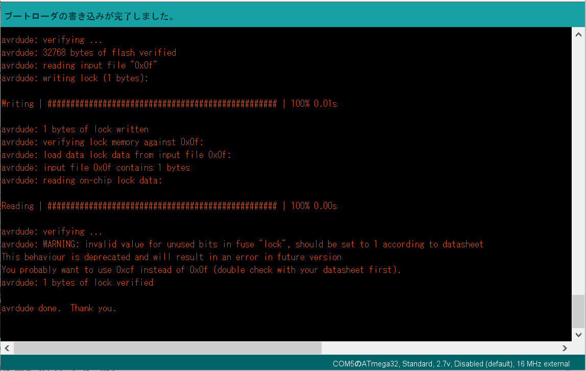
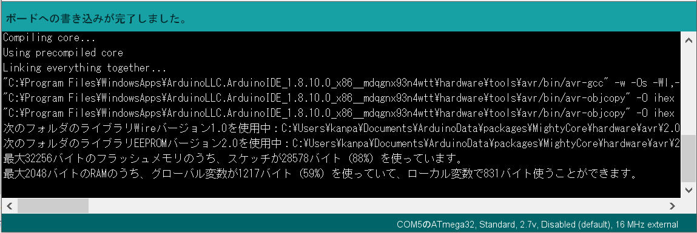
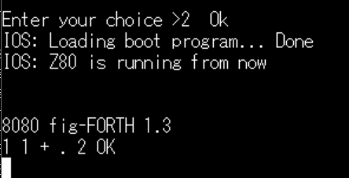

### Z80-MBC2とは

Z80-MBC2というワンボードマイコンがあります。Z80 CPU、メモリ（SRAM）とブートローダーの役割をするATMEGA32、あとは汎用ロジックの74HC00というたった４つのICで構成されています。

公式サイトはこちらです。組み立てに必要なドキュメントやスケッチはこちらから入手できます。

- [https://hackaday.io/project/159973-z80-mbc2-4ics-homemade-z80-computer](https://hackaday.io/project/159973-z80-mbc2-4ics-homemade-z80-computer "Z80-MBC2")

基板はこんな感じです。特徴としてはmicroSDやRTCを接続できるコネクタがあることです。

ATMEGA32の中にはArduinoのブートローダーが書きこまれています。これでArduinoと同じようにスケッチを動かすことができます。そこでZ80のブートローダーとなるスケッチを動かすことで、指定されたプログラムを、Z80のRAMに書き込んでZ80 CPUに制御を渡すことができます。

<!--more-->

### 基板の組み立て

基板を含めた主要なICはオレンジピコさんで購入しました。秋月電子さんやAitendoさんでもある程度は揃えることができます。

早速組み立てていきましょう。まずははんだ付けです。部品表に従ってパーツを集めましたが、私の場合は1N5817は代替品として1S3を使用しました。

はんだ付けが終わった状態です。まだICは取り付けません。

### Arduino IDEの設定

次にATMEGA32にArduinoのブートローダーを書き込みますが、標準のArduino IDEではATMEGA32はサポートしていませんので、以下のgithubにあるMightyCoreをボードマネージャで組み込みます。

- [https://github.com/MCUdude/MightyCore](https://github.com/MCUdude/MightyCore "MCUdude/MightyCore")

インストール方法もこのgithubのページに書かれていますが、簡単にまとめました。

1. Arduino IDEを起動します。
2. ファイルメニューから環境設定を選びます。
3. 設定メニューに追加のボードマネージャのURLの項目に以下のように入力し、OKボタンを押します。  
    　https://mcudude.github.io/MightyCore/package\_MCUdude\_MightyCore\_index.json
    
    
4. ツールメニューからボードを選び一番上にある「ボードマネージャー...」を選択します。
5. 各種のボードが表示されますが、一番最後のあたりにMightyCore by MCUdudeがありますのでこれを選択し、インストールボタンを押します。インストールが完了したら閉じるボタンを押します。  
    
6. この状態で再度ツールメニューからボードを選択すると、MighyCoreが表示されますので、ATmega32を選択してください。ブートローダーやスケッチの書き込みはこの状態で行います。

### ブートローダーの書き込み

基板にATMEGA32のみを取り付けて、ISP端子にAVRISP mkIIを接続し、電源を投入します。

ブートローダーを書き込むを選択すると、以下のような画面が表示されて書き込みが完了します。

### Z80-MBC2のスケッチの書き込み

公式サイトからZ80-MBC2のスケッチをダウンロードして、Arduino IDEに読み込みます。

検証が終わったら、ATMEGA32にスケッチを書き込むのですが、AVRISP mkIIが接続されたままなので、これを使ってスケッチを書き込んでみます。検証・コンパイルをした後に、「書込装置を使って書き込む」を選択します。

正常にスケッチが書き込まれると、スケッチが動き出して緑のLEDが点滅を始めました。

### 動作確認

ここまでで特に問題はなさそうなので、いったん電源を切りAVRISP mkIIを取り外し、他のICも基板に取り付け、シリアルポートにシリアルUSB変換基板を使いPCに接続しました。通信速度は9600bpsです。

再度電源を投入したところ次の画面が表示されました。

ここでBasicを選ぶと・・・

BASICが起動しました。

一旦USERスイッチを押しながらRESETスイッチを押すと、再びIOSに戻ります。

次はForthを動かしてみます。

問題なさそうです。

### 今後の展開

まだ拡張コネクタにはSDカードやRTCは取り付けていません。このあたりはこれからになります。プロジェクトの進行をみながら試してみたいと思います。
