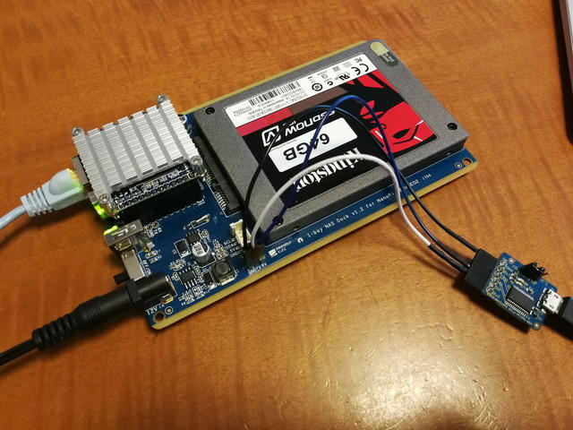
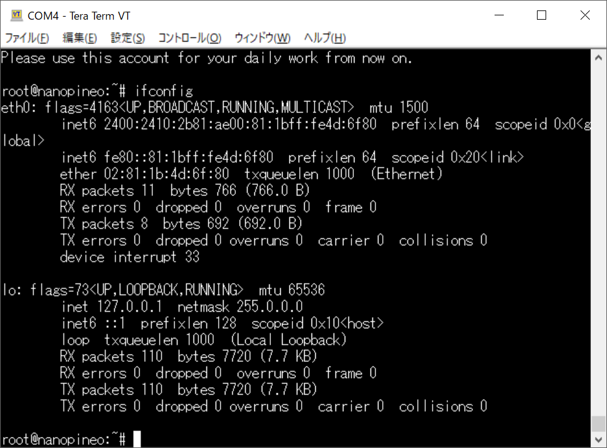
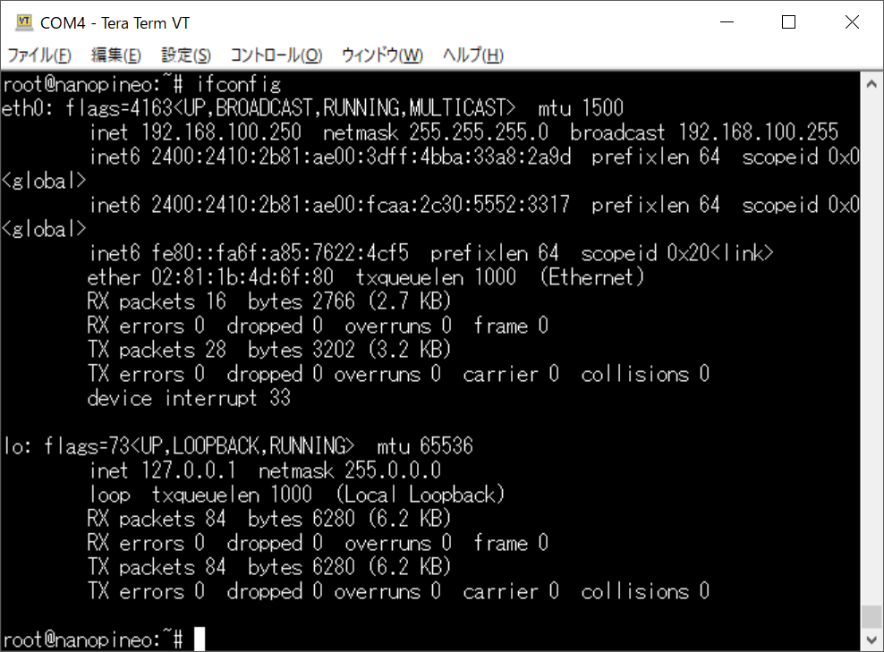
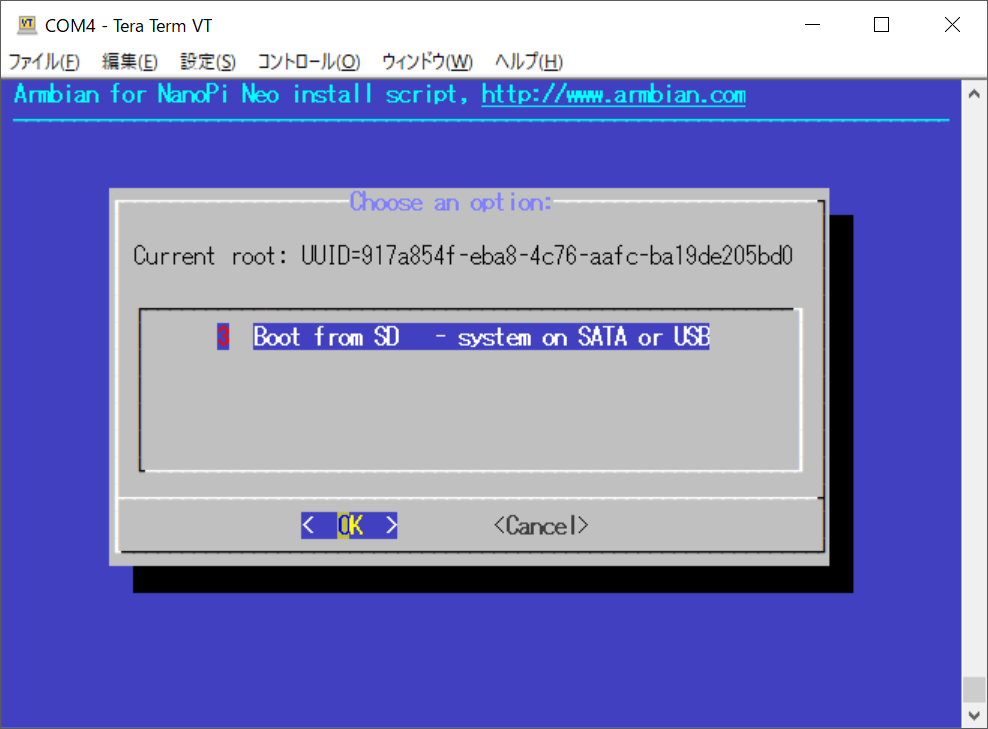
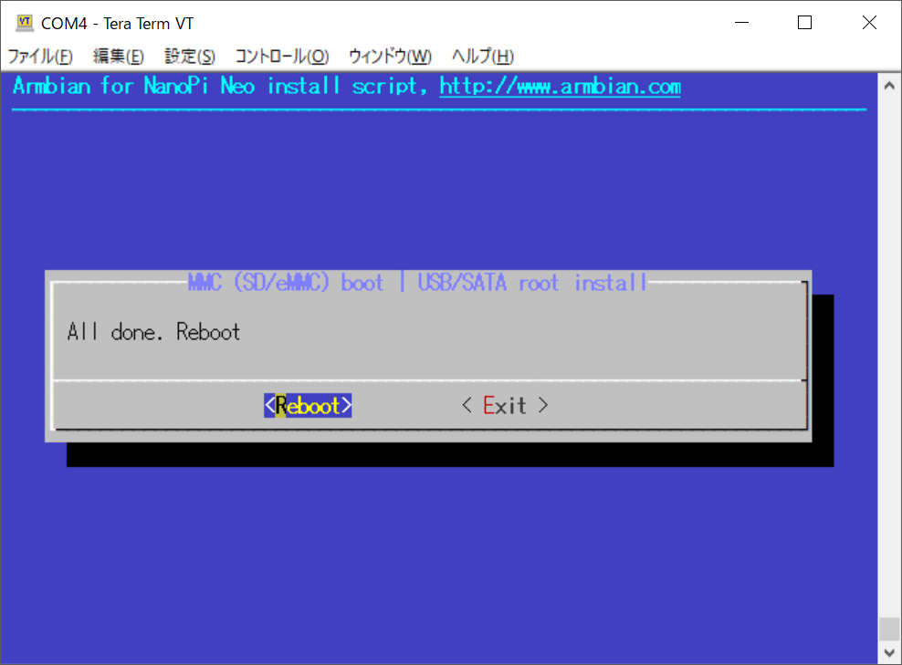
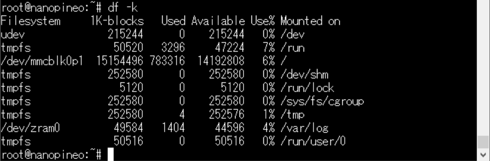
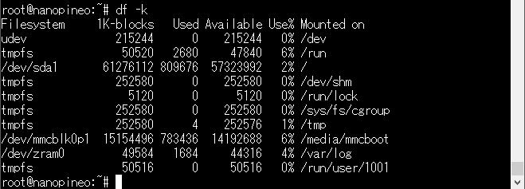

自宅サーバーのOpenblocks AX3の調子が悪いので開発機として使っていたもう一台のAX3と入れ替えました。現状は問題なく動いていますが、こちらも調子が悪くなることを考えて、もう一台自宅サーバーを作っておこうと思います。

以前[Nano Pi NEO NASキット](https://kanpapa.com/2017/11/nano-pi-nas-case-kit.html "Nano Pi NEO用NASケースキットを組み立ててみた")を購入してNASとして使っていましたが、microSDがルートパーティションになっているので自宅サーバーのような長期間にわたる連続運用にはやや不安がありました。いろいろ調べたところarmbianだとルートパーティションを簡単にsataデバイスに切り替えできるということなので試してみました。


## armbianをmicroSDカードに書き込む

[armbianの公式サイト](https://www.armbian.com/ "armbian")からダウンロードします。

今回は[Nano pi NEO / Core 用のArmbian Bionic](https://www.armbian.com/nanopi-neo/ "Nano pi NEO / Core")をダウンロードしました。

7zのファイルなので展開すると、Armbian\_5.59\_Nanopineo\_Ubuntu\_bionic\_next\_4.14.65.img というイメージファイルができますので、これをmicroSDカードに書き込みます。

イメージファイルの書き込みは公式サイトにリンクされていた[Etcher](https://etcher.io/ "Etcher")を使います。このプログラムはSDカードにイメージファイルを書き込む機能に特化しているので簡単につかえます。

Etcherを起動して、書き込むイメージファイルを指定して、書き込み先のSDカードを指定して、実行するだけです。


正常に書き込みが完了すれば、Flash Complete! と表示されます。

## armbianで起動する

armbianを書き込んだmicroSDカードをNano Pi NEOにセットしてNano Pi NEO NASの電源を投入します。しばらくするとNano Pi NEOの青いLEDが周期的に点灯を始めます。armbianが起動したようです。

確認するためにsshでログインしてみますが、なぜか反応がありません。pingも反応なしです。おかしいなとNAS基板にあるシリアルコンソールの端子にシリアルUSBボードを接続しました。



ターミナルを115200bpsに設定したところ問題なくarmbianが起動していました。


では、なぜsshは使えなかったのかというとDHCPサーバからIPv6を取得したようで、IPv6のアドレスしか振られていなかったのです。



これではIPv4で接続できないので、armbian-configを起動して、Networkを選び、IPV6の項目で、IPv6をdisableに変更しました。


再起動してifconfigで確認したところ、IPv4が振られています。



この結果IPv4で問題なくsshログインできるようになりました。

## SSDにパーティションを作成する

次はルートパーティションをSATAデバイスであるSSDに切り替えます。こうすることで常に書き込まれるログファイルをSSDに逃がすことができ、microSDには定常的な書き込みがなくなるはずです。

最初にSSDにパーティションを作成しておきます。これはfdiskコマンドで行います。私の場合は64GBのSSDなので、すべてをLinuxパーティションに割り当てました。


## ルートパーティションをSSDに変更する

次にルートパーティションをSATAデバイスであるSSDに切り替えます。これはnand-sata-installというスクリプトファイルが準備されています。

```
root@nanopineo:~# nand-sata-install
```

コマンドを入力すると次のような画面が表示されます。



ここはそのままOKで進みます。次はどのパーティションをルートパーティションにするか聞いてきますので、選択してOKを押します。入力が終わるとファイルシステムが作成されて、コピーが始まります。


コピーが完了するとRebootするか聞いてきますので、Rebootします。



## ルートパーティションを確認する

Reboot前はルートパーティションがmicroSDカードになっていました。



Reboot後はSSDがルートパーティションに設定できていることが確認できます。



これで長期間の連続稼働も問題ないでしょう。今後AX3の調子が悪くなっても安心です。ただし、CPUパワーがAX3のようにはありませんので、そのうちNano Pi NEO2にでもしてみようと思います。
