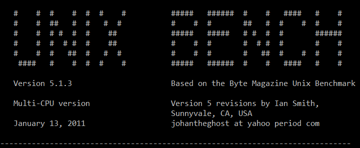
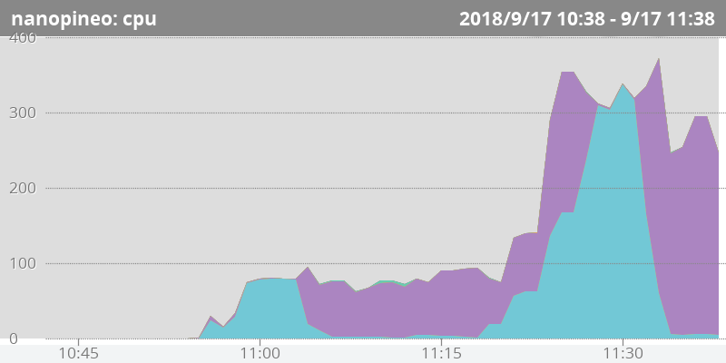
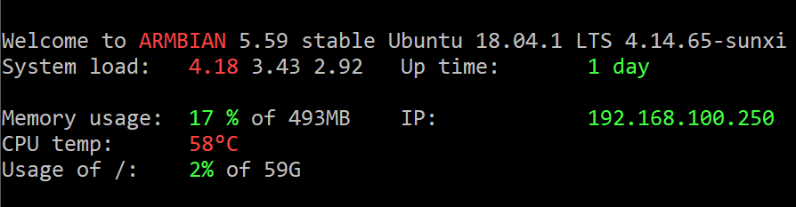
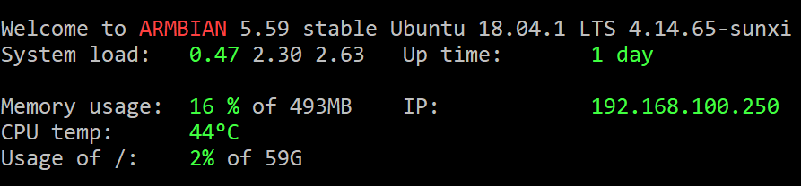

armbianをインストールして順調に稼働している[Nano Pi NEO NASキット](http://akizukidenshi.com/catalog/g/gM-12591/ "Nano Pi NEO NASキット")ベースの自宅サーバーですが、ちょっとした遊びごごろで負荷をかけてみました。使用したソフトウェアはUNIXBENCHです。パッケージはありませんのでコンパイルする必要があります。

```
$ git clone https://github.com/kdlucas/byte-unixbench.git
$ cd byte-unixbench/UnixBench/
$ ./Run
```

コンパイルが終わると、次のような表示になりベンチマークが始まります。

 <!--more-->

ベンチマークが始まりそのまま放っておいたところ、このサーバを監視している [mackerel.io](https://mackerel.io/ "mackerel.io") からアラートがSlackで上がってきました。mackerel.io のダッシュボードで確認したところ、ロードアベレージとCPU負荷が急激に上がっています。  ちょっと大丈夫かなとログインしたところ、CPUの温度が58℃まで上がっていました。  ちょっと怖くなったのでベンチマークを中断したところ、CPU負荷と温度が急速に下がりました。   Nano Pi NEOにはヒートシンクはついていますが、NASのアルミケースに格納されています。アルミケースを外せばもう少し温度は低下すると思いますが、もし壊れては元も子もないのでここまでにしておきます。

ちなみにアイドル時のCPU温度は36℃をキープしています。このくらいだと長時間稼働でも安心ですね。

今回の実験で、万が一自宅サーバの負荷が急に高くなってもサーバ監視でアラートがあがることは確認できたので壊れることは防げるかなと思います。
