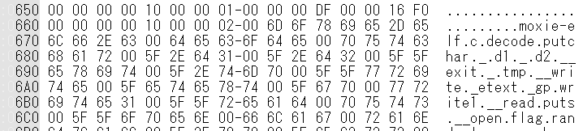

SECCON 2018 オンラインCTFに参加しました。

[去年のCTF](https://kanpapa.com/2017/12/seccon-ctf-2017-online-write-up.html "SECCON 2017 Write-up")[](https://kanpapa.com/2016/12/seccon-ctf-2016-online-write-up.html "SECCON CTF 2016")と同様一人でのんびり取り組んだのですが、今回は回答できた人の人数でどんどん点数が低くなるということで、一人チームでは厳しい状況でした。

解いた問題は２つで、合計で371点獲得できました。

- Unzip 101点 597人が回答
- Special Instructions　270点　61人が回答

忘れないうちにWrite-upを書いておきました。

<!--more-->

### Unzip (Forensics)

unzip.zipというファイルが提供されました。Unzip flag.zip.とのことです。

普通にzipを解いてみたところ、flag.zipとmakefile.sh がでてきました。

次のflag.zip を展開しようとしたところパスワードがかかっています。

makefile.shをみてみると、どうもこのzipファイルのパスワードはファイルを作成した日時のUNIXTIMEが該当するようです。

ファイルの作成日付は、2018年10月27日 0:10:42とのことなので、

```
$ date +%s --date "2018-10-27 00:10:42"
1540566642

```

この数字の前後の値を試してみるとパスワードが一致しました。

### Special Instructions (Reversing)

問題ではrunmeというファイルが添付されていました。

このファイルを実行するとフラグがでてくるようです。

また、「[大熱血！アセンブラ入門](http://kozos.jp/books/asm/ "大熱血アセンブラ入門サポートページ")」で使用しているクロスコンパイル環境がヒントのようです。

まずはこのファイルが何なのか調べます。

```
$ file runme_f3abe874e1d795ffb6a3eed7898ddcbcd929b7be
runme_f3abe874e1d795ffb6a3eed7898ddcbcd929b7be: ELF 32-bit MSB executable,*unknown arch 0xdf* version 1 (SYSV), statically linked, not stripped

```

ELFのようですが、アーキテクチャが0xdfで普通のCPUではなさそうです。

次にreadelfで見てみます。

```
$ readelf runme_f3abe874e1d795ffb6a3eed7898ddcbcd929b7be
ELF Header:
Magic:   7f 45 4c 46 01 02 01 00 00 00 00 00 00 00 00 00
Class:                             ELF32
Data:                              2's complement, big endian
Version:                           1 (current)
OS/ABI:                            UNIX - System V
ABI Version:                       0
Type:                              EXEC (Executable file)
Machine:                           Moxie
Version:                           0x1
Entry point address:               0x1400
Start of program headers:          52 (bytes into file)
Start of section headers:          1936 (bytes into file)
Flags:                             0x0
Size of this header:               52 (bytes)
Size of program headers:           32 (bytes)
Number of program headers:         3
Size of section headers:           40 (bytes)
Number of section headers:         9
Section header string table index: 8

```

これを見る限り[Moxie 仮想CPU](http://moxielogic.org/blog/pages/architecture.html "Moxie Aarchitecture")のELFファイルのようです。

他にヒントがないかなとバイナリダンプをしてみます。



moxie-elf.c という文字が見えます。やはりmoxie CPUのバイナリのようです。

また、バイナリダンプには他にも気になる文字列があったので、stringsしてみると。

```
$ strings runme_f3abe874e1d795ffb6a3eed7898ddcbcd929b7be
,.U7
0123456789abcdef
This program uses special instructions.
SETRSEED: (Opcode:0x16)
RegA -> SEED
GETRAND: (Opcode:0x17)
xorshift32(SEED) -> SEED
SEED -> RegA
GCC: (GNU) 4.9.4
moxie-elf.c
decode
putchar

```

どうやら特別なCPU命令が含まれたELFバイナリのようです。この命令を仮想CPUに実装しないと動かないのだと思います。

これは間違いなく「大熱血！アセンブラ入門」の実行環境のビルドが必要になるということで、急いでWSLのUbuntuにビルド環境を構築しました。

```
$ wget -nd http://kozos.jp/books/asm/cross-gcc494-v1.0.zip

```

コンパイルに時間がかかるので、moxieのアーキテクチャだけコンパイルするようにしました。付属のREADME.txtにそのあたりも書かれていましたので助かりました。

moxieの実行環境でこのバイナリを動かしてみたところ、

```
$ /usr/local/cross-gcc494/bin/moxie-elf-run ~/runme_f3abe874e1d795ffb6a3eed7898ddcbcd929b7be
program stopped with signal 4 (Illegal instruction).
$

```

やはり、未定義命令があるので、途中で停止してしまいました。

普通に考えると実行環境で使っているCPUシミュレータに新しい命令を追加すればよいはずです。

ソースをさがしてみたところ、該当する部分が見つかりましたので、新しい命令を追加します。

今回組み込んだxorshift32の計算方法は[Wikipedia](https://ja.wikipedia.org/wiki/Xorshift "Xorshift")を参考にしました。

```
~/cross-gcc494/toolchain/gdb-7.12.1/sim/moxie$ diff -rc interp.c.org interp.c
*** interp.c.org        2018-10-28 11:15:52.420937700 +0900
--- interp.c    2018-10-28 14:39:13.465745600 +0900
***************
*** 246,251 ****
--- 246,252 ----
int siggnal) /* ignore  */
{
word pc, opc;
+   unsigned int seed; /* seed */
unsigned short inst;
sim_cpu *scpu = STATE_CPU (sd, 0); /* FIXME */
address_word cia = CPU_PC_GET (scpu);
***************
*** 660,667 ****
cpu.asregs.regs[a] = r >> 32;
}
break;
!           case 0x16: /* bad */
!           case 0x17: /* bad */
case 0x18: /* bad */
{
opc = opcode;
--- 661,691 ----
cpu.asregs.regs[a] = r >> 32;
}
break;
!           case 0x16: /* setrseed */
!             {
!               int a = (inst >> 4) & 0xf;
!               unsigned int av = cpu.asregs.regs[a];
!               seed = av;
!
!               printf("a = %08x, av = %08x, seed = %08x\n",a,av,seed);
!               MOXIE_TRACE_INSN ("setrseed");
!             }
!             break;
!           case 0x17: /* getrand */
!             {
!               int a = (inst >> 4) & 0xf;
!               printf("a = %08x, seed = %08x, ",a,seed);
!
!               /* xorshift32 */
!               seed ^= seed << 13;
!               seed ^= seed >> 17;
!               seed ^= seed << 15;
!
!               printf("newseed = %08x\n",seed);
!               MOXIE_TRACE_INSN ("getrand");
!               cpu.asregs.regs[a] = seed;
!             }
!             break;
case 0x18: /* bad */
{
opc = opcode;
~/cross-gcc494/toolchain/gdb-7.12.1/sim/moxie$

```

修正したソースを使ってビルドしたmoxie仮想CPUシミュレータで実行してみると、

```
~/cross-gcc494/build/gdb/moxie-elf/sim/moxie$ ./run ~/runme_f3abe874e1d795ffb6a3eed7898ddcbcd929b7be
a = 00000002, av = 92d68ca2, seed = 92d68ca2
This program uses special instructions.
SETRSEED: (Opcode:0x16)
RegA -> SEED
GETRAND: (Opcode:0x17)
xorshift32(SEED) -> SEED
SEED -> RegA
a = 00000002, seed = 92d68ca2, newseed = 35c36d03
a = 00000002, seed = 35c36d03, newseed = c8fa2132
:
:
a = 00000002, seed = f63e5c0a, newseed = bcd582d5
a = 00000002, seed = bcd582d5, newseed = 9ec62492
SECCON{MakeSpecialInstructions}
~/cross-gcc494/build/gdb/moxie-elf/sim/moxie$

```

無事フラグがでてきました。

### 総評

今回は２問ということでたいしたことはできませんでしたが、大好きな「大熱血！アセンブラ入門」本に関係する問題がでたので、これだけは必ず解くぞという感じで取り組んでみました。仮想CPUに触れるよい機会になりましたし、久しぶりに大規模なビルドをすることもできました。

関係者の皆様ありがとうございました。

また次回もよろしくお願いします。
