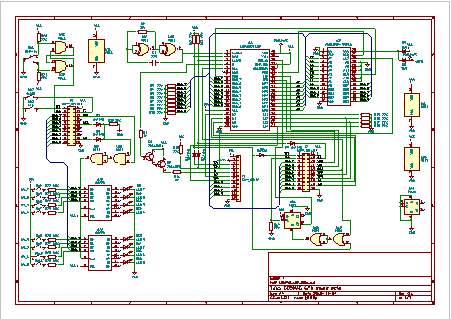
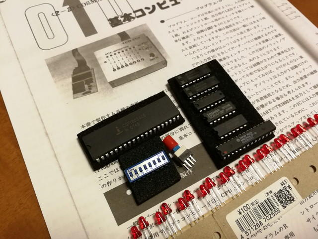

2017年5月の連休に実家の書庫の本を整理したのですが、その時「トラ技別冊　つくるシリーズ７　手作りコンピュータ入門」という本を見つけました。

懐かしい表紙です。1981年5月初版です。この時は本は買ったものの製作までには至らなかったと思います。

<!--more-->

久しぶりに読み返してみると[COSMAC](https://ja.wikipedia.org/wiki/RCA_1802 "RCA_1802 COSMAC")というアーキテクチャを持つCPU CDP1802で基本CPUボードを作り、それに付加回路を接続することで、電子工作の応用例を提示されています。今で言うとArduinoのような使い方ですね。目次を抜粋します。

ミュージック＆マイコン

- 電子オルガン、電子メトロノーム、ラテンボックス、メロディボックス

ハム＆マイコン

- モールスジェネレータ、マイコンキーヤ、ハムコンテスタ

クロック＆マイコン

- ワールドクロック、メモリクロック

などなど

今回製作するCPUボードにはモニタROMなどはなく、CPUのDMA機能にあるLOADモードを使い、プログラムをトグルスイッチだけで入力できる点も特徴です。掲載の回路は極力簡略化して製作がしやすいように配慮されているため、メモリも256byteしか使えませんが、COSMACでどこまでできるのか。私も遊んでみようかなとまずはCPUの調達から始めました。

CPUはAliexpressで容易に購入することができました。最近まで製造もされていたようで、ますます興味がわきました。

購入したCPU CDP1802ACEです。2個で$3.00でしたので、とりあえず4個買いました。

その後、いろいろあってすっかりCPUを買ったことを忘れてしまいました。

1年以上経過した2018年10月にCOSMACについてTwitterでつぶやいたところ、反応が多かったのでパーツ集めを再開することにしました。

掲載されている回路自体はシンプルなのですが、さすがに5101 (256 x 4bit SRAM)はありません。ここの部分は手持ちの6264に置き換えて回路図を起こしました。

集めたパーツはこんな感じです。ICの数も少ないです。今回はブレッドボードで試作を行うため、トグルスイッチではなくDIPスイッチを使いました。プッシュスイッチやスライドスイッチもブレッドボードで使えるものにしています。

作成した回路図に従い少し大きめのブレッドボードに組み上げました。

さて動くかどうか。電源投入は[次の記事](https://kanpapa.com/cosmac/blog/2018/11/rca-cdp1802-cosmac2.html "COSMAC 動作確認編")で。
