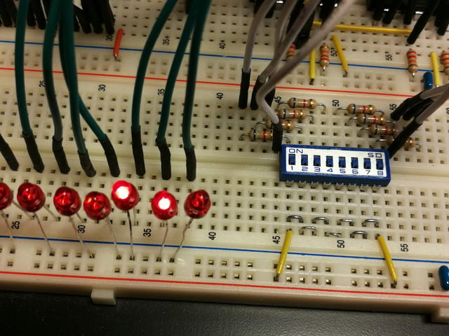
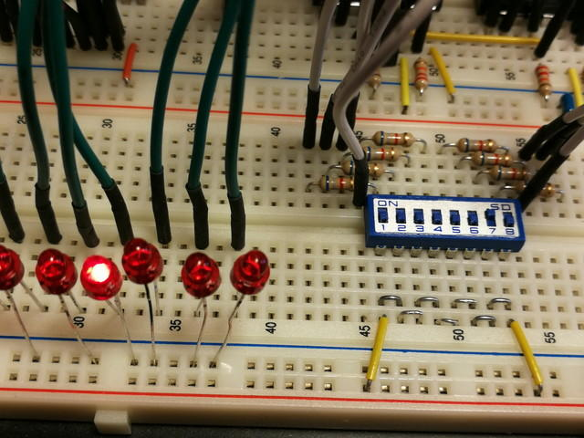
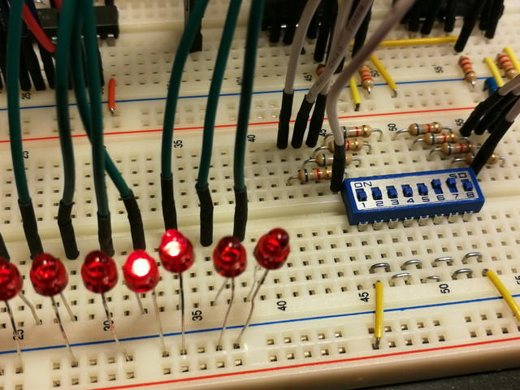

[ひとつ前の記事](https://kanpapa.com/cosmac/blog/2018/11/rca-cdp1802-cosmac3.html "RCA CDP1802 COSMACを動かしてみた(3) アセンブラ編")でアセンブラ開発環境が整いましたので、引き続きサンプルプログラムを実行してみます。

その前に簡単にCOSMACのレジスタの説明です。アキュームレータはDレジスタで8ビットです。何をやるにしてもこのDレジスタを経由して行うことが多いです。R0～RFは16個の16ビットレジスタです。例としてR3レジスタの下位8ビットはR(3).0、上位8ビットはR(3).1と表します。Xは8ビットのインデックスレジスタです。

まずはカウンタプログラムを動かします。R4レジスタをカウントアップしてその値をLEDに表示することを繰り返すものです。

アセンブルリストは以下のようになります。

```
0000- 1 *0000- 2 * Counter program 1 for COSMAC0000- 3 * SB-Assembler0000- 4 *0000- 5            .CR 18020000- 6            .OR $00000000- 7 *0000-F8 31   8 ( 2) START LDI #$31    #$31をDレジスタに入れる0002-A3      9 ( 2)       PLO 3       Dレジスタの内容をR3レジスタの下位8ビットに入れる0003-E3     10 ( 2)       SEX 3       3をインデックスレジスタXに入れる0004-84     11 ( 2) LOOP1 GLO 4       R4レジスタの下位8ビットをDレジスタに入れる0005-53     12 ( 2)       STR 3       Dレジスタの内容をR3レジスタが示すメモリに代入する。0006-61     13 ( 2)       OUT 1       R(X)（ここではR3）レジスタが示すメモリの内容をBUSに出力する。0007-23     14 ( 2)       DEC 3       OUT命令でR3レジスタが1加算されるので、R3レジスタを1減算しておく0008-14     15 ( 2)       INC 4       R4を1加算する（カウントアップ）0009-30 04  16 ( 2)       BR LOOP1    LOOP1にジャンプする。000B- 17000B- 18            .EN
```

実行した結果をYouTubeにアップしておきました。

https://youtu.be/b9bunGEz8RQ?si=TD6UW02by\_WpmATU

<!--more-->

このプログラムで命令を１つ変更するだけで、R4レジスタの下位8ビットの値をLEDに出力していたものが、上位8ビットの値をLEDに出力するようになります。この結果LEDの表示が256倍遅くなります。

```
0000- 1 *0000- 2 * Counter program 2 for COSMAC0000- 3 * SB-Assembler0000- 4 *0000- 5            .CR 18020000- 6            .OR $00000000- 7 *0000-F8 31   8 ( 2) START LDI #$310002-A3      9 ( 2)       PLO 30003-E3     10 ( 2)       SEX 30004-94     11 ( 2) LOOP1 GHI 4        R4レジスタの上位8ビットをDレジスタに入れる。0005-53     12 ( 2)       STR 30006-61     13 ( 2)       OUT 10007-23     14 ( 2)       DEC 30008-14     15 ( 2)       INC 40009-30 04  16 ( 2)       BR LOOP1000B- 17000B- 18            .EN
```

こちらもYouTubeに動画をアップしておきました。

https://youtu.be/tyrP2b0x0OM?si=US\_kdQnF8j20m69F

次は加算プログラムです。トグルスイッチで設定した値に6を加算した数値をLEDに表示します。

```
0000- 1 *0000- 2 * Add program 1 for COSMAC0000- 3 * SB-Assembler0000- 4 *0000- 5 * SW input + 6 -> LED Display0000- 6 *0000- 7            .CR 18020000- 8            .OR $00000000- 9 *0000-F8 0D  10 ( 2) START LDI #IOR    IOレジスタのメモリアドレスをDレジスタに代入する0002-A5     11 ( 2)       PLO 5       Dレジスタの内容をR5レジスタの下位8ビットに代入する。（R5レジスタはIOレジスタのメモリアドレスになる。）0003-E5     12 ( 2)       SEX 5       5をインデックスレジスタXに代入する。0004-6A     13 ( 2) LOOP1 INP 2       BUSの内容をR(X)レジスタ（ここではR5レジスタ）が示すメモリに代入する。0005-F8 06  14 ( 2)       LDI #$06    加算する値である6をDレジスタに代入する。0007-F4     15 ( 2)       ADD         R(X)レジスタ（ここではR5レジスタ）が示すメモリの内容とDレジスタを加算する。0008-55     16 ( 2)       STR 5       Dレジスタの内容をR5レジスタが示すメモリに代入する。0009-61     17 ( 2)       OUT 1       R(X)レジスタ（ここではR5レジスタ）が示すメモリの内容をLEDに出力する。000A-25     18 ( 2)       DEC 5       OUT命令でR5に1加算されるので、1減算して元に戻す。000B-30 04  19 ( 2)       BR LOOP1    LOOP1にジャンプする。000D- 20 *000D-00     21 IOR        .DB 0       IO Register000E- 22000E- 23            .EN
```

DIPスイッチを00000000（10進数で0）にしてこのプログラムを動かすと、LEDの値は00000110（10進数で6）になります。



この状態でDIPスイッチを00000010（10進数で2）とすると、LEDの値は00001000（10進数で8）になります。



さらにDIPスイッチを00000110（10進数で6）とすると、LEDの値は00001100（10進数で12）になります。



このようにDIPスイッチで設定した数に６が加算された数がLEDに表示されます。

これでCPUとプログラムローダー、DIPスイッチによる入力とLEDによる出力表示が正常に動作することが確認できました。

せっかくなので[この回路を基板にして使い勝手を良くしてみよう](https://kanpapa.com/cosmac/blog/2018/12/rca-cdp1802-cosmac5.html "RCA CDP1802 COSMACを動かしてみた(5) 基板発注編")と思います。
