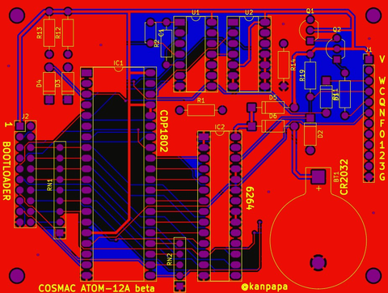
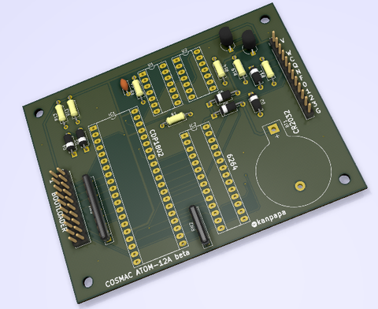

今回[ブレッドボードで作成した回路](https://kanpapa.com/cosmac/blog/2018/12/rca-cdp1802-cosmac4.html "RCA CDP1802 COSMACを動かしてみた(4) プログラミング編")をユニバーサル基板に移してもよいのですが、何枚か作ってみたいのでプリント基板を作ってみます。

参考にしている「トラ技別冊　つくるシリーズ７　手作りコンピュータ入門」でも、感光基板のマスクが付いていて、なるべく簡単に試せるように工夫されています。

私も昔は感光基板を露光し、エッチングをしてミニドリルで穴をあけて片面基板を作っていましたが、今は廃液処理などを考えると基板を発注したほうがよさそうです。

ちょうどKosaka.Lab.出版さんの[「KiCad 5.0入門実習テキスト『KiCad Basics for 5.0』」](https://booth.pm/ja/items/941963 "KiCad 5.0入門実習テキスト『KiCad Basics for 5.0』")も購入したばかりですので、このテキストを見ながら早速KiCadでガーバーデータを作成してみました。今回の基板はCPUボードとプログラムローダーボードに分けています。

ちなみに基板を発注するのは今回が２回目です。無駄なところやおかしなところがあるかもしれませんが、その点は大目にみてください。

COSMAC CPUボードはこんな感じです。秋月電子のB基板とサイズは合わせています。S-RAMのバッテリーバックアップもつけてみました。

プログラムローダーボードはこんな感じです。秋月電子のC基板のサイズに収まったので、V-Cutを試してみました。これで10枚作れます。

今回はKiCadを使いましたので3Dビューアでも見ることができます。実装イメージがつかみやすいですね。

プログラムローダーボードにはトグルスイッチがありますが、3Dイメージが見当たらなかったのでFUSION360を使って図面からモデリングして作成しました。これも楽しかったのでそのうちまとめようと思います。

今回はseeed studioさんの[Fusion PCB](https://www.fusionpcb.jp/ "Fusion PCB")で行っている100\*100mmまでの二層プリント基板が５枚で配送料込みの[$7.9基板セール](https://www.fusionpcb.jp/prototype-pcb-sale.html "$7.9基板セール")で発注しました。

配送に少し時間がかかりますが、楽しみに待ちたいと思います。

基板到着後の製作過程は[次の記事](https://kanpapa.com/cosmac/blog/2019/01/rca-cdp1802-cosmac6.html "RCA CDP1802 COSMACを動かしてみた(6) 基板動作編")で。
