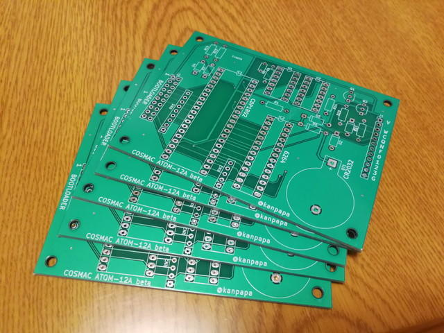
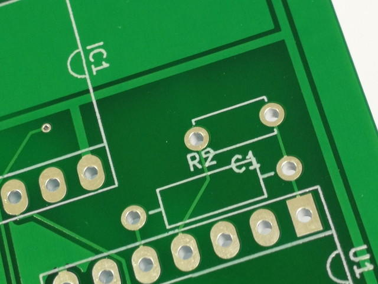
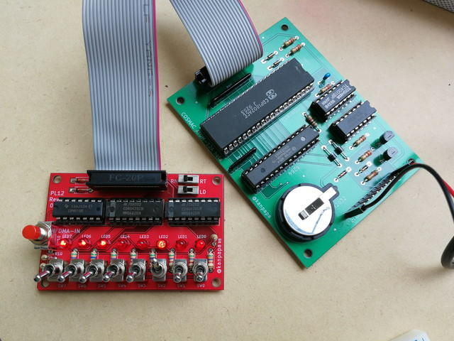

[前回の記事](https://kanpapa.com/cosmac/blog/2018/12/rca-cdp1802-cosmac5.html "RCA CDP1802 COSMACを動かしてみた(5) 基板発注編")で基板を発注してから３週間がたちました。まずはCPU基板が到着しました。

注文通り５枚入っていました。見た目はガーバーデータと同じにできているようです。

でも、よく見るとシルク印刷が重なっているところがいくつかありました。

<!--more-->

もう少し慎重にチェックすればよかったです。次回は気を付けるようにします。

早速パーツをはんだ付けして組み立てました。

その２～３日後にプログラムローダー基板が到着しました。こちらも５枚のはずだったのですが、なぜか９枚入っていました。他にもパンフレットとかしおりとか入っていました。初めてのV-Cutも問題なさそうです。しかし赤い基板はカッコいいですね。

すぐ組み立てたいところですが、トグルスイッチなどパーツをまだ購入していなかったので製作は年明けになりました。

新年の初作業はこのプログラムローダー基板のはんだ付けでした。

以前製作していたCPU基板と今回製作したプログラムローダ基板を20Pのフラットケーブルで接続し、まだICは取り付けずに電源を入れてみました。ここでICのピンに正しく電源が供給されているかを確認します。CPUボードのV端子に+5V、G端子をGNDに接続します。

特に問題なさそうなので、ICを取り付けて動作確認を行いました。

プログラムの入力は次のように行います。

1. ２つあるスライドスイッチの上側をRTにします。これでCPUがリセット状態になります。
2. 下側のスライドスイッチをLDにします。これでLOADモードになり、メモリの０番地から書き込める状態になります。
3. ８つあるトグルスイッチでメモリに書き込むデータの値を設定します。
4. DMA-INの押しボタンスイッチを押してメモリに書き込みます。LEDが書き込んだデータの値になります。
5. 3.4.を繰り返してプログラムを書き込んでいきます。もし途中で間違えたら1.からやり直します。
6. プログラムの書き込みが終わったら下側のスライドスイッチをLDからRNにします。
7. 上側のスライドスイッチをRNにするとプログラムが実行されます。

今回はカウンタプログラムを入力してみました。LEDがスイッチ通りに点灯し、正常にメモリに書き込みができているようです。RUNモードにして実行してみると・・・



見事にLEDが点灯して動作しました。

最後にメモリ保持用のバッテリを取り付けて、メモリ内容が残っていることまで確認できました。

ひとまずこれで完成です。

このあとは、CPUボードの入出力端子を使って書籍に載っていたいろんなものを動かしてみようと思います。
