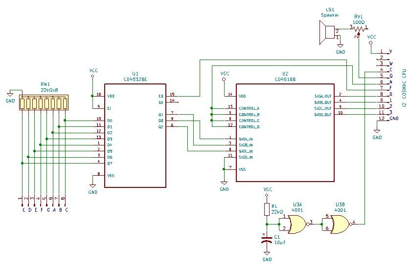
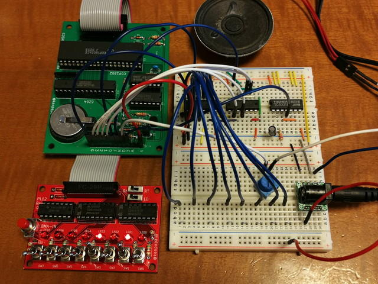
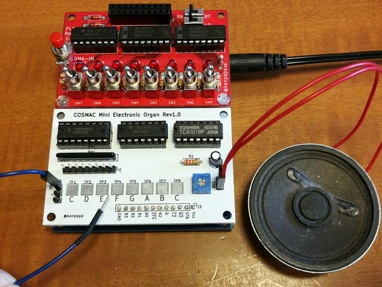

[前回の記事](https://kanpapa.com/2019/02/rca-cdp1802-cosmac7.html "RCA CDP1802 COSMACを動かしてみた(7) 音を出してみる編")ではスピーカーから音を出すところまで行いました。これを応用して電子オルガンを作ってみます。書籍の記事ではプリント基板を製作してもう少し広い音域をカバーしているのですが、ここではブレッドボードを使用して製作するため、音域も回路も簡素化しています。



ブレッドボードで製作した電子オルガンは写真のようになりました。



オルガンの鍵盤がわりにの８つの端子をブレッドボード上に作りました。この端子に5Vのリード線をあてることで音をだします。左からCDEFGABCです。

各端子は4532プライオリティエンコーダに接続され、３ビットのデータを作ります。データが確定したことをEF4端子をLowにすることでCPUに伝え、それをトリガとして、INP命令でN3端子をHighにしてデータを読み込みます。あとは読み込んだデータでパルスのタイミングを調節して該当する音を出すという流れです。

プログラムは以下のようになりました。

```
0000-           1 *
0000-           2 * Electronic organ program 1 for COSMAC
0000-           3 * SB-Assembler
0000-           4 *
0000-           5            .CR 1802
0000-           6            .OR $0000
0000-           7 *
0000-30 0A      8 ( 2) START BR MAIN
0002-           9 * 
0002-23        10      DATA  .DB $23    C
0003-26        11            .DB $26    B
0004-2B        12            .DB $2B    A
0005-31        13            .DB $31    G
0006-38        14            .DB $38    F
0007-3B        15            .DB $3B    E
0008-43        16            .DB $43    D
0009-4C        17            .DB $4C    C
000A-          18 *
000A-3F 0A     19 ( 2) MAIN  BN4 MAIN   IF EF4=0 MAIN
000C-F8 2F     20 ( 2)       LDI #$2F   $2F->D
000E-A3        21 ( 2)       PLO 3      D->R(3).0
000F-E3        22 ( 2)       SEX 3      3->X
0010-6C        23 ( 2)       INP 4      BUS->M(R(3));N LINES=4
0011-03        24 ( 2)       LDN 3      M(R(3))->D
0012-FC 02     25 ( 2)       ADI DATA   D+DATA->D. DF
0014-A4        26 ( 2)       PLO 4      D->R(4).0
0015-04        27 ( 2)       LDN 4      M(R(4))->D
0016-A5        28 ( 2)       PLO 5      D->R(5).0
0017-25        29 ( 2) LOOP2 DEC 5      R(5)-1
0018-85        30 ( 2)       GLO 5      R(5).0->D
0019-3A 17     31 ( 2)       BNZ LOOP2  IF D!=0 LOOP2
001B-31 20     32 ( 2)       BQ  LOOP3  IF Q=0 LOOP3
001D-7B        33 ( 2)       SEQ        1->Q
001E-30 0A     34 ( 2)       BR  MAIN
0020-          35 *
0020-7A        36 ( 2) LOOP3 REQ        0->Q
0021-30 0A     37 ( 2)       BR  MAIN
0023-          38 *
0023-          39            .EN
```

このプログラムをプログラムローダーから書き込んだあとは、プログラムローダーは必要ありません。取り外す場合はメモリの値が書き換わらないように、あらかじめCS2の信号をGNDに落としておく必要があります。今回はジャンパ線でGNDに接続しましたが、CPU基板にスタンバイスイッチを作ってCS2の信号をGNDに落とせるようにすれば良かったです。

CPU基板とブレッドボードだけで動作させてみました。



このようにCPU基板とちょっとした回路を組み合わせれば組み込みシステムとして活用できそうです。

追記：後日プリント基板を製作しました。


