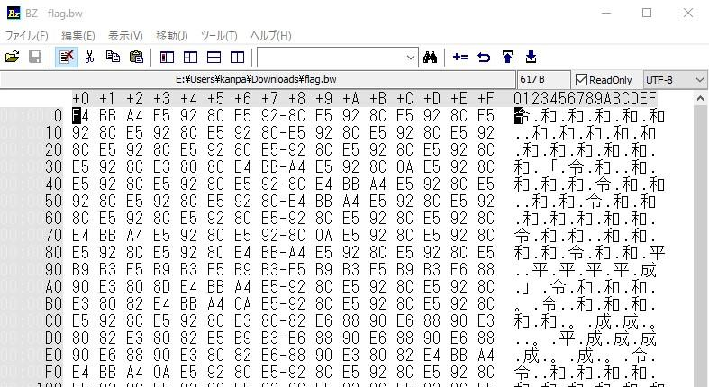
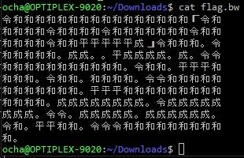
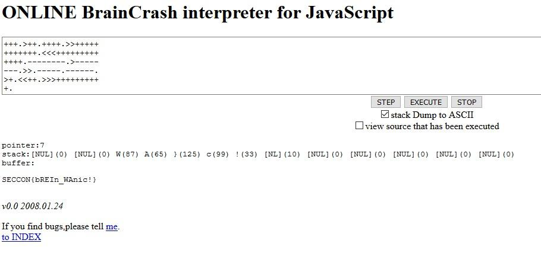
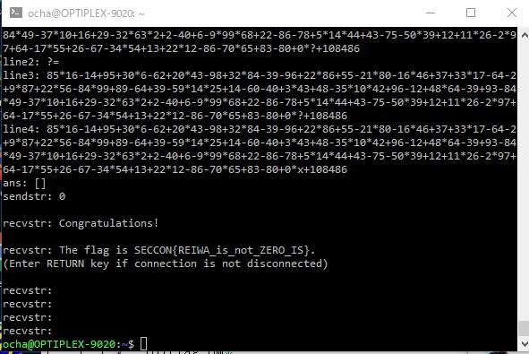

[SECCON 令和CTF](http://score-reiwa.seccon.jp/ "SECCON 令和CTF")に参加しました。

今回は２時間という短期決戦です。今回も回答できた人の人数でどんどん点数が低くなるということで、なかなか厳しかったです。途中で1時間延長されましたが・・・。

解いた問題は２つで、合計で110点獲得できました。

- フラグの例は　10点
- bREInWAck　100点

あと、時間はすぎてしまいましたが、以下の１問も解きました。

- 零は？　100点（でも時間外なので0点）

忘れないうちにWrite-upを書いておきました。

<!--more-->

### フラグの例は (Misc)

いつものサービス問題です。

### bREInWAck (Misc)

flag.bwというファイルが提供されました。バイナリエディタでみたところ



令和とか平成という文字が並んでいます。

とりあえずテキスト形式のようなのでcatで確認です。



参考サイトとして、以下のサイトが挙げられていました。

[https://ja.wikipedia.org/wiki/Brainfuck](https://ja.wikipedia.org/wiki/Brainfuck "Brainfuck")

面白いプログラム例です。ここででてくる８つの言語仕様が、それぞれの漢字１文字に対応づけられているのでしょう。

見たところ以下の３つは想像がつきます。

「　→　\[

」　→　\]

。　→　.

残りは、次のように考えました。

傾向として「和」がたくさんでてきます。多分これはポインタが指す値をインクリメントするのだろうと、「＋」としました。

また最初に「令」がきているのでこれはポインタ操作かなと、いきなり減算はしないだろうから、「＞」と考えました。

残るは、「平」、「成」ですが、まあ、「－」と「＜」のどちらかなので２通り置換したものを作りました。

このルールに従ってエディタで置換したものが以下のようになります。

```
>++++++++++++++++[>+++++>++++>+++++++>++++++>++<<<<<-]>+++.>+++++.--..<----.-.>>+++++++++++.>++.<<<++++.>++.++++.>>++++++++++++.<<<+++++++++++++.--------.>--------.>>.-----.------.>+.<<++.>>>++++++++++.

```

これをWikiPediaにリンクされていたBrainCrashのJavaScriptに流してみましたが、うまく表示されません。ここでいろんなパターンを試していて時間が過ぎていきました。

良く説明を読んだらこのJavaScriptでは初期値にHello Worldが設定されているとのことで、これが邪魔をしているのかなと、一度ローカルにコピーして、JavaScriptのHello Worldの文字列の値をすべて0に変更して流し込んだところ、無事フラグがでてきました。



### 零は？ (Misc)

問題にはサーバ名とポート番号が書かれていました。早速接続してみると

```
[1/100]
0=?-34
?=34
[2/100]
0=92+?-184
?=
Wrong!
(Enter RETURN key if connection is not disconnected)

```

という感じで、表示された式の結果を０にする値を回答するもののようです。

これは以前[Z80の逆アセンブラ問題](https://kanpapa.com/2014/12/seccon-ctf-2014-online-writeup.html "Z80の逆アセンブラ問題") (Let's disassemble)で苦労したパターンだなと思いだしました。

入出力の部分は前回の[Z80問題のソース](https://github.com/kanpapa/ctf/blob/master/lets_disassemble.py "Z80問題のソース")を持ってきて作りだしましたが、方程式の解法ってpythonでどうやるんだろうと調べている間に、タイムリミットになってしまいました。

その後、[SymPy](https://ja.wikipedia.org/wiki/SymPy "SymPy")という便利なものがあることを知り早速組み込みました。

何度かプログラムを修正して、フラグを取得できました。



いつものように汚いプログラムですが、[github](https://github.com/kanpapa/ctf/blob/master/reiwa_zero.py)に載せておきます。

### 総評

今回は実質１問ということで残念な結果に終わりましたが、時間切れになってしまっても最後まで取り組んでなんとか解けたのが良かったです。

関係者の皆様ありがとうございました。

また次回もよろしくお願いします。
