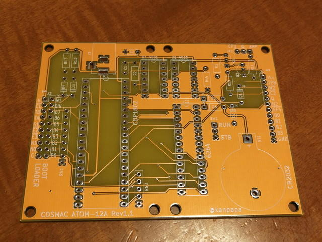
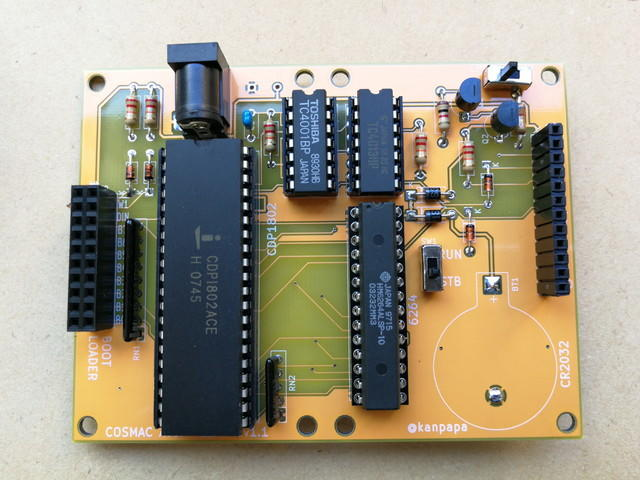

これまで製作してきた実験回路をコンパクトなシールド基板にしてみました。ArduinoのようにCPU基板に重ねる形です。プログラムローダー基板も同様に重ねる形にしました。こうすることでより操作しやすくなりますし、カッコいいです。

CPU基板はコネクタ位置の微調整とQ信号とTPB信号を直接出力できるように変更したものを製作しました。

<!--more-->

また、シールド基板と干渉しないようにバッテリとメモリスタンバイスイッチを裏面に実装しています。コネクタもメス型のヘッダピンにしました。

シールド基板は秋月電子のC基板のサイズでガーバーデータを作成しました。もちろんV-CUTで2つの基板を一度に作ります。

完成した基板はこんな感じになりました。基板の色は白を使ってみました。白もなかなかかっこいいです。

部品を実装した基板を並べてみました。最初のプロトタイプからだんだん形になってきたと思います。

完成したシールド基板です。

ハードウェアは形になりましたので、これらのシールドを使って、もう少しアプリケーションを作ってみようと思います。
