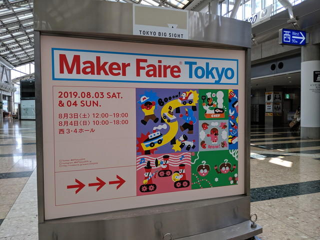
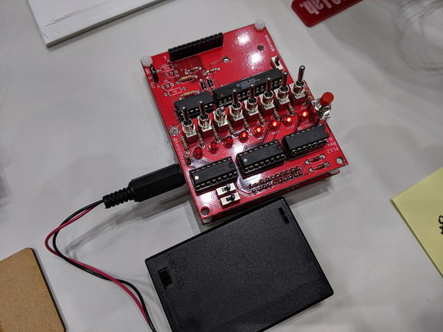
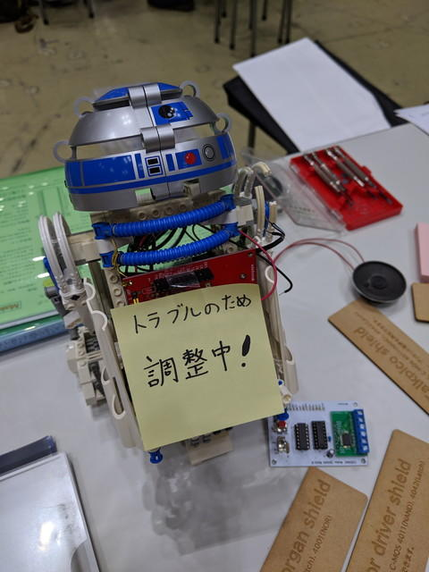
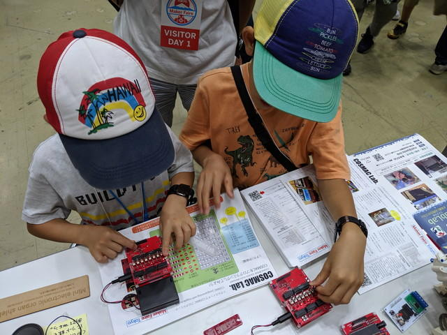
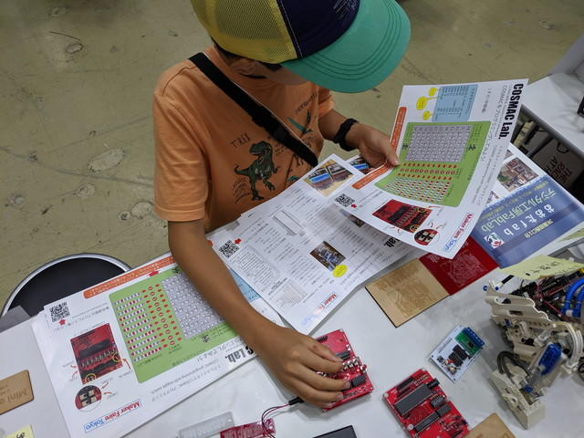
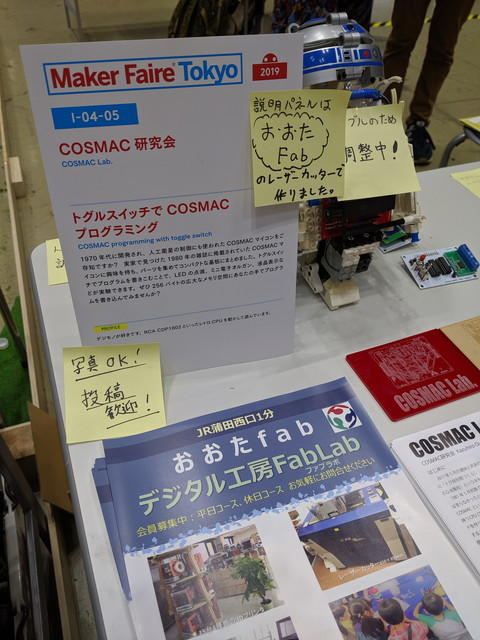

[COSMAC研究会](https://makezine.jp/event/makers-mft2019/m0098/ "COSMAC研究会")で[Maker Faire Tokyo 2019](https://makezine.jp/event/mft2019/ "Maker Faire Tokyo 2019")に出展しました。[前日のレポート](https://kanpapa.com/cosmac/blog/2019/08/cosmac-maker-faire-tokyo-2019-3.html "前日のレポート")に引き続き1日めの様子のまとめです。

<!--more-->

## ブースの設営

まずは当日分の機材を搬入し、前日搬入分の機材を含めて並べました。

電源を確保したあとにトグルスイッチでプログラムを書き込んでいきます。

ここでトラブル発生。R2D2さんのモータードライバが動かないと思ったら、ドライバのICが異常発熱。そうです。電源を逆接続してしまったのです。モータードライバは予備が無く、ここでR2D2さんは飾りになってしまいました。

テーブルのスペースを考えて、最終的なレイアウトは右側から次のように並べました。

- キツネさん
- [モーターシールド](https://kanpapa.com/cosmac/blog/2019/06/rca-cdp1802-cosmac11-1.html "モーターシールド")
- 音声出力シールド
- [ミニ電子オルガンシールド](https://kanpapa.com/cosmac/blog/2019/02/rca-cdp1802-cosmac8.html "ミニ電子オルガンシールド")
- Lチカのタッチ＆トライ用２台
- [動かないR2D2](https://youtu.be/LgxPKIGbSCo "動かないR2D2")
- フライヤー一式

## 開場後の反応

基板むき出しの展示なので、一般のかたには難しい内容とおもわれますが、そこはMaker Faire。それなりの人が集まってきます。CPUボードと各種シールドを説明しつつ、さまざまなかたにトグルスイッチでのプログラミングを体験いただきました。

「昔、こういうのやっていました。」という方から、とにかくスイッチをパチパチするのが楽しそうな小学生くらいのかた、「Twitterやブログをみてます」というかた、「学校では教えてもらったけど、実際に操作したのは初めて」とか。

ただ、入力はやはり難しそうで、ちゃんとプログラムが動いたかたは３分の２ぐらいでしょうか。中にはもう一回入力して正しく動かしたかたもいました。

時間をみてモータードライバの応用である「きままなキツネさん」を動かしました。これは子供たちの目を引くようでした。



質問として多かったのは、「古いCPUはどうやって入手しているのですか？」と、「これは販売しないのですか？」でした。

また、展示に使っている説明パネルは[おおたFab](https://ot-fb.com/ "おおたFab")さんのレーザーカッターで作成したこともあり、[おおたFab](https://ot-fb.com/ "おおたFab")さんのフライヤーも置いたところ、そちらに興味をもたれるかたもいて、「Fabってなんですか？」という質問から、「大田区にこんな場所があったのか」等、反応があり、フライヤーを持っていかれるかたもたくさんいらっしゃいました。

## フライヤーが足りない

1日目だけで、100部しか印刷していない操作マニュアルが残りわずかとなってしまいました。一緒に置いたおおたFabさんのフライヤーもです。何とか1日目は足りましたが明日にはなくなってしまうと思われました。

東京ビックサイトにはビジネスセンターというコーナーがあり、印刷はできるのですが、オープンが9:00からなので、出展者向けの内覧会の時間を考えると、時間がありません。やむをえず明日の朝一で川崎のkinko'sによって増刷することにしました。

## １日目終了

これで１日目が終了しました。おつかれさまでした。

[2日目のレポート](https://kanpapa.com/cosmac/blog/2019/08/cosmac-maker-faire-tokyo-2019-5.html "2日目のレポート")に続きます。
