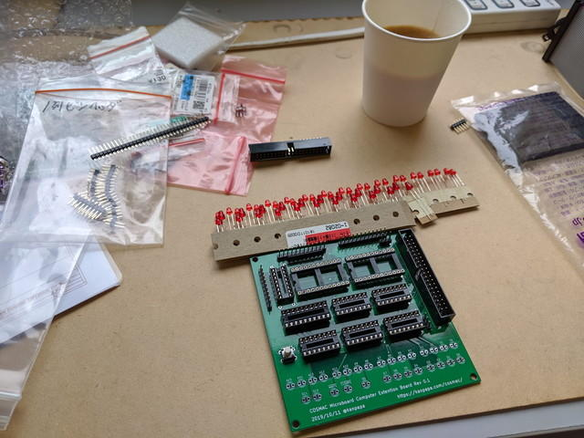
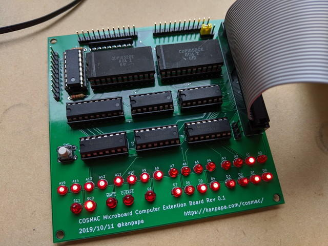
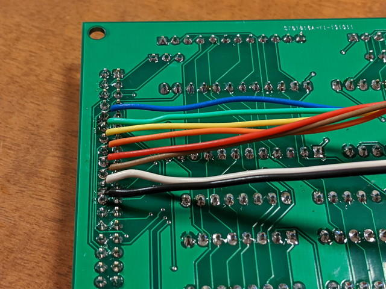

[到着した拡張ボードのプリント基板](https://kanpapa.com/cosmac/blog/2019/10/cosmac-mbc-ex-pcb2.html "到着した拡張ボードのプリント基板")にパーツを実装しました。いつものように[おおたFab](https://ot-fb.com/ "おおたFab")さんではんだ付けです。


<!--more-->

製作は問題なくできましたが、CPUボードに接続するIDCコネクタの向きが逆だったことに気がつきました。まあ、物理的にはつながるので問題ないということで。



まずはLEDの表示確認です。29個のLEDを実装しているので、やや基板が温かくなります。

評価ボードのマニュアルにあるステップ実行の手順で確認しましたが、A8-A15の表示がおかしいです。どうもデータバスを表示しているように見えたので回路図を確認したところ、アドレスのラッチ入力になぜかDB0-DB7がつながっていました。ここは正しくはA0-A7なので、ICピンをソケットから浮かしてジャンパー線で接続し修正しました。




また、たまにUT4モニタが動かないことがあり、確認したところ入力ポートのCDP1852のMODEを間違って出力モードにしていました。これでバスの信号が衝突していたようです。こちらもパターンカットとジャンパー線で修正です。これらの修正で、LEDの表示は正常になりました。



残るはCDP1852を使用した入力ポート、出力ポートの動作確認です。確認のため簡単なテストプログラムを作成しました。ポケットオシロスコープをポートに接続して信号を確認します。

出力ポートの確認プログラム

適当なメモリの内容を出力ポートに出力するシンプルなもの

```
0000-E3     START SEX 30001-65     LOOP1 OUT 50002-30 01        BR LOOP1!M0 E3 65 30 01$P0
```

カウンタの内容を出力ポートに出力するもの

```
0000-E3     START SEX 30001 F8 00        LDI 00003-B3           PHI 30004-F8 31        LDI #$310006-A3           PLO 30007-84     LOOP1 GLO 40008-53           STR 30009-65           OUT 5000A-23           DEC 3000B-14           INC 4000C-30 07        BR LOOP1!M0 E3 F8 00 B3 F8 31 A3 84 53 65 23 14 30 07$P0
```

入力ポートの確認プログラム

入力ポートの状態をそのまま出力ポートに出力するプログラム

```
0000-F8 0D  START LDI #$0D0002-A5           PLO 50003 F8 00        LDI 00005 B5           PHI 50006-E5           SEX 50007-6E     LOOP1 INP 60008-65           OUT 50009-25           DEC 5000A-30 07        BR LOOP1 !M0 F8 0D A5 F8 00 B5 E5 6E 65 25 30 07$P0
```

これですべての動作確認が完了しました。今の状態でも正常に動作はするのですが、正しい情報を回路図に反映して修正版の基板のガーバーデータを作成しました。合わせて電源ラインの見直し、コネクタの方向の修正、シルクの追加なども行っています。


今回は[Fusion PCB](https://www.fusionpcb.jp/ "Fusion PCB")さんに発注しました。修正版の基板が到着するまでは現在のジャンパー線だらけの基板で楽しむことにしましょう。


