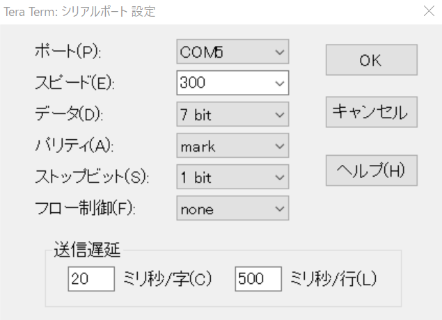

[COSMAC MicroBoard Computer](https://kanpapa.com/cosmac/blog/2019/10/cosmac-mbc-new-pages.html "COSMAC MicroBoard Computer")でサンプルプログラムを動かしてみます。

サンプルプログラムは[github.com](https://github.com/kanpapa/cosmac/tree/master/ut4 "github.com")に置きましたので参照してください。オリジナルは評価ボードのマニュアルに載っていますが、SB-Assemblerのソースに書き換えてアセンブルしています。

事前準備として、アセンブルしてできたHEXファイルにUT4モニタの書き込みコマンドと書き込みアドレスをエディタで追記しておきます。今回は以下のようなファイルになります。

```
!M0000 7100F800B5F809A5D5F880BCF8EFACF8!M0010 28BEF800AEF800B6F836A6F881B3F89C!M0020 A3D300F8A4A346BF322DD33023F8FFB7!M0030 27973A3030090D0A5243412042525553!M0040 53454C530D0A535452494E47204F5554!M0050 5055540D0A5553494E47205554342052!M0060 4F5554494E455300
```

プログラムの実行は以下の手順でおこないます。

1. USB-シリアル変換ボードを使ってシリアルポートにPCに接続します。信号レベルは5Vです。
2. ターミナルソフトで7bit,300bps,parity mark,stop 1bitにし、送信時に遅延をいれてアップロード時に文字抜けがおこらないようにします。TeraTermの場合は以下の設定としました。  
    
3. リセットスイッチを押す。
4. RUN Uスイッチを押す。
5. PCのEnterキー（CR）を押すとターミナルの通信速度を自動認識した後に、UT4モニタのプロンプトの \* が表示されます。
6. 最初に作った書き込みコマンド!Mを追記したHEXファイルをアップロードします。

```
*!M0000 7100F800B5F809A5D5F880BCF8EFACF8*!M0010 28BEF800AEF800B6F836A6F881B3F89C*!M0020 A3D300F8A4A346BF322DD33023F8FFB7*!M0030 27973A3030090D0A5243412042525553*!M0040 53454C530D0A535452494E47204F5554*!M0050 5055540D0A5553494E47205554342052*!M0060 4F5554494E455300
```

7\. メモリに書き込めたか?Mコマンドで確認します。

```
*?M0000 700000 7100 F800 B5F8 09A5 D5F8 80BC F8EF ACF8;0010 28BE F800 AEF8 00B6 F836 A6F8 81B3 F89C;0020 A3D3 00F8 A4A3 46BF 322D D330 23F8 FFB7;0030 2797 3A30 3009 0D0A 5243 4120 4252 5553;0040 5345 4C53 0D0A 5354 5249 4E47 204F 5554;0050 5055 540D 0A55 5349 4E47 2055 5434 2052;0060 4F55 5449 4E45 5300 0000 0000 0000 04FF
```

8\. 問題なく書き込めていれば$Pコマンドで実行します。正常に動作すると次のようなメッセージが表示されます。

```
*$P0000RCA BRUSSELSSTRING OUTPUTUSING UT4 ROUTINESRCA BRUSSELSSTRING OUTPUTUSING UT4 ROUTINES
```

同様な手順で様々なアプリケーションを動かすことができます。

追記：通信速度は600bpsまでは大丈夫のようです。
