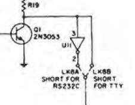
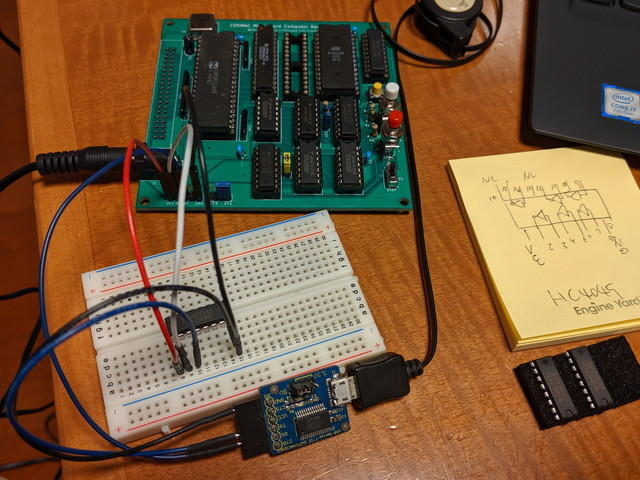
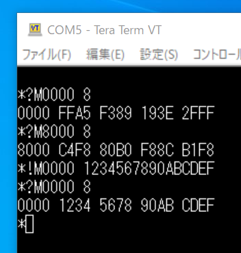

[UT4モニタがうまく動かないCOSMAC MicroBoard Computer](https://kanpapa.com/cosmac/blog/2019/10/cosmac-mbc-started.html "UT4モニタがうまく動かないCOSMAC MicroBoard Computer")のトラブルシューティングを始めました。ターミナル出力にプロンプトが出ているので、まずはこの信号をロジアナで確認してシリアル信号の形式を確認します。ロジアナをシリアル出力に接続し、RESETしてRUN Uボタンを押して、ターミナルからCRを入力してみました。

この出力されたCR LFのデータを見る限り、UT4のマニュアルにあるDATA 7bit、START 1bit、STOP 1～2bit、PARITY Markで良さそうです。

シリアル出力がOKなら、シリアル入力に問題があるかもということで、オリジナルの回路図を見直したところ、RS232Cの入力にインバーターが入っていました。

これが原因かなとさっそくインバーターを途中にいれシリアル入力信号を反転させてみました。

この状態でもう一度UT4モニタのコマンドを入力したところ、

ようやくUT4が動きました！これでメモリを自由に読み書きできるようになりましたので、プログラムを入力して動かしてみようと思います。

インバーターの追加は偶然にも1ゲート未使用のところがありましたので、そちらにジャンパー線で接続することにします。もちろん基板も修正しますが、もう少し動作確認を行ってからとなります。

追記：ジャンパー線で修正を行い、ここまでの回路図([cdp18s020\_cpu\_rev02\_sch.pdf](https://github.com/kanpapa/cosmac_mbc/blob/main/schematics/cdp18s020_cpu_rev02_sch.pdf))を作成しました。

