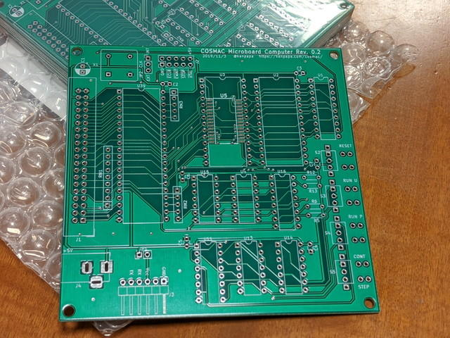

[先日発注したCOSMAC MBC CPUボード Rev. 0.2のプリント基板](https://kanpapa.com/cosmac/blog/2019/11/cosmac-mbc-cpu-rev02-pcborder.html "COSMAC MBC CPUボード Rev.0.2発注")が到着しました。

見た目は問題なさそうです。秋月電子の[28ピンフラットパッケージの256Kbit SRAM](http://akizukidenshi.com/catalog/g/gI-10715/ "SRAM 256K SRM2B256SLMX55")も問題なく実装できそうです。 <!--more-->

心配していたトグルスイッチまわりのシルク印刷ですが、トグルスイッチが少しスリムだったので文字が隠れることはありませんでした。

遅い時間の到着だったのでパーツの実装は今度の週末の予定です。
