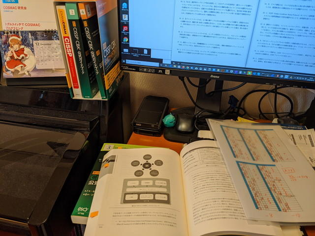

昨日、[CISSP](https://japan.isc2.org/cissp_about.html "CISSPについて")の試験を受けて無事合格となりました。まだ資格認定の手続きが残っていますが一安心です。今後受験されるかたの参考になるようにどう取り組んできたかをまとめておきます。なお、試験内容についてはNDAがありますのでここでは触れません。

 <!--more-->

### まずは、試験日を決定

私は今年度のうちにCISSPを取得しようと考えました。難易度が高いものは目標がないとなかなか進まないので最初に試験日を決めてしまいました。

試験の申込は[ピアソンVUE](https://www.pearsonvue.co.jp/ "ピアソンVUE")で行うのですが、長時間の試験かつ試験会場の収容人数も限られているようで、かなり先まで予定が入っているようです。

業務の都合で当日キャンセルになってしまうとUSD 699.00(税別)の受験料も戻ってこないので、平日ではなく土曜日で空いている日がないかと探し、2019/12/14(土) 11:00-17:00が予約できました。少し先になりますが、試験日が決まっていることでやりきる原動力になるはずです。

### CBK 公式ガイドブックを通読

2019/4/17に「[新版 CISSP CBK 公式ガイドブック](http://www.nttpub.co.jp/search/books/detail/100002450 "新版 CISSP CBK公式ガイドブック")」を購入。**全1700ページ**を少しずつ読み始めたのですが、[レトロCPUのCOSMAC](https://kanpapa.com/cosmac/ "COSMAC研究会")にはまり、[Maker Faire Tokyo](https://makezine.jp/event/makers-mft2019/m0098/ "Maker Faire Tokyo")に出展したり、[トラ技に記事を掲載](https://toragi.cqpub.co.jp/tabid/889/Default.aspx "トラ技に記事を掲載")したり、オレンジピコショップさんから[専用プリント基板が販売](https://store.shopping.yahoo.co.jp/orangepicoshop/cosmaca5b7.html "専用プリント基板が販売")されるなどイベントが多く、進捗が出ませんでした。

**「ヤバイ。これでは進まない。」**

そこで、どこでも勉強できる環境にするために、2019/9/21に「[新版 CISSP CBK 公式ガイドブック Kindle版](https://www.amazon.co.jp/dp/B07HFPNR6B/ "新版 CISSP CBK 公式ガイドブック Kindle版 ")」もあえて購入しました。スマホやiPadで持ち運べるのは非常に便利で、通勤時間の往復２時間は全てこのCBK公式ガイドブックの通読に充て、合わせて各章の最後の練習問題もこなしました。

というわけで、実質10月から本格的な学習開始といった状況です。その後の進捗は順調でした。

- 2019/11/4 CBK公式ガイドブック　第4章読了
- 2019/11/10 CBK公式ガイドブック　第7章読了
- 2019/11/13 CBK公式ガイドブック　全章読了

### 公式問題集にチャレンジ

このあとも通勤時間を利用し2019/6/15に購入しておいた電子書籍「[CISSP公式問題集](https://honto.jp/ebook/pd_29714148.html "CISSP公式問題集")」に取り組みました。

まずは「本書の使い方」の章にあるように、模擬問題１をやって苦手なドメインを見つけようとしたら、全体的に厳しい状況であることが判明しました。この解決策として、問題で詰まったところや聞いたことがないキーワードはマーカーを引き、紙のCBK公式ガイドブックやインターネットで調べて、分かったことやCISSPはこう考えるという事例をOneNoteに書き出して進めました。なお、問題集と同じ問題はほぼ出ないので、暗記ではなく知識を確認する、CISSPとしての考え方を発見するために問題を解くと思ってください。

その後は、ドメイン１からドメイン８までの**全834問**を順に進めていきました。

- 2019/11/23 公式問題集 ドメイン７まで完了
- 2019/11/24 公式問題集 ドメイン８まで完了

この調子で、公式問題集のドメイン１～８までを通して繰り返し２回解き、さて次は模擬試験と思っていたら・・・

- 2019/12/6 **ぎっくり腰再発！**

痛みのためCISSPどころではなく寝込んでしまいました。

### 模擬試験にチャレンジ

数日経って、落ち着いたところで学習を再開しました。

公式問題集の模擬試験は１～４まであり、それぞれ125問です。

私の場合は実際の試験会場を想定して、朝に個室にこもり、iPadで問題をみながらGoogleスプレッドシートで印刷した[回答用紙](https://docs.google.com/spreadsheets/d/1J2OtUPCxpaqHlR_9gD5QCVGrj4tV1SUmysTP-AanDiY/edit?usp=sharing "回答用紙")に鉛筆で記入する形で行いました。この結果125問はおよそ1時間ぐらいで回答できることが確認できました。本番の試験は250問なので早くて2時間以上かかる計算となります。

夜に赤鉛筆で採点し、これまでと同様にわからなかったところは調べてOneNoteに書き出しました。

- 2019/12/10 朝に模擬試験１、夜は採点とレビュー
- 2019/12/11 朝に模擬試験２、夜は採点とレビュー
- 2019/12/12 朝に模擬試験３、午後は無料の[CISSPチャレンジセミナー](https://www.cvent.com/events/cissp-/event-summary-0eacba504ea5497a81d5c62b10ab9ca3.aspx "CISSPチャレンジセミナー")に参加、夜は採点とレビュー

[CISSPチャレンジセミナー](https://www.cvent.com/events/cissp-/event-summary-0eacba504ea5497a81d5c62b10ab9ca3.aspx "CISSPチャレンジセミナー")は、ある程度学習をしたあとに受講するのが効果的で講師が説明する内容が、実によくわかります。少しは身についているぞという実感がわきました。夜は忘れずに模擬試験3のレビューです。

- 2019/12/13 朝に模擬試験４、夜は採点とレビュー。これまで書いたOneNoteを見直して総復習。

ここまでの４つの模擬試験ではいずれも7割は正解できていたので、何とかなるかもという予感が・・・。

### 試験当日

- 2019/12/14 試験当日

帝国ホテルタワーで11:00からの試験です。30分前集合とのことなので、少し早めの10:15に受付に行ったら、まだ席が空いていないので10:45ぐらいにまた来てくださいということで退室。[東京ミッドタウン日比谷](https://www.hibiya.tokyo-midtown.com/jp/ "東京ミッドタウン日比谷")をうろうろし、[ゴジラ像](https://tokyo-trip.org/spot/visiting/tk0363/ "ゴジラ像")を見ながら、ここでパンとコーヒーでも良かったなと思いつつiPadに入れたOneNoteで最後の復習。

10:45に受付に戻ってきて受験手続きをおこない、11:00から250問6時間にわたる試験開始。とにかく答えを埋める方針で、一気に250問を解くとすでに14:45。問題の後半には肩が凝ってきて、結構しんどかったです。

ここで、いったん休憩とし、コンビニで買っておいたおにぎりとドーナツをほうじ茶でいただきました。トイレにも行って15:00ぐらいから再開。ちなみにコンビニは同じビルの一階にあります。

最初から一通り見直して、少しでも自信がない問題にチェックを入れました。この時チェックは100問以上はついていたのでこれはヤバイかもと思いながら、チェックをいれた問題だけを再度見直し終わったところで残り18分。もうこれ以上は進捗はないと判断し、終了ボタンを押しました。

この学習中に作成したOneNoteは公式ガイドブックや問題集やインターネットのWebサイトなど、あちこちからコピーしてきた内容ばかりなので公開はできませんが、最終的には27ページになりました。

### 終わりに

今回の学習を通して、CISSP CBK(Common Body of Knowledge)の理解を深めることができました。CBKの範囲は本当に幅広く、今年発生した話題でもある、洪水などの災害に備えてデータセンターは何階に置くべきかとか、データ残留による漏洩の問題も詳しく取り上げられています。またこれまで当たり前と思っていたけど根拠があいまいだったものも、セキュリティモデルできちんと定義されていたり、様々なフレームワークの概要やプライバシーを守るための法律など、新しく学べたことが多いです。

この記事がこれからCISSPを受験されるかたの何かのヒントになればとうれしいです。

CISSP受験の背中を押してくれた同僚の皆様、Facebookでコメントをいただいた皆様、試験の準備に協力いただいた家族、すべての皆様に感謝です。
