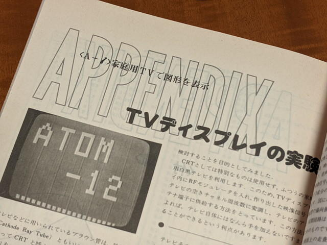
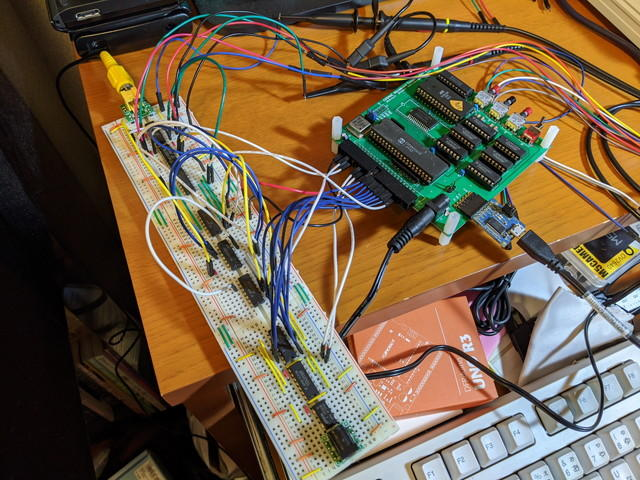
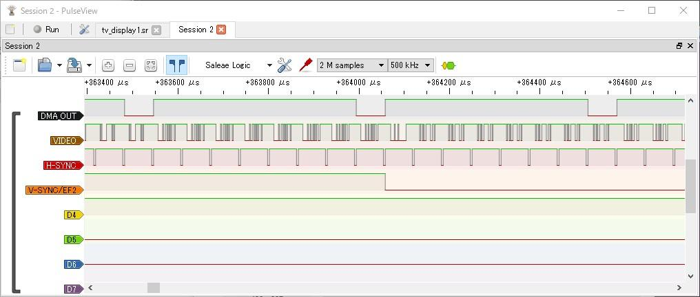

COSMACの実験で参考にしている書籍「つくるシリーズ７　手作りコンピュータ入門」にはAppendixがあり、そこにTVディスプレイの実験という記事があります。



COSMACにTVディスプレイを接続する場合に思いつくのは[CDP1861](http://www.cosmacelf.com/publications/data-sheets/cdp1861.pdf "CDP1861")というNTSC信号が生成できるチップですが、この記事では通常のロジックICのみで、1MHzのクロックからTVディスプレイに必要な信号を作り出す内容になっています。

<!--more-->

書籍に掲載されている回路図では、８つのCMOSロジックICを使っています。COSMAC CPUボードのメモリの内容をDMAで出力し、それを映像信号としてテレビに出力します。この回路はRFモジュレーター経由でテレビに接続するための信号レベルになっていたため、現在のビデオ入力の信号に合うように一部変更しています。また、COSMAC CPUでV-SYNCを検出するためにEF4を使用していますが、使用しているCPUボードのシリアル入力で使っているので、EF2を使用するように変更しました。回路図は以下になります。PDF版は[cosmac\_tv\_rev0\_2\_sch.pdf](https://github.com/kanpapa/cosmac_mbc/blob/main/schematics/cosmac_tv_rev02_sch.pdf)です。


この回路図をもとにブレッドボード上に試作しました。



表示プログラムは書籍に載っているものをベースとして垂直同期信号の入力にEF2を使うように修正しました。なお、$20番地からが表示データのメモリ領域になります。

```
0000- 1            .LF   tv10000- 2            .TF   tv1.hex,HEX0000- 3      *0000- 4      * TV Display program 1 for COSMAC0000- 5      * SB-Assembler0000- 6      *0000- 7            .CR   1802 ;To load the 1802 cross overlay0000- 8            .OR   $00000000- 9      *0000-F8 04    10 ( 2) START LDI 4     ;4 -> D0002-A3       11 ( 2)       PLO 3     ;D -> R(3).00003-D3       12 ( 2)       SEP 3     ;3 -> P0004-F8 20    13 ( 2) LOOP1 LDI $20   ;$20 -> D0006-A0       14 ( 2)       PLO 0     ;D -> R(0).00007-00       15 ( *) LOOP2 IDL       ;WAIT FOR DMA OR INTERRUPT; M(R(0)) -> BUS0008-3D 07    16 ( 2)       BN2 LOOP2 ;IF EF2=0000A-30 04    17 ( 2)       BR  LOOP1000C- 18000C- 19            .EN
```

この結果、何やら画像は出るのですが、表示領域に書き込んでおいた横直線ではなく、しばらく目まぐるしく不規則なドットが表示されたのち、全面が白くなった状態がしばらく続き、そのうちにまたドットが目まぐるしく点滅するといった状態です。

https://youtu.be/M3EVghqHzN8?si=\_83xop00pJEVQ0RP

この状態からみて、コンポジット信号のレベルはこれで良さそうに見えます。ドットが表示されているので映像信号自体も正常にみえます。でも想定していた横直線の静止画になっていないので、実験回路をいじってみることにします。

各信号の様子をロジアナで見てみましたが、想定通りの動きをしているように見えます。



次に生成されたコンポジット信号をUSBオシロスコープで確認すると、各信号が混合されていて、信号レベルもテレビ入力の規定内（映像信号1V (p-p)、同期負）になっています。問題なさそうです。


なぜ、映像が止まらないのか。鍵となっている信号はEF2の信号です。試しにEF2の信号をGNDに落とすと画像が止まります。これから考えて、何らかの原因でV-SYNCと同期しているEF2がうまく読み取れず、読み出しメモリの位置を初期値に戻せず、そのままメモリを読み続けて、映像信号にしているのではないかと考えました。

先ほどの不規則な表示も前半はRAMエリア($0000-$7FFF)のランダムな値を出力し、後半はROMエリア($8000-$FFFF)の$FFを出力していることで真っ白になっていると考えるとつじつまが合います。DMAでの出力アドレスはR(0)で指定します。EF2に信号が来た場合、V-SYNCのタイミングなので、DMAで出力するメモリのアドレスであるR(0)を初期値の$0020に戻す必要がありますが、これがうまくできていないようです。

もう一度プログラムをみたところ、書籍のハードはメモリが256バイトしかないので、R(0).1は初期化をしていません。今回使用しているCOSMAC CPUボードは32Kバイトのメモリを積んでいますので、R(0).1も初期化しなければなりません。この部分のコードを修正しました。

```
0000- 1            .LF tv20000- 2            .TF tv2.hex,HEX0000- 3      *0000- 4      * TV Display program 2 for COSMAC0000- 5      * SB-Assembler0000- 6      *0000- 7            .CR 1802 ;To load the 1802 cross overlay0000- 8            .OR $00000000- 9      *0000-F8 00   10 ( 2) START LDI 0     ;0 -> D0002-B3      11 ( 2)       PHI 3     ;D -> R(3).10003-F8 07   12 ( 2)       LDI LOOP1 ;LOOP1 -> D0005-A3      13 ( 2)       PLO 3     ;D -> R(3).00006-D3      14 ( 2)       SEP 3     ;3 -> P0007-F8 00   15 ( 2) LOOP1 LDI 0     ;0 -> D0009-B0      16 ( 2)       PHI 0     ;D -> R(0).1000A-F8 20   17 ( 2)       LDI $20   ;$20 -> D000C-A0      18 ( 2)       PLO 0     ;D -> R(0).0000D-00      19 ( *) LOOP2 IDL       ;WAIT FOR DMA OR INTERRUPT; M(R(0)) -> BUS000E-3D 0D   20 ( 2)       BN2 LOOP2 ;IF EF2=0(Vcc) LOOP20010-30 07   21 ( 2)       BR  LOOP10012- 220012- 23            .EN
```

また、実験手順として、次のようにDMA OUTの接続をプログラム実行前に行うようにしました。

1. DMA OUTをCPUボードから切り離す。

3. RESET後にRUN-UでUT4モニタを起動する。

5. UT4モニタで表示プログラムと表示データを書き込む。

7. DMA OUTをCPUボードに接続する。

9. RESET後にRUN-Pでプログラムを実行する。

修正したプログラムを上記の手順でUT4でアップロードして実行したところ、想定している画面が表示されました。


さらに表示データの内容を修正して縦線の表示もできました。


次にランダムな値です。ここまで表示できればQRコードぐらいは表示できそうです。


これでTVディスプレイが無事動作することが確認できました。せっかくなので基板化してみようと思います。

追記：[2020年の書き初め](https://kanpapa.com/2020/01/cosmac-tv-newyear2020.html "COSMACとTVディスプレイ回路で2020年の書き初めをしてみた")もしてみました。
