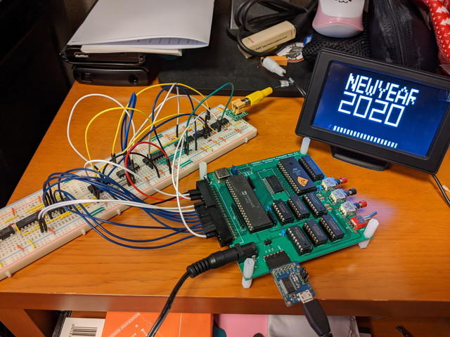
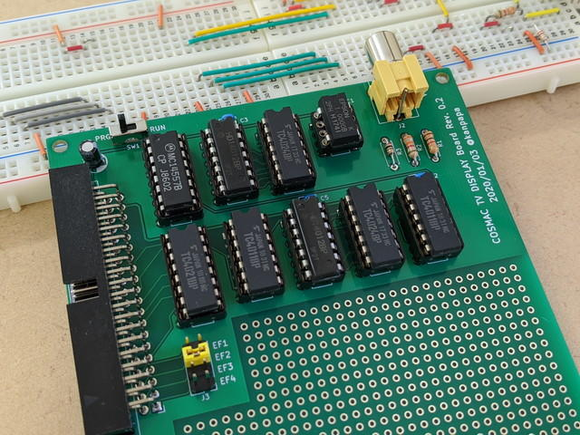
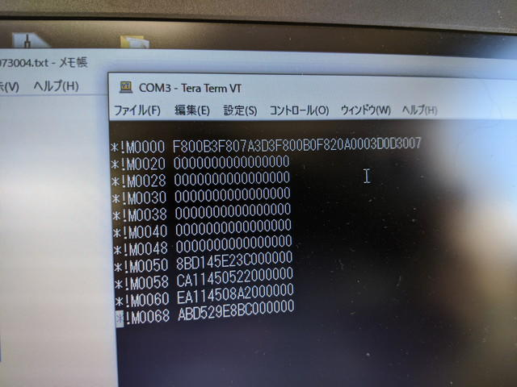
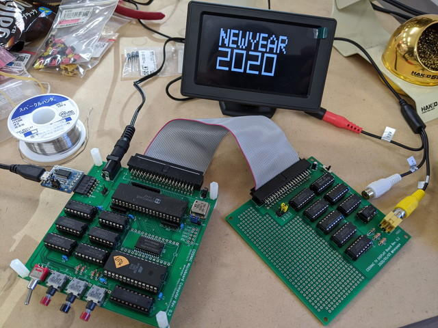
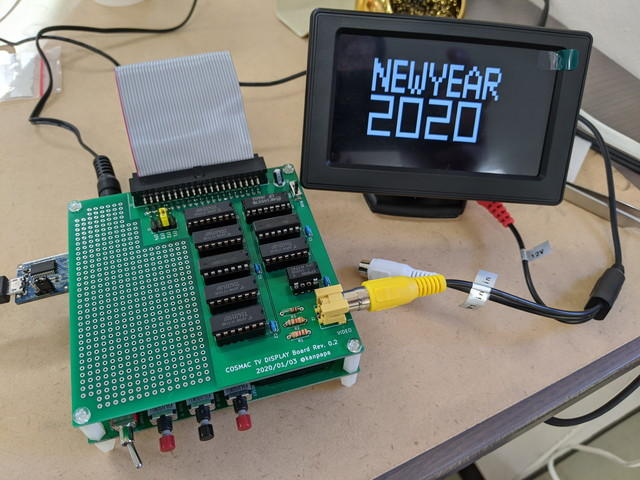

到着した[COSMAC MBC用 TVディスプレイボード Rev. 0.2の基板](https://kanpapa.com/cosmac/blog/2020/01/cosmac-mbc-tv-rev-02-pcb-delivery.html "COSMAC MBC用 TVディスプレイボード Rev. 0.2の基板")を組み立てる前に、実験環境を見直しを行いました。これまではNTSCビデオ信号を表示する機器として通常のテレビを使っていましたが、なかなか使えるタイミングがないため、[秋月電子のNTSCモニタ](http://akizukidenshi.com/catalog/g/gM-11053/ "4.3インチTFT液晶カラーモニター")を購入しました。これならいつでも机の上で動作確認を行うことができます。また、[MachiKania](http://www.ze.em-net.ne.jp/~kenken/machikania/ "MachiKania")や[IchigoJam](https://ichigojam.net/ "IchigoJam")でも使えるので一石三鳥です。

ブレッドボードに組んでいるTVディスプレイ回路に接続したところ、同期が合わず不安定だったのですが、表示データの最初のあたりにあるNULLの範囲を広げ、非表示の部分を広くしたところ安定して表示するようになりました。このあたりは表示データでの調整が必要のようです。

次は専用プリント基板の組み立てです。いつものように[おおたfab](https://ot-fb.com/ "おおたfab")さんで作業しました。

今回は試作なのですべてICソケットを実装し、電源回りを確認した後で、ロジックICを取り付けました。パーツも少ないため30分ぐらいではんだ付け完了です。

TVディスプレイボード基板が完成したところで、次の手順で動作確認を行いました。

1. COSMAC MBC CPUボードとTVディスプレイボードを40Pフラットケーブルで接続します。
2. TVディスプレイボードの切替スイッチをPRGに設定します。これでTVディスプレイボードからのDMA OUT信号が切り離されます。
3. COSMAC MBC CPUボードのシリアルポートにPCを接続します。今回は外部クロック1MHzなので300bps/7bit data/1 stopbit/markにします。
4. COSMAC MBC CPUボードの電源を入れます。（フラットケーブル経由でTVディスプレイボードにも電源が供給されます。）
5. RUN-Uスイッチを押して、UT4モニタを立ち上げ、表示プログラムと表示データを!Mコマンドでメモリにロードします。
6. リセットを行い、TVディスプレイボードのスイッチをRUNに設定します。これでTVディスプレイボードからのDMA OUT信号がCPUボードに供給されます。
7. RUN-Pで表示プログラムを実行します。

さて、動作結果は？

正常に動作しました！　問題なさそうなのでスタッキングして、コンパクトになりました。（基板下：COSMAC MBC CPUボード、基板上：TVディスプレイボード）

心なしかブレッドボードの時よりも安定しているように見えます。

これでCOSMAC MBCボードから画像を出力する装置ができました。あくまでも実験回路なので、専用ICである[CDP1861](https://en.wikipedia.org/wiki/RCA_CDP1861 "CDP1861")の豊富な機能は持っていませんが、基本的なNTSC信号の作り方は理解できたように思います。

今回は書籍の記事通りにロジックICでモノクロ信号を生成していますが、これをPICやLPCだけで行っている[MachiKania](http://www.ze.em-net.ne.jp/~kenken/machikania/ "MachiKania")や[IchigoJam](https://ichigojam.net/ "IchigoJam")は素晴らしいなぁと思いました。

もう少し基本的な表示プログラムで実験してみようと思いますが、何か応用はできないかなと調べたところ、COSMAC VIPの資料に[CHIP-8インタプリタ](https://en.wikipedia.org/wiki/CHIP-8 "CHIP-8インタプリタ")を見つけました。このあたりを動かして、このTVディスプレイボードで簡単なゲームを作ってみようかなと。少し時間がかかりそうですが。
