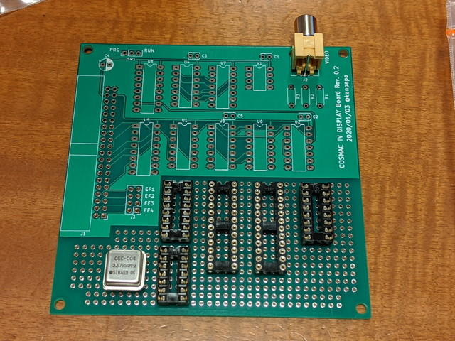
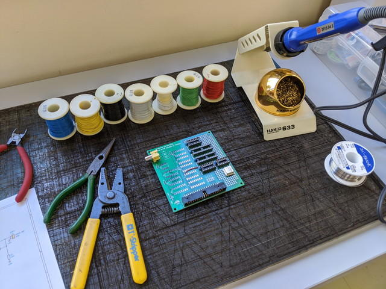
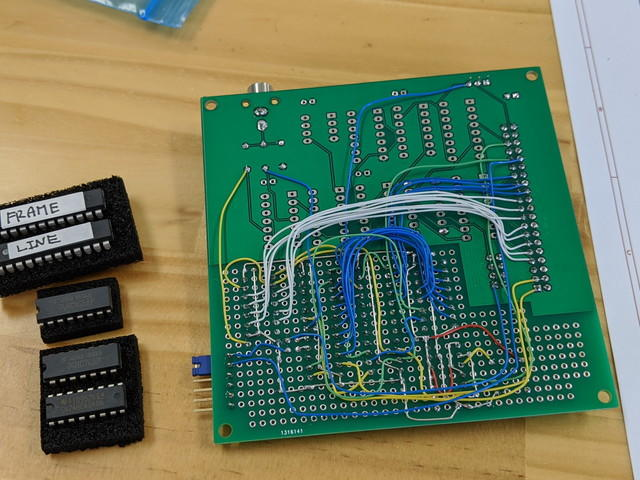
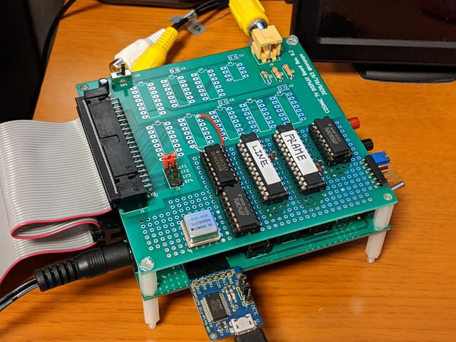
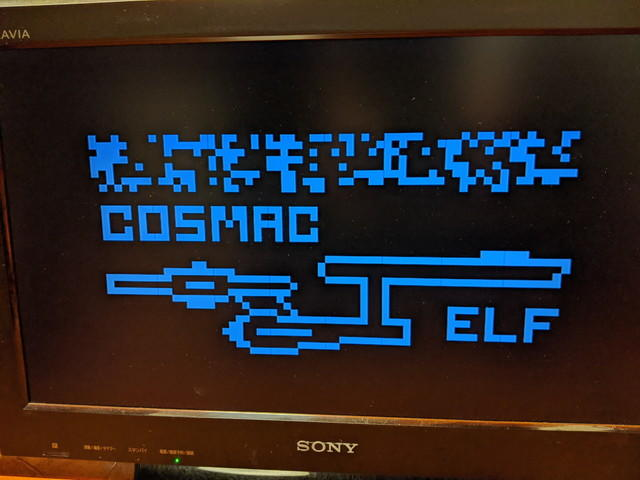

[ブレッドボードでSTG1861を製作](https://kanpapa.com/cosmac/blog/2020/02/cosmac-mbc-cdp1861-pixie-stg1861.html "ブレッドボードでSTG1861を製作")しましたが、やはり基板に実装しないと使い勝手がよくありません。そこで、先日作成した[TVディスプレイボード](https://kanpapa.com/cosmac/blog/2020/01/cosmac-mbc-tv-rev02-finished.html "TVディスプレイボード")のユニバーサル領域に実装してみることにしました。

レイアウトはこのような感じで考えました。ビデオ出力周りは基板上のパターンをそのまま使います。

<!--more-->

早速[おおたfab](https://ot-fb.com/ "おおたfab")さんで実装開始です。私の場合は手持ちのラッピングワイヤーを使って配線しています。いろんな色があるので配線の種類の応じて色を変えています。

配線が完了した基板の裏側です。データバスは白、制御信号は青、クロックは黄、Vccは赤となるようにしています。

配線チェックを行い問題なさそうなので[COSMAC MBC CPU基板](https://kanpapa.com/cosmac/blog/2019/11/cosmac-mbc-cpu-rev02-finished.html "COSMAC MBC CPU基板")とフラットケーブルで接続しました。

ビデオ出力はテレビのビデオ入力に接続します。

テストプログラムを実行したところ、前回同様にテレビに無事エンタープライズ号が表示されました。

次にこのプログラムを拡張した[アニメーションプログラム](https://billr.incolor.com/elf/html/elf-4a42.htm "アニメーションプログラム")があるのでそれも試してみました。



エンタープライズ号が横スクロールで動くことが確認できました。表示されているプログラム本体のスタック領域が点滅して値が変化しているのもわかります。

STG1861は前回製作した[TVディスプレイボード](https://kanpapa.com/cosmac/blog/2020/01/cosmac-mbc-tv-rev02-finished.html "TVディスプレイボード")とは異なり、割り込み処理により他の処理をしながら表示することができます。これにより応用範囲が広がります。

このSTG1861も機会があれば基板化してみようと思います。
